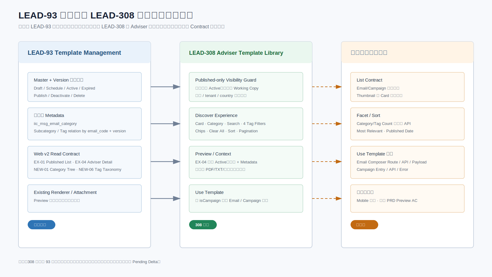
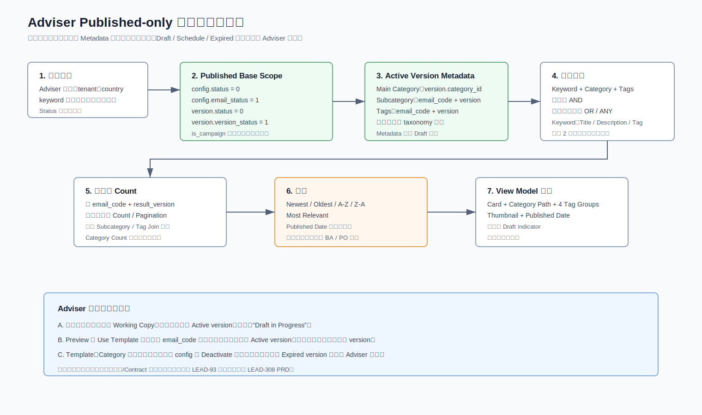
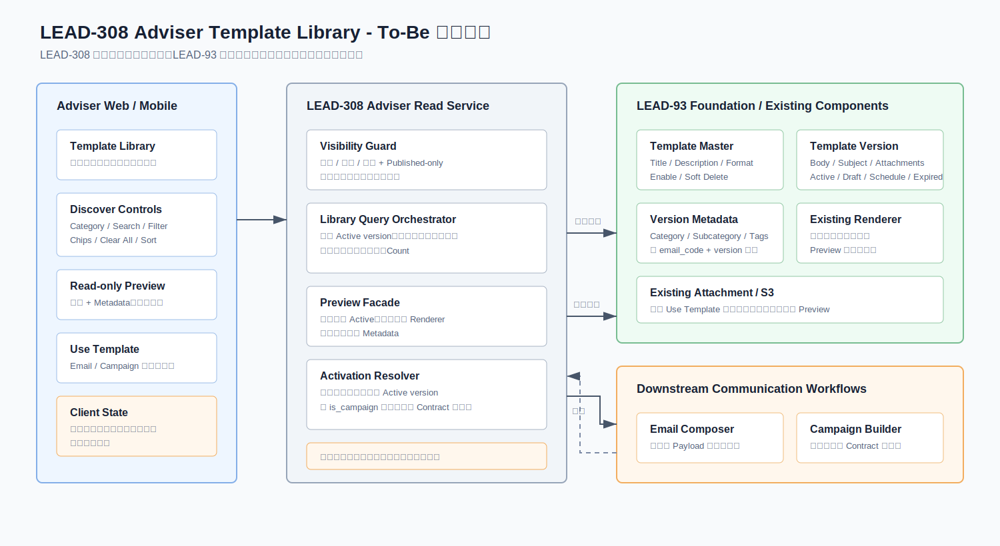
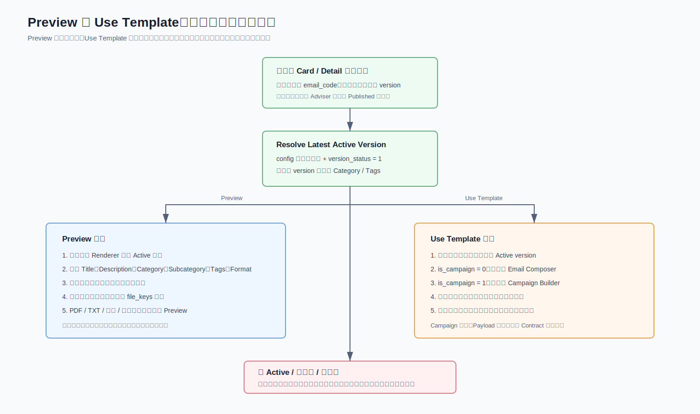

# LEAD-308 Adviser Template Management 技术方案评审稿

> 状态：待评审会对齐  
> 需求基线：`PRD_LEAD-308 Advisor-Template Management_v1.1 -updated July 14th.docx`  
> 详细开发基线：[LEAD-308 详细解决方案 V2](LEAD-308_Advisor_Template_Management_Solution_Design_CN_v2.md)  
> 上游基线：[LEAD-93 详细解决方案 V3](../Lead-93/LEAD-93_Template_Management_Solution_Design_CN_v3.md)  
> 统一未确认项：[LEAD-308 未确认项登记册](LEAD-308_Open_Questions_Register_CN.md)

## 1. 本次改造工作内容

LEAD-308 是 LEAD-93 的 Adviser 消费侧扩展。LEAD-93 负责 Template 创建、版本、Category、Tag、附件和发布；LEAD-308 只读取当前可用 Published Template，提供发现、预览和使用入口。

| 工作内容 | 主要说明 |
|---|---|
| Template Library | 以 Card 展示 Adviser 可见的当前 Active Template |
| Category Navigation | 复用两级 Category Tree，并展示/筛选 Published Template |
| Search / Filter | Title、Description、Tag Name；同组 OR、跨组 AND |
| Query State | Chips、Clear All、Sort、分页和返回状态统一管理 |
| Preview | 复用现有 Renderer，只显示正文和 Metadata，不显示附件 |
| Use Template | 点击时重读最新 Active，按 Email/Campaign 进入既有下游 |

## 2. 与 LEAD-93 的边界

### 2.1 保持不变

| 能力 | 处理 |
|---|---|
| Master / Version | 继续使用 `iic_msg_email_config` 和 `iic_msg_email_config_version` |
| 生命周期 | Draft、Schedule、Active、Expired 不变 |
| Metadata | Category/Subcategory/Tag 按 `email_code + version` 保存 |
| Taxonomy | 使用 `iic_msg_email_category`、Tag Group/Value |
| 附件 | 继续使用现有 `file_keys`、文件表和 S3；Preview 不加载 |
| v1 兼容 | v1 接口不增加 308 字段、不改变硬编码行为 |
| 审计 | 本期不新增审计表或强制审计事件 |

### 2.2 新增或修改

| 能力 | LEAD-308 增量 |
|---|---|
| Adviser 可见性 | 后端强制有效、启用、Active 和 Adviser 数据范围 |
| Library View Model | Card、Format、Thumbnail、当前 Active Metadata |
| Discovery | Category、Search、四组 Tag Filter、Chips、Clear All、Sort |
| Adviser Detail | 复用 `EX-04`，客户端不能指定 version |
| Preview 交互 | Modal/Page、只读渲染、关闭后恢复 Library 状态 |
| Use Template | 当前 Active 重解析与下游路由 |
| Query SQL | 去重、Count、Facet 和稳定分页查询 |

## 3. 核心数据规则

Adviser 结果必须同时满足：

- `config.status = 0`；
- `config.email_status = 1`；
- `version.status = 0`；
- `version.version_status = 1`；
- 权限、国家和租户范围匹配；
- Category 与版本 Metadata 关系有效。

先确定唯一 `email_code + result_version`，再在同一 version 上读取 Category、Subcategory 和 Tag。Active 与 Draft 共存时只展示 Active；Active 不存在时不回退到 Expired。

## 4. Story 与实现映射

| Story | 复用接口/能力 | 308 增量 | 未冻结内容 |
|---|---|---|---|
| LEAD-312 | `EX-01` Published List | Card、加载/空状态、响应式 | Thumbnail、混合格式 |
| LEAD-313 | `NEW-01` Category Tree | Adviser 导航、Count | Count 口径 |
| LEAD-314 | `EX-01` Keyword | 2 字符、debounce、高亮 | SQL 执行计划 |
| LEAD-315 | `EX-01` + `NEW-06` | 四组 Filter | 可用值/Count 返回方式 |
| LEAD-316 | 前端 Query State | Active Chips | 无后端增量 |
| LEAD-317 | 前端 Query State | Clear All | 默认 Sort 依赖排序确认 |
| LEAD-318 | `sortField/isAsc` 基础 | 五个 Sort 选项 | 相关度、Published Date |
| LEAD-319 | `EX-04` + Renderer | Adviser Preview | PRD 文本需修正 |
| LEAD-320 | `EX-01/EX-04` Metadata | Card/Detail Context | Optional Tag 展示 |
| LEAD-321 | `EX-04` 重读 Active | Email/Campaign 路由 | 下游 Route/API/Payload |

## 5. 目标方案

### 5.1 List、Search 与 Filter

- Web 直接使用 `EX-01` v2，不创建 LEAD-308 二次接口编号，也不修改 v1。
- Search 只匹配 Template Title、Description 和 Tag Name。
- Category、Search、不同 Tag Group 使用 AND；同一 Group 多值使用 OR。
- 多值 relation 使用 `EXISTS` 或先去重 Key Set，不能 Join 扩行后分页。
- Adviser 不展示或提交 Status Filter。

### 5.2 Preview 与 Use Template

Preview 与 Use Template 都先调用 `EX-04` 重新解析当前 Active。Preview 只渲染正文与 Metadata；Use Template 再根据 `isCampaign` 进入下游。二者都不能使用列表缓存 version，也不修改 Library Template。

### 5.3 API 复用

| LEAD-93 ID | Endpoint | 308 使用差异 | 改造结论 |
|---|---|---|---|
| `EX-01` | `POST /iic-dae-msg/web/msg/template/email/v2/queryList` | Adviser Card、Search、四组 Filter | 基础复用；Card/Sort/Facet Gap 待扩展 |
| `EX-04` | `POST /iic-dae-msg/web/msg/template/email/v2/published/detail` | 同时用于 Detail、Preview、Use 前重校验 | 接口不改，调用方式扩展 |
| `NEW-01` | `GET /iic-dae-msg/web/msg/template/email/v2/category/tree` | Adviser Navigation | Tree 复用；Count 待扩展 |
| `NEW-06` | `GET /iic-dae-msg/web/msg/template/email/v2/tag/taxonomy` | 只展示四组 Mandatory Filter | Taxonomy 复用；可用值待扩展 |

本期不新增独立 Preview API 或 Use API。完整字段、示例和 Pending Delta 见 [API Contract](LEAD-308_API_Contract_Clarification_CN.md)。

## 6. 数据库与 SQL

LEAD-308 不新增表，不执行 DDL/DML。数据库工作只有查询改造和性能验证：

- Published Base Scope 与 Adviser 可见性；
- Category/Subcategory/Tag Filter；
- Keyword Search；
- List/Count 一致性；
- Category/Tag Facet；
- Detail/Use 点击时 Active 重解析。

SQL 设计模板见 [QUERY_adviser_template_library.sql](sql/QUERY_adviser_template_library.sql)。正式 Mapper 必须与内网权限条件、现有分页和 LEAD-93 索引合并。

## 7. Preview 需求冲突

最新 308 PRD 的 LEAD-319 又描述了 PDF/TXT/图片和媒体预览。这与以下已确认基线冲突：

1. LEAD-93 Preview 复用现有 Renderer；
2. Preview 只支持正文和 Metadata；
3. Preview 不支持附件；
4. 用户此前已明确要求 LEAD-308 与 LEAD-93 一致。

技术方案按“正文 + Metadata、无附件”执行。该冲突不再作为技术猜测项，但 BA/PO 必须修正 PRD 文本和 AC，防止 QA 使用错误验收口径。

## 8. 开发准入

**可以开始：** 页面框架、Card、Query State、Chip/Clear All、四组 Filter、Published-only 查询骨架、`EX-04` Detail、正文 Preview 和基础自动化测试。

**对应功能开发前必须关闭：**

| ID | 冻结项 |
|---|---|
| `SCOPE-01` | Mobile 是否交付 308 新功能 |
| `LIST-01` | Email/Campaign 是否同屏混合以及请求方式 |
| `FACET-01` | Category/Tag Count 口径与返回 Contract |
| `SORT-01/02` | Most Relevant 和 Published Date |
| `CARD-01` | Thumbnail URL/缺省规则 |
| `USE-01/02` | Email/Campaign 下游 Route、API、Payload、失败码 |

## 9. 评审结论建议

建议评审会按三类结论关闭：

1. **批准复用基线：** 四个 v2 Endpoint、Published-only、Active Metadata、Preview 无附件；
2. **批准分阶段开发：** 先完成基础 Library 和 Preview，再接 Facet、复杂排序和 Use 下游；
3. **指定 Owner 与日期：** 所有未确认项必须在登记册关闭，不能只在会议纪要口头决定。
