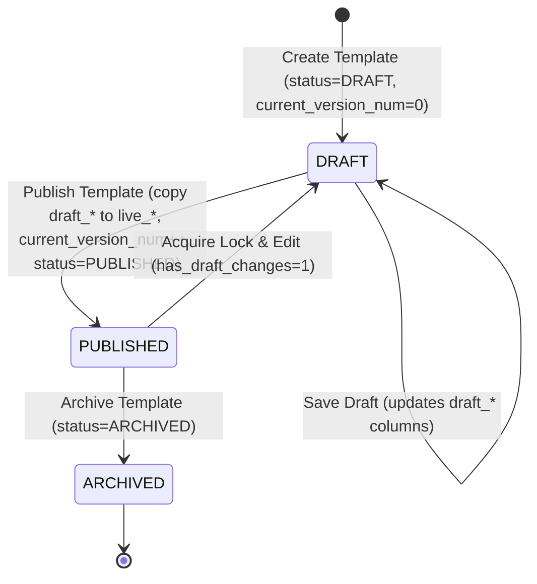

# DAE Lead-93 Backend Architecture & API Specification Document

This document defines the production-grade backend design, REST API contracts, Redis lock/cache architectures, and database DDL modifications for the **DAE Template Library Manager (LEAD-93)**. This design is built on top of the **As-Is** database schemas of the Opportunity Creator (OC) system, ensuring complete backward compatibility while enabling advanced content library features.

---

## 1. Database Schema & Migration DDL Design

To support directory trees, publishing workflows, and version history under Lead-93 without breaking existing OC modules, the database uses a **平滑向后兼容扩展 (Backward-Compatible Extension)** approach. 

The existing `iic_crm_campaign_template` table is extended with optional columns, while new dedicated tables are introduced for categories and version snapshots.

### 1.1 Extended `iic_crm_campaign_template` (As-Is Table)
The core table `iic_crm_campaign_template` is altered to include draft workspace columns, live published columns, versioning metadata, category foreign keys, and channel visibility:

```sql
-- DDL to extend the existing iic_crm_campaign_template table
ALTER TABLE `iic_crm_campaign_template`
  ADD COLUMN `category_id` BIGINT UNSIGNED DEFAULT NULL COMMENT '关联模板库分类ID',
  ADD COLUMN `has_draft_changes` TINYINT(1) NOT NULL DEFAULT 0 COMMENT '是否有未发布草稿 (0=无, 1=有)',
  ADD COLUMN `current_version_num` INT NOT NULL DEFAULT 0 COMMENT '当前已发布的最新版本号',
  
  -- Draft workspace columns (Content Manager edits here)
  ADD COLUMN `draft_subject` VARCHAR(200) DEFAULT NULL COMMENT '草稿主题',
  ADD COLUMN `draft_html_content` TEXT DEFAULT NULL COMMENT '草稿富文本正文',
  
  -- Live online columns (Financial Advisers retrieve from here)
  ADD COLUMN `live_subject` VARCHAR(200) DEFAULT NULL COMMENT '在线发布主题',
  ADD COLUMN `live_html_content` TEXT DEFAULT NULL COMMENT '在线发布正文',
  
  -- Audience channel segregation
  ADD COLUMN `target_channels` VARCHAR(200) DEFAULT NULL COMMENT '可见渠道 (逗号分隔, 如 PFA,AFD,DFA)',
  
  -- Foreign Key Constraint
  ADD CONSTRAINT `fk_campaign_template_category` 
    FOREIGN KEY (`category_id`) REFERENCES `template_category` (`category_id`) ON DELETE RESTRICT;
```

### 1.2 Category Table: `template_category` (New Table)
A self-referencing hierarchy table to govern a 2-level category tree (Root Category -> Subcategory), supporting soft-deletes and auditing:

```sql
CREATE TABLE IF NOT EXISTS `template_category` (
    `category_id`       BIGINT UNSIGNED NOT NULL AUTO_INCREMENT COMMENT '自增分类ID',
    `category_name`     VARCHAR(100)    NOT NULL                 COMMENT '分类名称',
    `parent_category_id` BIGINT UNSIGNED DEFAULT NULL             COMMENT '父分类ID (NULL=根节点)',
    `sort_order`        INT             NOT NULL DEFAULT 0       COMMENT '物理排序权重 (越小越靠前)',
    `target_channels`   VARCHAR(200)    DEFAULT NULL             COMMENT '可见渠道 (如 PFA,AFD,DFA)',
    `created_by`        VARCHAR(50)     NOT NULL DEFAULT 'SYSTEM' COMMENT '创建人',
    `updated_by`        VARCHAR(50)     NOT NULL DEFAULT 'SYSTEM' COMMENT '更新人',
    `created_at`        TIMESTAMP       NOT NULL DEFAULT CURRENT_TIMESTAMP COMMENT '创建时间',
    `updated_at`        TIMESTAMP       NOT NULL DEFAULT CURRENT_TIMESTAMP ON UPDATE CURRENT_TIMESTAMP COMMENT '更新时间',
    `deleted_at`        TIMESTAMP       NULL DEFAULT NULL        COMMENT '删除时间 (NULL=未删除)',
    `deleted_by`        VARCHAR(50)     DEFAULT NULL             COMMENT '删除操作人',
    PRIMARY KEY (`category_id`),
    CONSTRAINT `fk_category_parent` FOREIGN KEY (`parent_category_id`) REFERENCES `template_category` (`category_id`) ON DELETE RESTRICT,
    UNIQUE KEY `uk_category_name_parent_del` (`category_name`, `parent_category_id`, `deleted_at`)
) ENGINE=InnoDB DEFAULT CHARSET=utf8mb4 COLLATE=utf8mb4_unicode_ci COMMENT='模板目录分类表';
```

### 1.3 Snapshot Version Table: `template_version_history` (New Table)
An append-only database snapshot registry. Updates and deletes are blocked at the application tier:

```sql
CREATE TABLE IF NOT EXISTS `template_version_history` (
    `history_id`       BIGINT UNSIGNED NOT NULL AUTO_INCREMENT COMMENT '自增历史快照ID',
    `template_id`      BIGINT UNSIGNED NOT NULL                COMMENT '关联模板ID',
    `version_number`   INT             NOT NULL                COMMENT '此条记录对应的发布版本号',
    `subject`          VARCHAR(200)    NOT NULL                COMMENT '历史发布主题',
    `html_content`     TEXT            DEFAULT NULL            COMMENT '历史发布富文本正文',
    `category_id`      BIGINT UNSIGNED DEFAULT NULL             COMMENT '发布时的父分类ID快照',
    `subcategory_ids`  VARCHAR(200)    DEFAULT NULL            COMMENT '发布时的子分类ID快照列表 (逗号分隔)',
    `commit_log`       VARCHAR(500)    DEFAULT NULL            COMMENT '版本修改备注',
    `created_by`       VARCHAR(50)     NOT NULL                COMMENT '发布人账号',
    `created_at`       TIMESTAMP       NOT NULL DEFAULT CURRENT_TIMESTAMP COMMENT '归档时间',
    PRIMARY KEY (`history_id`),
    CONSTRAINT `fk_version_template` FOREIGN KEY (`template_id`) REFERENCES `iic_crm_campaign_template` (`id`) ON DELETE CASCADE,
    UNIQUE KEY `uk_template_version` (`template_id`, `version_number`),
    KEY `idx_template_id` (`template_id`)
) ENGINE=InnoDB DEFAULT CHARSET=utf8mb4 COLLATE=utf8mb4_unicode_ci COMMENT='模板版本历史快照表';
```

### 1.4 Template Subcategory Relation Table: `iic_crm_campaign_template_subcategory` (New Table)
Handles the many-to-many relationship between a template and multiple subcategories under its parent category:

```sql
CREATE TABLE IF NOT EXISTS `iic_crm_campaign_template_subcategory` (
    `id`             BIGINT UNSIGNED NOT NULL AUTO_INCREMENT COMMENT '自增关联ID',
    `template_id`    BIGINT UNSIGNED NOT NULL                COMMENT '关联模板ID',
    `subcategory_id` BIGINT UNSIGNED NOT NULL                COMMENT '关联子分类ID',
    PRIMARY KEY (`id`),
    CONSTRAINT `fk_template_sub_template` FOREIGN KEY (`template_id`) REFERENCES `iic_crm_campaign_template` (`id`) ON DELETE CASCADE,
    CONSTRAINT `fk_template_sub_category` FOREIGN KEY (`subcategory_id`) REFERENCES `template_category` (`category_id`) ON DELETE RESTRICT,
    UNIQUE KEY `uk_template_subcategory` (`template_id`, `subcategory_id`)
) ENGINE=InnoDB DEFAULT CHARSET=utf8mb4 COLLATE=utf8mb4_unicode_ci COMMENT='模板与子分类关联关系表';
```

### 1.5 Exclusions & S3/Media Mappings
* **Exclusion**: As per requirements (LEAD-303 excluded), the `iic_crm_campaign_template_material` table is out-of-scope for updates. 
* **Media URLs**: S3 media URLs for inline images or non-text templates are stored directly inside the `draft_html_content` / `live_html_content` (for inline images using relative paths, see Section 7) or custom fields inside the template metadata.


---

## 2. Category Management REST APIs & Governance Rules

Category management enables Content Managers to structure templates. The API enforces strict metadata validation, hierarchy limits, and data protection rules.

### 2.1 Get Category Tree
*   **Path**: `GET /api/v1/admin/categories/tree`
*   **Response (200 OK)**:
    ```json
    [
      {
        "categoryId": 1,
        "categoryName": "Rewards & Benefits",
        "parentCategoryId": null,
        "sortOrder": 0,
        "targetChannels": ["PFA", "AFD", "DFA"],
        "children": [
          {
            "categoryId": 4,
            "categoryName": "Welcome Packs",
            "parentCategoryId": 1,
            "sortOrder": 0,
            "targetChannels": ["PFA", "AFD"],
            "children": []
          }
        ]
      }
    ]
    ```

### 2.2 Create Category
*   **Path**: `POST /api/v1/admin/categories`
*   **Request Body**:
    ```json
    {
      "categoryName": "Retirement Letters",
      "parentCategoryId": 1,
      "targetChannels": ["PFA", "DFA"]
    }
    ```
*   **Governance Validations**:
    1.  **Unique Name at Sibling Level**: A sibling check queries the database to ensure no other category under the same parent has the identical `categoryName` (ignoring whitespace). Throws `409 Conflict` (Error: `DUPLICATE_CATEGORY_NAME`) on violation.
    2.  **Hierarchy Depth Limit**: Calculates the depth of the target `parentCategoryId`. Since `MAX_DEPTH = 2`, the parent node must be a Root Category (depth 1). Creating a child under a level 2 node (which would create a level 3 node) throws `422 Unprocessable Entity` (Error: `EXCEEDS_MAX_DEPTH`).
*   **Response (201 Created)**: Returns the newly created category VO.

### 2.3 Update Category
*   **Path**: `PUT /api/v1/admin/categories/{id}`
*   **Request Body**:
    ```json
    {
      "categoryName": "Retirement V2",
      "parentCategoryId": 2,
      "targetChannels": ["PFA"]
    }
    ```
*   **Governance Validations**:
    1.  **Unique Sibling Name**: Same as Create, excluding the target category ID.
    2.  **Topological Cyclic Dependency Prevention**: When shifting parent nodes, the system verifies that the target `parentCategoryId` is not the category itself and is not one of its own subcategories. Throws `400 Bad Request` (Error: `CYCLIC_DEPENDENCY`) on violation.
    3.  **Depth Re-evaluation**: Shifting a parent must not cause the category or any of its children to violate the `MAX_DEPTH <= 2` limit.

### 2.4 Reorder Categories
*   **Path**: `PUT /api/v1/admin/categories/reorder`
*   **Request Body**:
    ```json
    {
      "parentCategoryId": 1,
      "orderedCategoryIds": [5, 4, 12]
    }
    ```
*   **Response (200 OK)**: Success. Updates the `sort_order` of all listed sibling IDs sequentially in a single transaction.

### 2.5 Delete Category (Soft-Delete & Cascade Rules)
*   **Path**: `DELETE /api/v1/admin/categories/{id}`
*   **Cascade Soft-Delete Rules**:
    1.  **Block Validation**: The system queries `iic_crm_campaign_template` (and its subcategory relation table `iic_crm_campaign_template_subcategory`) to see if any template is assigned to the target category or any of its subcategories.
        *   If templates are assigned, the deletion is **blocked**. Returns `422 Unprocessable Entity` (Error: `CATEGORY_NOT_EMPTY`, message: *"This category/subcategory cannot be deleted while templates are still assigned."*).
    2.  **Cascade Process**:
        *   If the deleted category is a **parent category**: The system updates both the parent category and all its child subcategories to set `deleted_at = CURRENT_TIMESTAMP` and `deleted_by = <current_user>`.
        *   If the deleted category is a **subcategory**: The system updates only that subcategory to set `deleted_at = CURRENT_TIMESTAMP` and `deleted_by = <current_user>`. The parent category remains untouched.
    3.  **Adviser Cache Eviction**: Evict the Redis adviser tree cache.

---

## 3. Redis-Backed Concurrency Edit Locking Design

To avoid conflicting changes when multiple Content Managers (CMs) edit the same template simultaneously, the backend utilizes a Redis-backed distributed locking mechanism.

> [!IMPORTANT]
> **Lock Scope Restriction**: The edit lock **only** applies when a user is modifying the template content body (WYSIWYG editor). Metadata editing (such as changing the title, category, subcategories, or tags) is **not** affected by this lock and operates independently.

### 3.1 Lock State & Cache Keys
*   **Redis Key**: `lock:template:edit:{templateId}`
*   **Redis Value**: `<user_id>` (String value of the lock holder)
*   **Lock TTL (Time-to-Live)**: 10 minutes (`600` seconds).


### 3.2 Lock Acquisition API
*   **Path**: `POST /api/v1/admin/templates/{id}/lock`
*   **Headers**: `Authorization: Bearer <JWT>`
*   **Processing Logic**:
    1.  The system attempts to write the key to Redis with a 10-minute expiration:
        ```redis
        SET lock:template:edit:{id} <current_user_id> NX EX 600
        ```
    2.  **Success**: If Redis returns `OK`, return `200 OK` with lock duration and owner.
    3.  **Failure**: If the key already exists, query the current value and remaining TTL (`TTL lock:template:edit:{id}`). Return `409 Conflict` (Error: `LOCKED_BY_OTHER`, containing the lock holder's ID and remaining seconds).

### 3.3 Lock Renewal (Heartbeat) API
*   **Path**: `POST /api/v1/admin/templates/{id}/lock/heartbeat`
*   **Processing Logic**:
    1.  Read the value of `lock:template:edit:{id}`.
    2.  If the value equals `<current_user_id>`, renew the TTL for another 10 minutes:
        ```redis
        EXPIRE lock:template:edit:{id} 600
        ```
        Return `200 OK` with refreshed lock TTL.
    3.  If the key has expired or is held by someone else, return `403 Forbidden` (Error: `LOCK_EXPIRED_OR_LOST`).

### 3.4 Lock Release API
*   **Path**: `DELETE /api/v1/admin/templates/{id}/lock`
*   **Processing Logic**:
    1.  Compare the value in Redis to make sure the current user is the owner (preventing accidental deletion of locks owned by other users who acquired it after an expiration).
    2.  If matching, delete the key. Return `204 No Content`.
    3.  If not matching or already empty, do nothing and return `204 No Content`.

### 3.5 Aspect-Oriented `@RequireLock` Validation
*   A custom annotation `@RequireLock` is defined. It is applied to mutating API endpoints (e.g. Save Draft, Publish, Discard).
*   **AOP Aspect Interceptor**:
    *   Before executing the method, the interceptor extracts the `templateId` parameter and the current user's ID from the JWT.
    *   It checks Redis: if `lock:template:edit:{templateId}` is empty or holds a different user ID, it aborts the request and throws `BusinessException` with `403 Forbidden` status (Error: `EDIT_LOCK_REQUIRED`).
---

## 4. Template CRUD & Workflow State Machine

The template workflow implements a strict separation of Draft (under development) and Live (actively consumed by advisors) stages.



### 4.1 Create Template (Initial Draft)
*   **Path**: `POST /api/v1/admin/templates`
*   **Request Body**:
    ```json
    {
      "templateCode": "WELCOME_EMAIL_PFA",
      "templateName": "Welcome Pack PFA",
      "categoryId": 1,
      "subcategoryIds": [4, 6],
      "contentType": "EMAIL",
      "targetChannels": ["PFA"]
    }
    ```
*   **Processing Logic**:
    1.  Validate unique `templateCode` across the database. Throws `409 Conflict` (Error: `DUPLICATE_TEMPLATE_CODE`) on violation.
    2.  Set `status = 'DRAFT'`, `has_draft_changes = 1`, and `current_version_num = 0`.
    3.  Insert template record into `iic_crm_campaign_template` (storing `category_id = 1`).
    4.  Verify all IDs in `subcategoryIds` are children of `categoryId` in the database.
    5.  Batch insert subcategory relationships into `iic_crm_campaign_template_subcategory`.
*   **Response (201 Created)**: Returns template VO.

### 4.2 Save Template Draft (Incremental Body Content Save)
*   **Path**: `PUT /api/v1/admin/templates/{id}/draft`
*   **Request Body**:
    ```json
    {
      "draftSubject": "Welcome to Old Mutual",
      "draftHtmlContent": "Dear {ClientName}, Welcome! Your policy is {PolicyNumber}."
    }
    ```
*   **Processing Logic**:
    1.  **Lock Check**: Aspect intercepts and validates Redis edit lock. Since this modifies the content body, it is **strictly required**.
    2.  **HTML Clean**: Jsoup filters out malicious tags (XSS check).
    3.  **Loose Validation**: Saving drafts allows incomplete content, missing variables, or layout errors.
    4.  Update `draft_subject` and `draft_html_content` in `iic_crm_campaign_template`, and set `has_draft_changes = 1`.
*   **Response (200 OK)**: Returns updated template VO.

### 4.3 Update Template Metadata (Lock Bypass)
*   **Path**: `PUT /api/v1/admin/templates/{id}/metadata`
*   **Request Body**:
    ```json
    {
      "templateName": "Updated Welcome Pack PFA",
      "categoryId": 1,
      "subcategoryIds": [4, 7],
      "targetChannels": ["PFA", "DFA"]
    }
    ```
*   **Processing Logic**:
    1.  **Lock Bypass**: Bypasses Redis distributed locking check, enabling simultaneous properties management.
    2.  If `categoryId` changes:
        *   Clear all existing relations in `iic_crm_campaign_template_subcategory` for this template.
        *   Insert new relationships into `iic_crm_campaign_template_subcategory` after validating sibling child associations.
    3.  Update the fields `template_name`, `category_id` (parent), and `target_channels` in `iic_crm_campaign_template`.
    4.  If the template status is `PUBLISHED`, set it to `DRAFT` (as per LEAD-276 status change rule: *"Given a template is in Published status, when the Category or Subcategory is changed, then the template status changes to Draft and the previously published version remains visible to Advisers"*).
    5.  **Adviser Cache Eviction**: Evict the Redis adviser tree cache.
*   **Response (200 OK)**: Returns updated template VO.

### 4.4 Publish Template (Release)
*   **Path**: `POST /api/v1/admin/templates/{id}/publish`
*   **Request Body**:
    ```json
    {
      "commitLog": "First release of Welcome Packs"
    }
    ```
*   **Processing Logic**:
    1.  **Lock Check**: Aspect validates Redis edit lock.
    2.  **Required Category Validation**: Enforces that `category_id` (parent) is set and at least one subcategory relationship exists in `iic_crm_campaign_template_subcategory`. Throws `422 Unprocessable Entity` (Error: `CATEGORY_SELECTION_REQUIRED`) on validation fail.
    3.  **Content Whitelist Check**: Match variables against whitelist (`{ClientName}`, `{MaturityValue}`, `{MaturityDate}`, `{PolicyNumber}`). Throws `422 Unprocessable Entity` (Error: `INVALID_PLACEHOLDERS`) if unrecognized placeholders exist.
    4.  **Promotion**: Update `live_subject = draft_subject`, `live_html_content = draft_html_content`.
    5.  **Version Snap**: Increment `current_version_num`. Insert snapshot row into `template_version_history` (saving parent `category_id` and a comma-separated list of `subcategory_ids`).
    6.  **State Clean**: Set `status = 'PUBLISHED'`, `has_draft_changes = 0`.
    7.  **Adviser Cache Busting**: Delete key `cache:template:adviserTree:*` from Redis.
*   **Response (200 OK)**: Returns updated template VO.

### 4.5 Discard Draft Changes
*   **Path**: `POST /api/v1/admin/templates/{id}/discard`
*   **Processing Logic**:
    1.  **Lock Check**: Aspect validates Redis edit lock.
    2.  **Revert**: Update `draft_subject = live_subject`, `draft_html_content = live_html_content`.
    3.  **State Clean**: Set `has_draft_changes = 0`.
*   **Response (200 OK)**: Returns reverted template VO.

### 4.6 Archive Template
*   **Path**: `POST /api/v1/admin/templates/{id}/archive`
*   **Processing Logic**:
    1.  Update `status = 'ARCHIVED'` (maps to `4-Closed` under OC standard status).
    2.  **Adviser Cache Busting**: Delete adviser tree cache in Redis.
*   **Response (200 OK)**: Success.

### 4.7 Batch Move Templates
*   **Path**: `PUT /api/v1/admin/templates/batch-move`
*   **Request Body**:
    ```json
    {
      "targetCategoryId": 5,
      "templateIds": [101, 104, 108]
    }
    ```
*   **Processing Logic**:
    1.  Update `category_id = targetCategoryId` for all templates inside a single transaction.
    2.  **Clear Subcategories**: Deletes all active relationships from `iic_crm_campaign_template_subcategory` for the specified template IDs (as subcategories from the old category are no longer valid under the new parent category).
    3.  **Adviser Cache Eviction**: Evicts the adviser tree Redis cache.
*   **Response (200 OK)**: Success.

---

## 5. Version History & Conflict-Free Restore Design

The version history mechanism ensures Content Managers can audit changes over time and rollback template content safely.

### 5.1 Snapshot Creation
Each time a template is published, the backend performs the following steps inside a transaction:
1.  Increments `current_version_num` by 1.
2.  Inserts a snapshot of the live content into the `template_version_history` table:
    ```sql
    INSERT INTO template_version_history 
      (template_id, version_number, subject, html_content, category_id, commit_log, created_by)
    VALUES 
      (#{templateId}, #{newVersionNum}, #{liveSubject}, #{liveHtmlContent}, #{categoryId}, #{commitLog}, #{currentUser});
    ```

### 5.2 Get Version History List
*   **Path**: `GET /api/v1/admin/templates/{id}/versions`
*   **Response (200 OK)**:
    ```json
    [
      {
        "historyId": 501,
        "versionNumber": 2,
        "commitLog": "Added welcome voucher link",
        "createdBy": "manager_001",
        "createdAt": "2026-07-01T12:00:00Z"
      },
      {
        "historyId": 482,
        "versionNumber": 1,
        "commitLog": "Initial load of template",
        "createdBy": "system_admin",
        "createdAt": "2026-06-15T09:00:00Z"
      }
    ]
    ```

### 5.3 Restore Historical Version
*   **Path**: `POST /api/v1/admin/templates/{id}/versions/{versionNumber}/restore`
*   **Query Parameters**:
    *   `forceOverwrite` (boolean, optional, default: `false`)
*   **Conflict-Free Restore Protocol**:
    *   To prevent accidental loss of active edits, the restore protocol enforces these rules:
        1.  Verify the Redis edit lock for the template.
        2.  Check the database: If `has_draft_changes = 1`, it indicates there are un-saved or un-published changes in the draft workspace.
        3.  If `has_draft_changes = 1` AND `forceOverwrite = false`, **abort the restore operation** and return `409 Conflict` (Error: `UNPUBLISHED_DRAFT_CONFLICT`, alerting the user that proceeding will overwrite active drafts).
        4.  If `has_draft_changes = 0` OR `forceOverwrite = true`:
            *   Fetch the snapshot from `template_version_history` matching the `versionNumber`.
            *   Overwrite the draft workspace columns in `iic_crm_campaign_template` with the snapshot data:
                ```sql
                UPDATE iic_crm_campaign_template
                SET draft_subject = #{historySubject},
                    draft_html_content = #{historyHtmlContent},
                    has_draft_changes = 1
                WHERE id = #{templateId};
                ```
            *   Return `200 OK` with the restored draft state.
---

## 6. Adviser Consumption & Visibility Tree with Redis Cache

For advisers, the library is read-only. The system dynamically filters templates and optimizes performance via Redis caching.

### 6.1 Get Adviser Template Tree
*   **Path**: `GET /api/v1/adviser/templates/tree`
*   **Headers**: 
    *   `X-Channel`: `PFA` / `AFD` / `DFA` (Required, determines visibility scope)
*   **Business Rules**:
    1.  **Channel Filtering**: Identify the channel from `X-Channel`. Filter categories and templates so only nodes matching `target_channels` are included.
        *   *Category Filter*: `target_channels LIKE CONCAT('%', #{channel}, '%')`
        *   *Template Filter*: `status = 'PUBLISHED'` and `target_channels LIKE CONCAT('%', #{channel}, '%')`
    2.  **Double-Zone Isolation**: Advisers **only** view live columns (`live_subject`, `live_html_content`). Draft columns (`draft_html_content`) must be hidden from this endpoint.
*   **Response (200 OK)**:
    ```json
    [
      {
        "categoryId": 1,
        "categoryName": "Rewards & Benefits",
        "parentCategoryId": null,
        "templates": [
          {
            "templateId": 101,
            "templateCode": "REWARDS_INTRO",
            "templateName": "Rewards Intro Packet",
            "contentType": "EMAIL",
            "subject": "Your Rewards Welcome Guide",
            "htmlContent": "Dear {ClientName}, Here is your guide..."
          }
        ],
        "children": []
      }
    ]
    ```

### 6.2 Redis Caching and Eviction Policy
*   **Cache Key**: `cache:template:adviserTree:{channel}`
*   **Caching Strategy**:
    *   When an adviser calls `/adviser/templates/tree`, the system checks Redis:
        ```redis
        GET cache:template:adviserTree:<channel>
        ```
    *   **Hit**: Parse cached JSON string directly and return.
    *   **Miss**: Load from MySQL database, group into category-template tree, cache JSON in Redis with a TTL of 24 hours (`86400` seconds), and return.
*   **Eviction (Busting) Strategy**:
    *   To prevent advisers from viewing stale templates, the Redis cache for *all* channels must be immediately deleted on the following events:
        *   Category created, updated, reordered, or deleted.
        *   Template successfully **Published** (`POST /templates/{id}/publish`).
        *   Template successfully **Archived** (`POST /templates/{id}/archive`).
        *   *Eviction Command*: `DEL cache:template:adviserTree:PFA cache:template:adviserTree:AFD cache:template:adviserTree:DFA`
---

## 7. Content Security, Jsoup Sanitizer & Variable Checkers

To comply with security audits (XSS prevention) and ensure robust adviser mail outputs, the backend integrates safety gates at both the edit and publish phases.

### 7.1 Jsoup HTML Sanitization
*   **Trigger**: Executed whenever `draft_html_content` is modified via `PUT /templates/{id}/draft`.
*   **Library**: `org.jsoup:jsoup:1.17.2`
*   **Whitelist Configuration**:
    *   Allows text formatting tags: `p`, `br`, `strong`, `em`, `u`, `h1`, `h2`, `h3`, `ul`, `ol`, `li`, `span`, `div`, `a[href]`, `img[src]`.
    *   Strictly blocks scripting and framing tags: `script`, `iframe`, `onload`, `onclick`, `onerror`, `object`, `embed`.
*   **Behavior**: Strips malicious nodes and attributes silently before saving to `draft_html_content` in the database.

### 7.2 Variable Whitelist Checking (Publish Gate)
*   **Trigger**: Executed during template publishing `POST /templates/{id}/publish`.
*   **Placeholder Whitelist**:
    *   `{ClientName}`
    *   `{MaturityValue}`
    *   `{MaturityDate}`
    *   `{PolicyNumber}`
*   **Processing Logic**:
    1.  Parse both `draft_subject` and `draft_html_content`.
    2.  Extract all placeholders enclosed in curly braces `{}` using regex pattern:
        ```regex
        \{([A-Za-z0-9_]+)\}
        ```
    3.  Iterate through the extracted variables:
        *   If any variable is NOT in the whitelist (e.g. `{ClietName}` or `{PolicyNum}`), reject publication immediately.
        *   Return `422 Unprocessable Entity` with error code `INVALID_PLACEHOLDERS` and a payload detailing the unrecognized variables.

### 7.3 Relative Path Image Storage & Dynamic CDN Injection
*   **XSS/SMTP Constraint**: Inline Base64 images are blocked by email servers. Images must refer to external absolute HTTP URLs.
*   **Database Storage Strategy**:
    *   When Content Managers insert images, the backend uploads them to an S3 public-read bucket and returns a relative path (e.g. `/media/images/a83f9c2d.png`).
    *   The database stores the relative path in `draft_html_content` / `live_html_content`. This decouples the data layer from CDN domain names.
*   **Dynamic Injection (发信/Preview Time)**:
    *   The system loads the CDN prefix from the environment configuration (e.g., `https://cdn.dae-system.com`).
    *   Before sending or previewing the HTML template, the service executes a dynamic rewrite of all relative image paths to absolute CDN URLs:
        ```java
        // Example implementation using Jsoup
        Document doc = Jsoup.parse(htmlContent);
        Elements imgs = doc.select("img[src^=/media/]");
        for (Element img : imgs) {
            String relativeSrc = img.attr("src");
            img.attr("src", cdnPrefix + relativeSrc);
        }
        return doc.body().html();
        ```

---

## 8. Story-to-API & Database Mapping Registry

This section maps each of the **14 active stories** under the **LEAD-93** feature to its backend REST API endpoints and database/cache schema implementations.

| Story ID | Story Title | REST API Endpoints | Database & Cache Changes |
| :--- | :--- | :--- | :--- |
| **LEAD-293** | Create a category/ subcategories | `POST /api/v1/admin/categories` | Insert row into `template_category` (with default `deleted_at = NULL`). Validates parent depth and unique sibling name constraint. |
| **LEAD-307** | Delete a category/subcategory | `DELETE /api/v1/admin/categories/{id}` | Soft delete: updates `deleted_at = NOW()` and `deleted_by = currentUser` in `template_category`. Blocks deletion if templates are assigned to the category or its subcategories. Cascade deletes child subcategories. |
| **LEAD-276** | Template Reassignment (1 Category, Multiple Subcategories) | `PATCH /api/v1/admin/templates/{id}/category`<br>`PUT /api/v1/admin/templates/{id}/metadata` | Update `category_id` in `iic_crm_campaign_template` and clear old relations. If target category is different, clear old subcategory relations. |
| **LEAD-306** | Create a new template | `POST /api/v1/admin/templates` | Insert row into `iic_crm_campaign_template` and subcategory mapping table `iic_crm_campaign_template_subcategory` with default draft status. |
| **LEAD-301** | Assign & Edit Category & subcategory | `PUT /api/v1/admin/templates/{id}/metadata` | Sets or updates parent `category_id` in `iic_crm_campaign_template` and links multiple subcategory IDs in `iic_crm_campaign_template_subcategory`. |
| **LEAD-300** | Select /Assign and Edit Tags | `PUT /api/v1/admin/templates/{id}/metadata` | Updates metadata columns and `target_channels` in `iic_crm_campaign_template`. (Lock bypass). |
| **LEAD-278** | Edit a Published template | - `POST /api/v1/admin/templates/{id}/lock`<br>- `POST /api/v1/admin/templates/{id}/lock/heartbeat`<br>- `DELETE /api/v1/admin/templates/{id}/lock` | Creates, extends, and deletes the Redis edit lock key `lock:template:edit:{id}` with 10-minute TTL. (Only blocks content body editing). |
| **LEAD-280** | Template versioning | - `GET /api/v1/admin/templates/{id}/versions`<br>- `POST /api/v1/admin/templates/{id}/versions/{versionNumber}/restore` | Selects from or inserts/restores from `template_version_history` (saving subcategory list). Restoring updates `draft_subject`/`draft_html_content` and sets `has_draft_changes = 1`. |
| **LEAD-279** | Manage Draft & Publish Workflow | - `POST /api/v1/admin/templates/{id}/publish`<br>- `POST /api/v1/admin/templates/{id}/discard` | **Publish**: Syncs `draft_*` to `live_*` columns, increments version, creates snapshot in `template_version_history`, resets `has_draft_changes = 0`, evicts adviser tree Redis cache.<br>**Discard**: Reverts `draft_*` back to `live_*`, resets `has_draft_changes = 0`. |
| **LEAD-296** | Delete a template | `POST /api/v1/admin/templates/{id}/archive` | Sets `status = 'ARCHIVED'` (maps to `4-Closed` in OC) in `iic_crm_campaign_template`. Evicts adviser tree Redis cache. |
| **LEAD-277** | Template data model and validation framework | `POST /api/v1/admin/templates/{id}/publish` | Validates variables whitelist inside `draft_html_content`/`draft_subject` and ensures at least one subcategory is selected on publication. |
| **LEAD-326** | Template Preview | `GET /api/v1/adviser/templates/tree` | Read-only check on `draft_*` (admin preview) vs `live_*` (live preview) fields. |
| **LEAD-327** | Search and Filter Templates in Library | `GET /api/v1/admin/templates` | Dynamic search query filtering by parent `categoryId`, subcategories, and executing text queries on `iic_crm_campaign_template`. |
| **LEAD-328** | Data alignment/Template Migration to Structured Model | Migration SQL scripts / bulk migration jobs | Script to populate `template_category` (parent/subcategories), creates structured templates in `iic_crm_campaign_template` and links relations in `iic_crm_campaign_template_subcategory`. |


