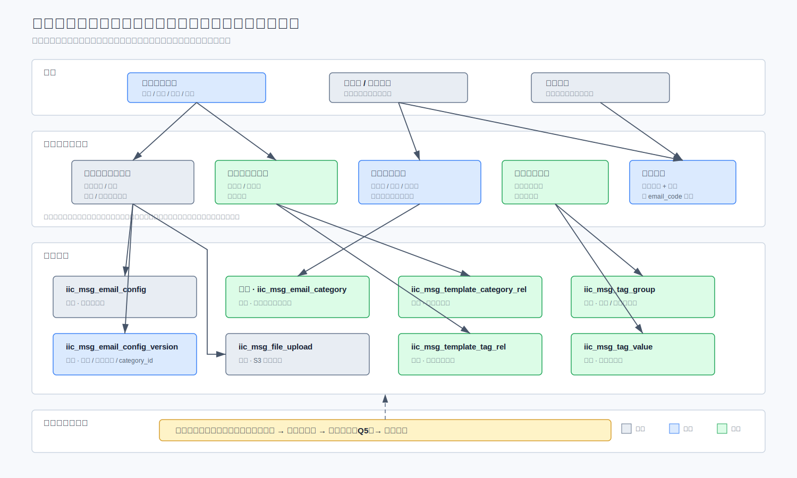
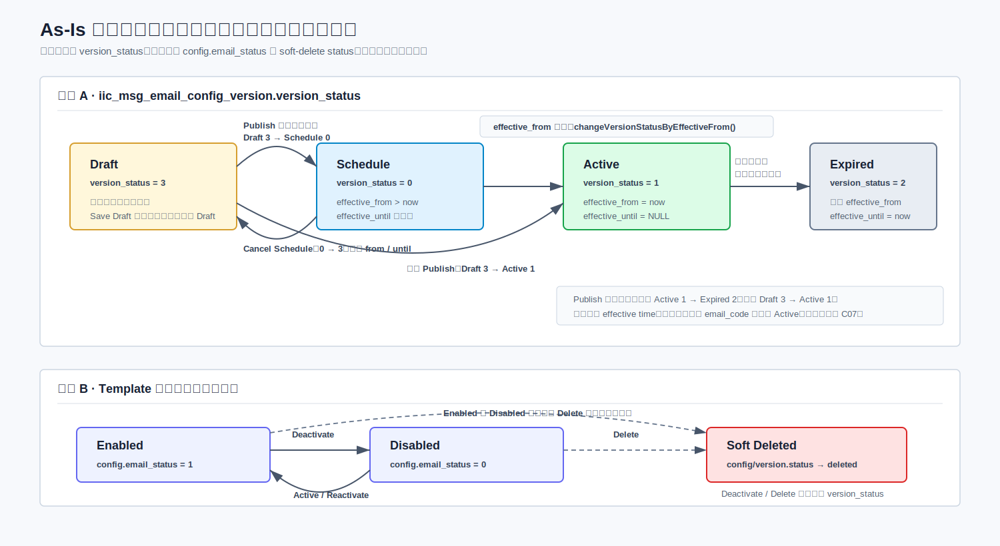
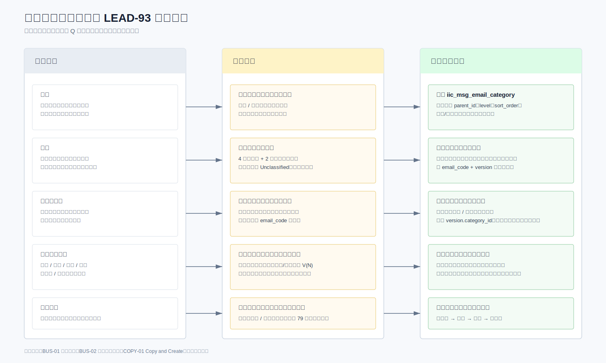
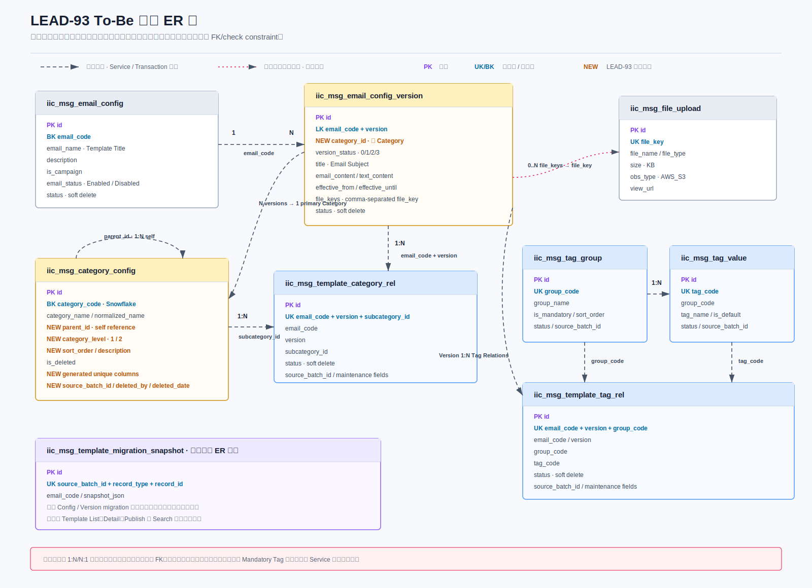
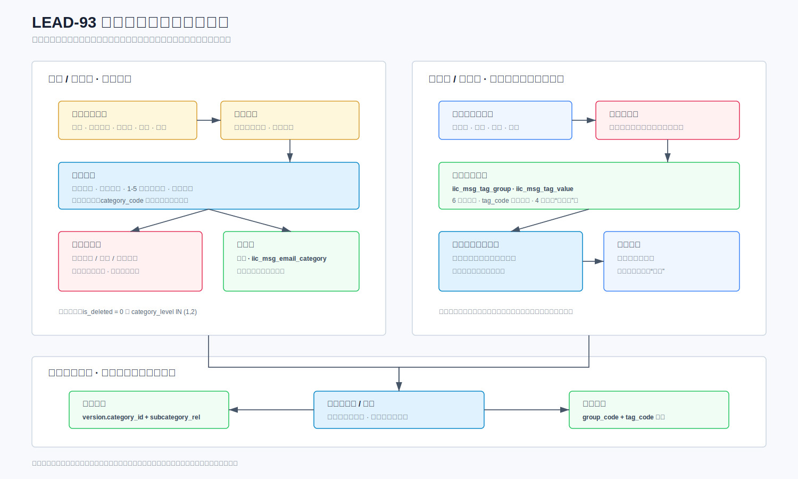
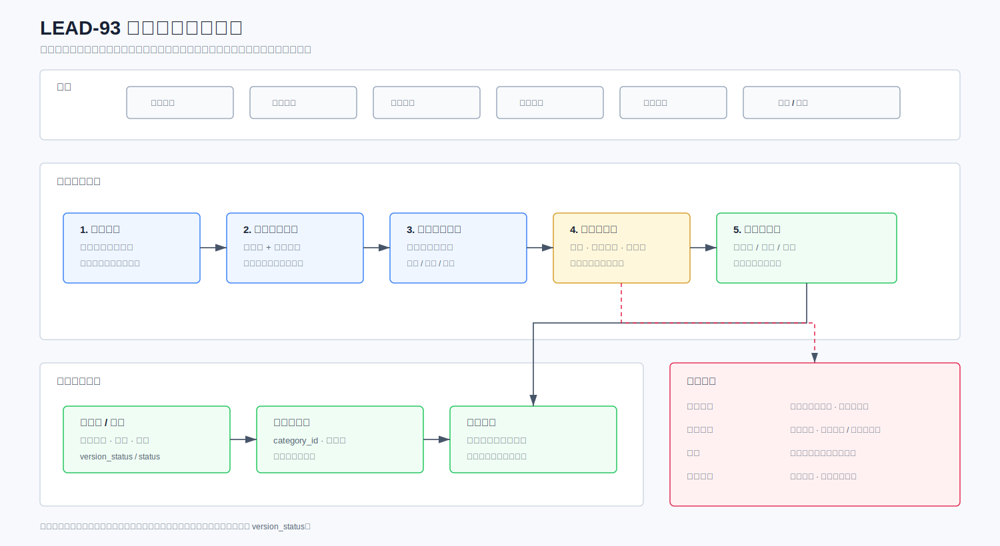
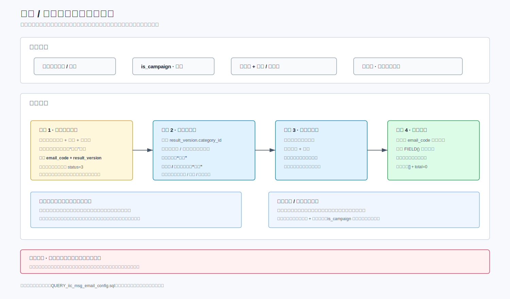
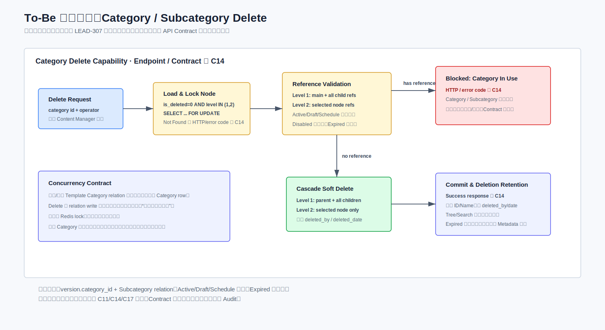

# LEAD-93 / LEAD-405 / LEAD-406 模板管理总体技术方案评审稿

> 状态：评审基线
> 需求基线：`DAE_PRD_LEAD-93 Template Management_v2.0 - updated July 21st.docx`（PRD v2.0）、2026-07-17 Jira Feature 拆分及 2026-07-21 LEAD-278 Jira/OM Copy and Create 澄清
> 交叉需求参考：`PRD_LEAD-308 Advisor-Template Management_v1.3 -updated July 20th.docx`
> 详细开发基线：[详细解决方案（V3）](LEAD-93_Template_Management_Solution_Design_CN_v3.md)  
> 统一未确认项：[未确认项与现状核对登记册](LEAD-93_Open_Questions_Register_CN.md)  
> 说明：本文用于业务分析、测试和技术团队对齐需求理解和实现范围，只保留目标状态、关键流程、实施影响和待确认项。字段、数据库脚本和完整接口约定由专项文档维护。

> 阅读提示：反引号中的英文为系统实际表名、字段名或固定取值，文档保留原名是为了与数据库和接口对照；业务含义均使用中文说明。

## 1. 本次改造工作内容

本评审覆盖 LEAD-93、LEAD-405、LEAD-406 三个 Feature 的总体架构。它们共同增强现有模板管理功能，不重建模板主记录、版本记录或生命周期状态机；目标是为 Template 增加当前 Category/Subcategory/Tag、修改历史，并新增模板专用分类与标签模型。

| Feature | 工作范围 | Story |
|---|---|---|
| LEAD-93（1 of 3） | 数据模型、分类基础和新建草稿 | LEAD-277、301、306、307 |
| LEAD-405（2 of 3） | 分类治理、Published 编辑和 Tag | LEAD-276、278、293、300 |
| LEAD-406（3 of 3） | 发布、删除、预览、搜索和迁移 | LEAD-279、296、326、327、328 |



本次会议用于对齐以下改造内容及其与现有系统的关系：

| 工作内容 | 主要说明 |
|---|---|
| Template 当前元数据 | 分类、子分类和标签按 `email_code` 保存，不随 Version 切换 |
| Template 修改历史 | 字段边界已确认；基本信息、Email/Campaign 类型、Channel、Custom Branding、Category、Subcategory、Tag、启停和删除保存完整前后快照 |
| 模板生命周期 | 保留草稿、预约、生效和过期状态流转；发布时读取当前元数据做完整校验 |
| 模板专用分类 | 新增 `iic_msg_email_category`，支持两级分类、排序和软删除 |
| 分类迁移并删除 | 删除分类或子分类时，按 Template 迁移一次当前值、逐 Template 写历史，再软删除节点并记录操作级审计 |
| 列表、搜索和筛选 | 先按现有页签规则选定结果版本；邮件主题来自该 Version，分类和标签来自 Template 当前值 |
| 接口失败约定 | 业务成功和业务失败均返回 HTTP 200；`responseCode="00000000"` 表示成功，真实失败码和提示以 QA 实测为准 |
| 复制创建模板 | 从当前最新 Active 内容预填，首次 Save Draft 原子创建独立 B 并记录内部来源；B 发布前提醒 CM 按需停用 A，附件仅复用引用 |
| 现有操作兼容 | Cancel 已保存工作副本、版本冲突、启用和停用继续复用现有机制 |
| 一次性数据迁移 | 使用暂存数据、迁移日志和校验报告；正式映射数据确认后才执行 |

**接口影响汇总**

| 接口类型 | 接口编号 | 数量 | 说明 |
|---|---|---:|---|
| 行为复用、提供 v2 路由 | `EX-06`、`EX-07`、`EX-12`、`EX-14`、`EX-15` | 5 | Web 统一调用 v2；后端复用现有 Service，v1 URL 继续供 App 和存量消费者使用 |
| v2 增强接口 | `EX-01`—`EX-05`、`EX-08`—`EX-11`、`EX-13`、`EX-16` | 11 | 增加元数据、查询、校验、独立发布入口或关系清理行为；对应 v1 保持兼容 |
| v2 新增接口 | `NEW-01`—`NEW-12` | 12 | 覆盖分类、标签、元数据、影响查询、迁移删除、批量重分配和复制创建 |
| **合计** | 现有能力 v2 化 16 个 + 新增 12 个 | **28** | Web 可调用接口全部使用 `/v2`，按 Method + Path 去重 |

2026-07-16 已在 QA 完成 As-Is 顺序回归：15 个本次交付范围内的现有接口全部覆盖，并额外验证 `queryObject/recipientList` 两个辅助查询接口；22 个调用场景均完成，HTTP、公共包络、业务码和已记录状态结果符合预期。Send Email 和 Usage Report 不在本次改造及回归范围内。该结果证明现有 Endpoint 和所覆盖行为可用，不代表未执行的生命周期分支、To-Be Metadata 或新增接口已经实现。

现有兼容边界见[v1 As-Is API 基线](LEAD-93_API_V1_AsIs_CN.md)；Web 的全部 28 个接口见[v2 前端接口约定](LEAD-93_API_Contract_Clarification_CN.md)。逐 Story 接口映射见详细解决方案第 11.1 节。

## 2. 基线与变化边界

### 2.1 保持不变

| 能力 | 当前基线 | 目标处理 |
|---|---|---|
| 主记录与版本记录 | `iic_msg_email_config` + `iic_msg_email_config_version` | 保留；主表只扩展 `category_id` 和 Copy 来源字段，版本表不改模型 |
| 生命周期 | 草稿、预约、生效、过期 | 不新增状态，不修改定时任务 |
| 保存草稿时选版 | 无版本时插入 V1；生效或仅过期且无草稿时插入 V(N+1)；预约时复用 V(N) | 保持 |
| 发布 | 立即发布转为生效；未来发布转为预约；旧生效版本按现有逻辑过期 | 保持，增加完整校验 |
| 启用与停用 | 只修改 `config.email_status` | 保持 |
| 预览与附件 | 复用现有预览组件、S3 对象存储和 `file_keys` | 预览不展示附件；附件仍可选 |
| 版本冲突 | 复用现有冲突检测 | 不新增额外锁或版本令牌 |

**保持不变的关键状态机**

本期不新增版本状态，不改变草稿、预约、生效和过期的流转方向。模板启停、软删除和版本生命周期仍是三个独立维度；Template 当前 Metadata 与 Version 生命周期解耦。



本次黑盒回归已覆盖新建 V1 草稿、更新、立即发布、启停、V2 生效与 V1 过期、Active 版本删除拒绝和模板软删除。未来预约、定时任务到点生效、Active/Expired 首次创建下一版本 Draft、Schedule 改回 Draft 和 Version Conflict 未在本轮执行；其中 Save Draft 分支已由后续内网代码证据补充确认。

正常页面由前端限制同一模板只能有一个 Draft；现有后端和数据库不强制该约束。To-Be 暂时保持现状，多 Draft 仅作为异常数据与并发风险监测，不进入正常状态机。

### 2.2 新增或修改

| 能力 | 目标变化 | 主要需求 |
|---|---|---|
| Template 当前元数据 | 主分类、子分类和标签按模板保存；每次修改写历史 | LEAD-277、301、300 |
| 分类管理 | 新增两级分类树、增删改查、排序、批量子分类和软删除 | LEAD-293、307 |
| 标签体系 | 新增 4 个必填组；每组可多选，Trigger 最多 5 个 | LEAD-277、300 |
| 模板写流程 | Save Draft 保持现状；发布读取当前 Metadata 校验；基本信息/Metadata/启停/删除写修改历史 | LEAD-278、279、296、306 |
| 复制创建模板 | 点击时只预填；首次 Save Draft 创建新 `email_code` 的 B、V1 Draft、当前 Metadata 和历史，并写 `copy_from_email_code=A`；A/B 独立发布，B 发布前仅提醒 CM 按需停用 A | LEAD-278 |
| 分类删除 | 先查看影响，再按 Template 原子迁移当前值后删除 | LEAD-307 |
| 模板读流程 | 已发布页、草稿页和详情分别选择 Version 内容，但统一返回 Template 当前 Metadata | LEAD-327 |
| 数据迁移 | 增加 Template 级映射、执行日志和校验 | LEAD-328 |

下图用于快速区分“现有能力”、“需求差异”和“本期目标改造”，避免把保持不变的生命周期误解为需要重做。



## 3. 目标方案

### 3.1 数据模型与归属



| 数据 | 存储位置 | 生命周期或关联键 |
|---|---|---|
| 模板主记录 | `iic_msg_email_config` | `email_code` |
| 模板基本信息和当前主分类 | `iic_msg_email_config` | `email_code`；新增 `category_id` |
| Copy 来源追踪 | `iic_msg_email_config.copy_from_email_code` | 普通新建为 `NULL`；Copy 时保存 A 的 `email_code`，只用于管理端发布前提醒，不形成状态或版本关系 |
| 模板内容与生命周期 | `iic_msg_email_config_version` | `email_code + version`；不增加 Metadata 字段 |
| 分类和子分类字典 | `iic_msg_email_category` | 新建模板专用两级树；数据库 `id` 是唯一持久化标识，不保存 `category_code` |
| 子分类选择 | `iic_msg_template_category_rel` | `email_code + subcategory_id` |
| 标签组和标签值 | `iic_msg_tag_group`、`iic_msg_tag_value` | 固定标签体系；Tag Value 包含可选说明 |
| 标签选择 | `iic_msg_template_tag_rel` | `email_code + tag_code`；冗余保存并校验 `group_code`，关系使用状态字段软删除 |
| Template 修改历史 | `iic_msg_email_template_change_history` | 每次成功修改保存完整 before/after 快照 |
| 分类删除审计 | `iic_msg_email_category_delete_audit` | `operation_id`；保存一次成功删除操作摘要 |

**已确认的 Template 修改历史边界**

| 处理 | 字段范围 |
|---|---|
| 写修改历史 | Template Name、Description、Email/Campaign 类型（`is_campaign`）、Channel/Channel Name、Custom Branding、Category/Subcategory/Tag、启停状态和 Template Soft Delete |
| 不写修改历史 | Email Subject、正文、附件、生效时间、`version_status`、module/scenario、发送统计、租户/国家和维护字段；Version 内容继续由 Version History 表达 |
| 展示边界 | 修改历史仅后台记录，不新增页面或查询 API；版本编辑器可展示 Template 当前 Metadata，但不得作为历史 Version 快照 |

同一 `email_code` 只有一套当前 Category/Subcategory/Tag。生效、草稿和预约 Version 共享该当前值；Save Draft、Publish、Cancel 和 Version Delete 均不复制、不切换、不清理 Metadata。

### 3.2 分类、标签与元数据管理



**分类和子分类**

- 使用专用表 `iic_msg_email_category`，只允许两级结构。
- 名称最长 100 字符；不提供 Category/Subcategory Description 字段。
- 有效名称归一化后全局唯一；软删除后允许同名重建。
- 分类单条创建；子分类支持一次创建 1-5 条，并保证全部成功或全部失败。
- 排序只允许同级、同一父分类；前端 Drop 后提交完整同级顺序，后端锁定并核对完整节点集合、更新连续顺序并在失败时要求前端刷新。
- 节点层级由 `parent_id` 推导，前端使用节点 `id`。

**标签组和标签值**

- 4 个固定标签组，均为必填；每组可多选。
- 草稿允许任意标签组为空，不生成默认标签关系；发布时再校验四个必填组。
- 不提供标签管理页面和运行时写接口；首次初始化和后续维护均使用审核后的数据库脚本。

**元数据分配**

- 元数据更新必须明确指定 `email_code`，并全量替换主分类、子分类和标签当前值。
- 修改当前元数据会立即影响查询并保持 Published；成功修改写一条完整前后快照。
- Template 已取得 `email_code` 后，页面允许修改当前 Category/Subcategory/Tag 时调用 `NEW-07` 保存当前值并更新 Library 位置；Save Draft 请求本身不接收 Metadata，Version 状态不决定 Metadata 归属。
- 主分类单选，子分类多选，标签每组多选；后端校验节点有效性和归属关系。

### 3.3 模板写入与读取流程

Version 与 Template 当前属性分开处理：正文、Subject、附件和状态按 `email_code + version` 保存；基本信息与 Metadata 按 `email_code` 保存。读取先选结果 Version，再按同一 `email_code` 组装当前 Metadata。

#### 3.3.1 模板写入



| 操作 | 目标版本或状态 | 元数据与事务结果 |
|---|---|---|
| 保存草稿 | 按现有矩阵插入或更新目标版本，结果为草稿；仅 Expired 时保留旧 V(N) 并插入 V(N+1) | 不接收或修改 Category/Tag；config 基本信息实际变化时写修改历史 |
| 立即发布 | 旧生效版本 `1 → 2`，目标草稿 `3 → 1` | 读取 Template 当前 Metadata 完整校验，不复制元数据 |
| 未来发布 | 目标草稿 `3 → 0` | `effective_from` 晚于当前时间；旧生效版本到点前保持 |
| 预约改回草稿 | 同一版本 `0 → 3` | 保留时间，不修改当前 Metadata |
| 删除版本 | 版本记录 `status → -1` | 不修改当前 Metadata |
| 删除模板 | 主记录及版本记录 `status → -1` | 保留关系供追溯，写删除历史，不重写 `version_status` |
| 启用或停用 | 只切换 `config.email_status` | 不修改版本、不重新发布，写状态变更历史 |

校验分级：保存草稿允许信息不完整；修改当前生效元数据和发布时必须满足已发布模板的完整性要求。历史生效模板在修改或重新发布时也执行完整校验。

Template Title 非空、最长 120，仅允许字母、数字、空格及 `- , . & ' ’`，Copy 场景额外允许系统生成的结尾 ` (Copy)`；禁止 HTML 和 `@ # $ %`，在同一主分类内必须唯一。Trigger 最多选择 5 个，数量上限由标签组字典返回，前后端执行同一规则。

首次发布沿用现有版本行为：同一 V1 从草稿变为生效，不额外插入 V2；发布后的 V1 出现在版本历史中。Published 模板仅修改分类、子分类或标签时直接更新 Template 当前属性并保持 Published，不修改当前生效版本。

Published 页面不提供 Edit 操作；进入其他合法编辑流程本身不写数据库，首次 Save Draft 才 Insert V(N+1) Draft。放弃编辑保持现有行为：未保存草稿的编辑只在前端丢弃，已保存的工作副本复用版本删除。Copy and Create 与 Working Copy 分开：它固定读取当前最新 Published/Active Version，点击时只预填；首次 Save Draft 调用新增接口，原子创建新 `email_code` 的 Template B 和 V1 Draft，并在 B 主记录写 `copy_from_email_code=A`。该字段只用于 B 发布前显示非阻断提醒；发布 B 不自动停用 A。若 A 保持 Active，Content Manager 和 Adviser 都看到 A、B 两条普通 Template。A/B 不建立替代、隐藏、级联状态或内容版本关系；附件只复用 `file_keys`，不复制 S3 对象。

版本编辑器可以展示 Template 当前 Metadata，但该数据按 `email_code` 读取，不是所选历史 Version 的快照，页面文案不得把它标记为历史版本属性。Template 修改历史仅在后台落库，不新增页面或查询接口；现有 Version History 继续只表达内容版本。

#### 3.3.2 模板读取



| 读取入口 | 结果版本 | 元数据 |
|---|---|---|
| 已发布页和已发布详情 | 当前生效版本 | Template 当前元数据 |
| 顾问页面 | 已启用模板的当前生效版本 | 后端强制只返回已发布模板 |
| 草稿页和工作副本编辑 | 现有草稿、预约、停用模板选版结果 | Template 当前元数据；是否允许编辑由页面权限决定，不由 Version 状态决定 |
| 预览 | 当前页面输入 | 只渲染，不持久化，不包含附件 |

搜索和筛选先执行现有页签基础查询，得到 `email_code + result_version`，再按 `email_code` 过滤当前分类、子分类和标签；Email Subject 仍来自 `result_version`。不同筛选维度之间使用“并且”，同一维度或同一标签组的多个值使用“或者”。

### 3.4 分类迁移并删除



1. 删除影响查询接口返回子节点、受影响 Template 数量和版本状态分布，仅供页面确认。
2. 正式删除命令重新查询并锁定源节点、目标节点和全部受影响 Template。
3. 存在生效/草稿/预约 Version 的 Template 只迁移一次当前 Metadata；仅有过期 Version 的 Template 不迁移。
4. 所有元数据更新成功后软删除源节点；删除一级分类时同时软删除其有效子分类。
5. 每个被迁移 Template 写一条修改历史，修改前快照保留删除时的 Template Name 和 Category/Subcategory 名称；整个删除操作写一条删除审计，二者共享 `operation_id`。
6. 任一 Template 更新影响 0 行、目标失效、关系/历史/审计写入失败时整体回滚。

| Template 的有效 Version 范围 | 处理 |
|---|---|
| 至少存在生效、草稿或预约 | 迁移一次 Template 当前值 |
| 仅有过期 | 不迁移 |
| Template 已软删除 | 不处理 |

分类删除采用已确认的总体方案：存在引用时不直接阻止操作，而是要求 Content Manager 选择有效目标节点，由后端在同一事务中完成迁移和软删除。方案中的“管理员”与 Content Manager 是同一角色，不新增独立 Admin 角色。该规则以及“Published 修改元数据后保持 Published”与 Jira 当前部分 AC 文字不同，Jira 需求文本需要同步，但不再作为技术方案开放项。

## 4. 实施影响

### 4.1 数据库变化

| 类型 | 表 | 变化 |
|---|---|---|
| 修改 | `iic_msg_email_config` | 增加当前 `category_id` 和 nullable `copy_from_email_code` |
| 新增 | `iic_msg_email_category` | 模板专用两级分类体系 |
| 新增 | `iic_msg_template_category_rel` | 模板与当前子分类多选关系 |
| 新增 | `iic_msg_tag_group`、`iic_msg_tag_value` | 固定标签体系 |
| 新增 | `iic_msg_template_tag_rel` | 模板与当前标签多选关系 |
| 新增 | `iic_msg_email_template_change_history` | 模板基本信息和 Metadata 修改历史快照 |
| 新增 | `iic_msg_email_category_delete_audit` | 分类删除操作级审计 |
| 迁移支撑 | `iic_msg_template_migration_log` | 保存一次性执行状态和数量结果；初始迁移不写 Template Change History |

完整数据库脚本以[数据库脚本索引](sql/README.md)为准。

## 5. 数据迁移方案

```text
已批准的映射数据
      ↓
暂存表与执行前检查
      ↓
分类和标签初始化
      ↓
模板当前元数据映射
      ↓
校验报告
      ↓
迁移日志：成功或失败
```

| 组件 | 职责 |
|---|---|
| 暂存表 | 保存产品负责人、业务分析批准的模板、分类和标签映射；Subject 仍可按版本映射 |
| 事务回退 | 迁移业务 DML 在同一发布事务执行，任一步失败整体回滚 |
| 迁移日志 | 独立事务记录一次性批次、状态、数量和错误摘要 |
| 校验 | 检查数量、重复数据、孤立关系、层级和必填标签完整性 |

正式映射数据未签字前不得执行迁移脚本。执行顺序、脚本就绪门禁和文件清单以[数据库脚本索引](sql/README.md)为准。

## 6. 开放项

开放项状态、负责人、冻结点和关闭记录以[未确认项与现状核对登记册](LEAD-93_Open_Questions_Register_CN.md)为准。

| 编号 | 待确认项 | 当前处理 | 影响 |
|---|---|---|---|
| BUS-01 | 79 个存量模板的分类、标签、重复和淘汰映射 | 产品负责人、业务分析和数据负责人提供并签字 | 阻塞正式迁移脚本 |

详细实现以详细解决方案（V3）、接口约定和数据库脚本索引为准；本评审稿不替代开发基线。
