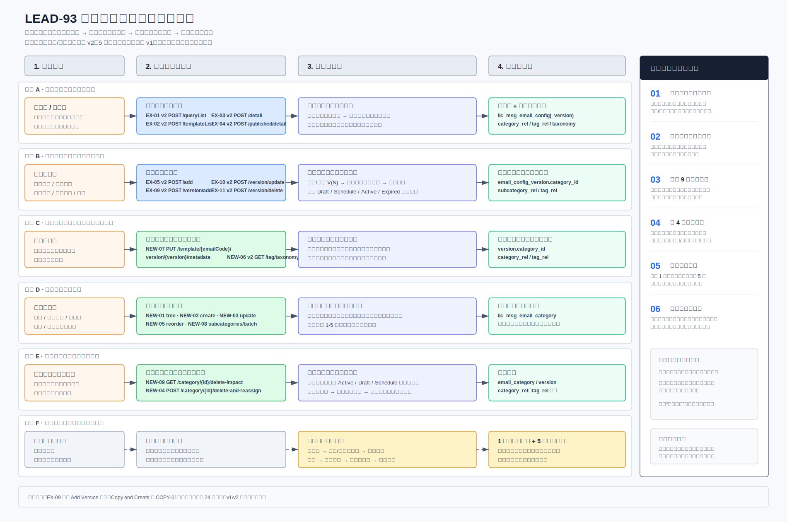

# LEAD-93 模板管理技术方案评审稿

> 状态：待评审会对齐  
> 需求基线：需求文档 v1.1（`DAE_PRD_LEAD-93 Template Management_v1 - updated July 14th.docx`）  
> 详细开发基线：[详细解决方案（V3）](LEAD-93_Template_Management_Solution_Design_CN_v3.md)  
> 统一未确认项：[未确认项与现状核对登记册](LEAD-93_Open_Questions_Register_CN.md)  
> 说明：本文用于业务分析、测试和技术团队对齐需求理解和实现范围，只保留目标状态、关键流程、实施影响和待确认项。字段、数据库脚本和完整接口约定由专项文档维护。

> 阅读提示：反引号中的英文为系统实际表名、字段名或固定取值，文档保留原名是为了与数据库和接口对照；业务含义均使用中文说明。

## 1. 本次改造工作内容

LEAD-93 是对现有模板管理功能的增强，不重建模板主记录、版本记录或生命周期状态机。目标方案是在现有模板版本上增加版本级元数据，并新增模板专用的分类、标签及关系模型。


本次会议用于对齐以下改造内容及其与现有系统的关系：

| 工作内容 | 主要说明 |
|---|---|
| 版本级元数据 | 分类、子分类和标签按 `email_code + version` 保存 |
| 模板生命周期扩展 | 保留草稿、预约、生效和过期状态流转，增加元数据写入和发布校验 |
| 模板专用分类 | 新增 `iic_msg_email_category`，支持两级分类、排序和软删除 |
| 分类迁移并删除 | 删除分类或子分类时，先迁移受影响模板版本，再软删除节点 |
| 列表、搜索和筛选 | 先按现有页签规则选定结果版本，再过滤和返回该版本的元数据 |
| 现有操作兼容 | 放弃已保存工作副本、版本冲突、启用和停用继续复用现有机制 |
| 一次性数据迁移 | 使用暂存表、快照、迁移日志和校验报告；正式映射数据确认后才执行 |

**接口影响汇总**

| 接口类型 | 接口编号 | 数量 | 说明 |
|---|---|---:|---|
| 保持不变/复用 v1 | `EX-06`、`EX-07`、`EX-12`、`EX-14`、`EX-15` | 5 | v1 接口地址和行为不变，Web 与 App 可继续调用 |
| v2 增强接口 | `EX-01`—`EX-05`、`EX-08`—`EX-11`、`EX-13` | 10 | 在 v2 增加元数据、查询、校验或关系软删除行为；对应 v1 不变 |
| v2 新增接口 | `NEW-01`—`NEW-09` | 9 | 覆盖分类、标签、元数据、影响查询和迁移删除 |
| **合计** | 现有 15 个 + 新增 9 个 | **24** | 按完整接口去重 |

2026-07-16 已在 QA 完成 As-Is 顺序回归：15 个本次交付范围内的现有接口全部覆盖，并额外验证 `queryObject/recipientList` 两个辅助查询接口；22 个调用场景均完成，HTTP、公共包络、业务码和已记录状态结果符合预期。Send Email 和 Usage Report 不在本次改造及回归范围内。该结果证明现有 Endpoint 和所覆盖行为可用，不代表未执行的生命周期分支、To-Be Metadata 或新增接口已经实现。

现有兼容边界见[v1 As-Is API 基线](LEAD-93_API_V1_AsIs_CN.md)；Web 新功能见[v2 前端接口约定](LEAD-93_API_Contract_Clarification_CN.md)。逐 Story 接口映射见详细解决方案第 11.1 节。

## 2. 基线与变化边界

### 2.1 保持不变

| 能力 | 当前基线 | 目标处理 |
|---|---|---|
| 主记录与版本记录 | `iic_msg_email_config` + `iic_msg_email_config_version` | 保留并扩展版本表 |
| 生命周期 | 草稿、预约、生效、过期 | 不新增状态，不修改定时任务 |
| 保存草稿时选版 | 无版本时插入 V1；生效版本无草稿时插入 V(N+1)；过期或预约时复用 V(N) | 保持 |
| 发布 | 立即发布转为生效；未来发布转为预约；旧生效版本按现有逻辑过期 | 保持，增加完整校验 |
| 启用与停用 | 只修改 `config.email_status` | 保持 |
| 预览与附件 | 复用现有预览组件、S3 对象存储和 `file_keys` | 预览不展示附件；附件仍可选 |
| 版本冲突 | 复用现有冲突检测 | 不新增额外锁或版本令牌 |

**保持不变的关键状态机**

本期不新增版本状态，不改变草稿、预约、生效和过期的流转方向。模板启停、软删除和版本生命周期仍是三个独立维度；LEAD-93 只在对应版本上增加元数据写入、校验和查询。


本次黑盒回归已覆盖新建 V1 草稿、更新、立即发布、启停、V2 生效与 V1 过期、Active 版本删除拒绝和模板软删除。未来预约、定时任务到点生效、Expired/Schedule 复用为 Draft、Active 首次创建 Working Copy 和 Version Conflict 未在本轮执行，仍以已确认业务规则和代码证据为基线。

### 2.2 新增或修改

| 能力 | 目标变化 | 主要需求 |
|---|---|---|
| 版本级元数据 | 主分类、子分类和标签随模板版本保存 | LEAD-277、301、300 |
| 分类管理 | 新增两级分类树、增删改查、排序、批量子分类和软删除 | LEAD-293、307 |
| 标签体系 | 新增 4 个必填组、2 个可选组，每组可多选 | LEAD-300 |
| 模板写流程 | 保存草稿、发布、删除接入元数据和统一校验 | LEAD-278、279、296、306 |
| 分类删除 | 先查看影响，再原子迁移生效、草稿、预约版本后删除 | LEAD-307 |
| 模板读流程 | 已发布页、草稿页、详情和搜索返回所选版本的元数据 | LEAD-327 |
| 数据迁移 | 增加版本级映射、快照、执行日志和校验 | LEAD-328 |

下图用于快速区分“现有能力”、“需求差异”和“本期目标改造”，避免把保持不变的生命周期误解为需要重做。


## 3. 目标方案

### 3.1 数据模型与归属


| 数据 | 存储位置 | 生命周期或关联键 |
|---|---|---|
| 模板主记录 | `iic_msg_email_config` | `email_code` |
| 模板内容和主分类 | `iic_msg_email_config_version` | `email_code + version`；新增 `category_id` |
| 分类和子分类字典 | `iic_msg_email_category` | 新建模板专用两级树 |
| 子分类选择 | `iic_msg_template_category_rel` | `email_code + version + subcategory_id` |
| 标签组和标签值 | `iic_msg_tag_group`、`iic_msg_tag_value` | 固定标签体系 |
| 标签选择 | `iic_msg_template_tag_rel` | `email_code + version + group_code + tag_code` |

生效、草稿和预约版本分别读取自身版本的元数据。创建工作副本时从当前生效版本初始化元数据，后续独立编辑。发布只切换目标版本状态，该版本已有的元数据自然成为当前有效数据。

### 3.2 分类、标签与元数据管理


**分类和子分类**

- 使用专用表 `iic_msg_email_category`，只允许两级结构。
- 有效名称归一化后全局唯一；软删除后允许同名重建。
- 分类单条创建；子分类支持一次创建 1-5 条，并保证全部成功或全部失败。
- 排序只允许同级、同一父分类，提交完整同级顺序并在一个事务中更新。
- `category_code` 由后端雪花算法生成，前端使用节点 `id`。

**标签组和标签值**

- 6 个固定标签组：4 个必填、2 个可选，每组可多选。
- 草稿缺少必填标签组时，保存该组的 `Unclassified`（未分类）。
- 不提供标签管理页面和运行时写接口；首次初始化和后续维护均使用审核后的数据库脚本。

**元数据分配**

- 元数据更新必须明确指定 `email_code + version`，并全量替换主分类、子分类和标签快照。
- 修改当前生效版本的元数据会立即影响查询；修改草稿只影响草稿，发布后才生效。
- 主分类单选，子分类多选，标签每组多选；后端校验节点有效性和归属关系。

### 3.3 模板写入与读取流程

模板的写入和读取使用同一个 `email_code + version` 作为版本边界。写入时把正文和元数据保存到目标版本；读取时先按现有规则选定结果版本，再返回该版本的正文和元数据。

#### 3.3.1 模板写入


| 操作 | 目标版本或状态 | 元数据与事务结果 |
|---|---|---|
| 保存草稿 | 按现有矩阵插入或更新 V(N)，结果为草稿 | 在同一目标版本保存分类、子分类和标签 |
| 立即发布 | 旧生效版本 `1 → 2`，目标草稿 `3 → 1` | 完整校验与状态切换原子提交，不再次复制元数据 |
| 未来发布 | 目标草稿 `3 → 0` | `effective_from` 晚于当前时间；旧生效版本到点前保持 |
| 预约改回草稿 | 同一版本 `0 → 3` | 保留时间和已保存元数据 |
| 删除版本 | 版本记录 `status → -1` | 同步软删除该版本的子分类和标签关系 |
| 删除模板 | 主记录及版本记录 `status → -1` | 同步软删除全部新增关系，不重写 `version_status` |
| 启用或停用 | 只切换 `config.email_status` | 不修改版本，不重新发布 |

校验分级：保存草稿允许信息不完整；修改当前生效元数据和发布时必须满足已发布模板的完整性要求。历史生效模板在修改或重新发布时也执行完整校验。

放弃与复制创建保持现有行为：未保存草稿的编辑只在前端丢弃；已保存的工作副本复用版本删除；复制创建只允许当前生效版本，已有草稿或预约版本时返回版本冲突。

#### 3.3.2 模板读取


| 读取入口 | 结果版本 | 元数据 |
|---|---|---|
| 已发布页和已发布详情 | 当前生效版本 | 当前生效版本的元数据 |
| 顾问页面 | 已启用模板的当前生效版本 | 后端强制只返回已发布模板 |
| 草稿页和工作副本编辑 | 现有草稿、预约、停用模板选版结果 | 对应 `result_version` 的元数据 |
| 预览 | 当前页面输入 | 只渲染，不持久化，不包含附件 |

搜索和筛选先执行现有页签基础查询，得到 `email_code + result_version`，再过滤该版本的分类、子分类和标签。不同筛选维度之间使用“并且”，同一维度或同一标签组的多个值使用“或者”。已发布页不提供状态筛选；`is_campaign` 必传，用于区分邮件模板和营销邮件模板。

### 3.4 分类迁移并删除


1. 删除影响查询接口返回子节点、模板和生效/草稿/预约版本的影响数量，仅供页面确认。
2. 正式删除命令重新查询并锁定源节点、目标节点和全部受影响版本。
3. 生效、草稿、预约版本的元数据迁移到请求指定的有效目标。
4. 所有元数据更新成功后软删除源节点；删除一级分类时同时软删除其有效子分类。
5. 任一版本更新影响 0 行、目标失效或关系数量不一致时整体回滚。

| 版本范围 | 处理 |
|---|---|
| 生效、草稿、预约 | 必须迁移 |
| 过期 | 不迁移，保留历史关系 |
| 已软删除版本 | 不处理 |

## 4. 实施影响

### 4.1 前后端交付与后端工作量



上图从页面操作、接口、后端工作包和数据库四个视角展示交付边界。后端工作量不能只按接口数量评估，还包括现有选版规则兼容、两阶段查询、跨表事务、生命周期状态、迁移脚本和一致性校验。

### 4.2 后端工作包与人天

| 后端工作包 | 前端可见结果 | 后端具体改造 | 主要接口/数据 | 关联需求 | 现有估算 |
|---|---|---|---|---|---:|
| 列表、详情、搜索与筛选 | 页签查询和详情返回同一版本的分类和标签 | 保留现有页签选版；增加版本级过滤、去重、总数、分页、排序和详情组装 | `EX-01`—`EX-04`；版本表和两张关系表 | LEAD-327 | 4 人天 |
| 模板写入与生命周期 | 保存草稿、立即/未来发布、复制创建和放弃行为一致 | 选定或创建目标版本；正文与元数据同事务写入；发布完整校验 | `EX-05`、`EX-09`—`EX-11`；版本表和关系表 | LEAD-278、279、296 | 5 人天 |
| 版本元数据与标签 | 支持指定版本的分类、子分类和标签查询/更新 | 全量替换元数据快照；校验节点有效性、父子归属和标签组 | `NEW-06`、`NEW-07`；标签字典和关系表 | LEAD-277、300、301 | 3 人天 |
| 分类和子分类管理 | 分类树、新增、重命名、排序和批量子分类可用 | 两级树规则、有效名称唯一、同级排序事务、批量 1-5 条整体回滚 | `NEW-01`—`NEW-03`、`NEW-05`、`NEW-08`；分类表 | LEAD-293、307 | 4 人天 |
| 分类影响查询与迁移删除 | 删除前可查看影响数量并选择迁移目标 | 锁定源/目标节点及受影响版本；迁移、影响行数校验和软删除原子提交 | `NEW-04`、`NEW-09`；分类、版本和关系表 | LEAD-307 | 4 人天 |
| 表结构和一次性数据迁移 | 无运行时页面；为上线准备数据 | 表结构、初始数据、版本映射、快照、迁移日志、校验和受控回退 | 1 张现有表扩展、5 张新业务表及迁移表 | LEAD-328 | 3 人天 |
| 联调与缺陷修正 | 前后端主流程可联调，现有行为不回归 | 列表、保存、发布、分类和删除主流程的集成修正 | 跨工作包 | 全部 | 2 人天 |
| **合计** |  |  |  |  | **25 人天** |

**估算判断：**25 人天可作为接口和映射数据按时冻结、现有查询与状态机无额外重构、不包含数据库管理员正式执行的情况下的压缩开发基线。当前只有 2 人天联调与缺陷修正空间，建议计划层面另保留 **5 人天风险缓冲**，不提前分摊到具体工作包。

### 4.3 数据库变化

| 类型 | 表 | 变化 |
|---|---|---|
| 修改 | `iic_msg_email_config_version` | 增加 `category_id` |
| 新增 | `iic_msg_email_category` | 模板专用两级分类体系 |
| 新增 | `iic_msg_template_category_rel` | 模板版本与子分类多选关系 |
| 新增 | `iic_msg_tag_group`、`iic_msg_tag_value` | 固定标签体系 |
| 新增 | `iic_msg_template_tag_rel` | 模板版本与标签多选关系 |
| 迁移支撑 | 迁移快照、迁移日志 | 保存修改前数据和一次性执行结果 |

完整数据库脚本以[数据库脚本索引](sql/README.md)为准。

## 5. 数据迁移方案

```text
已批准的映射数据
      ↓
暂存表与执行前检查
      ↓
迁移快照
      ↓
分类和标签初始化
      ↓
模板版本元数据映射
      ↓
校验报告
      ↓
迁移日志：成功或失败
```

| 组件 | 职责 |
|---|---|
| 暂存表 | 保存产品负责人、业务分析批准的模板、版本、分类和标签映射 |
| 快照 | 保存修改前数据，支撑受控回退 |
| 迁移日志 | 记录一次性批次、目标、动作和执行结果 |
| 校验 | 检查数量、重复数据、孤立关系、层级和必填标签完整性 |

正式映射数据未签字前不得执行迁移脚本。执行顺序、脚本就绪门禁和文件清单以[数据库脚本索引](sql/README.md)为准。

## 6. 开放项

开放项状态、负责人、冻结点和关闭记录以[未确认项与现状核对登记册](LEAD-93_Open_Questions_Register_CN.md)为准。

| 编号 | 待确认项 | 当前处理 | 影响 |
|---|---|---|---|
| REQ-01/02 | 哪些模板基本信息进入版本，以及主记录和版本记录的最终边界 | 不假设字段范围 | 阻塞对应表结构、保存、发布和迁移 |
| REQ-03/04 | 版本历史是否展示历史基本信息和元数据，以及展示字段范围 | 不扩大当前版本历史接口 | 阻塞版本历史接口和页面 |
| REQ-05/06 | 历史版本是否回填；删除分类是否迁移历史版本 | 当前只处理明确映射；过期版本暂不迁移 | 阻塞迁移映射和历史展示 |
| REQ-08 | 分类描述是否最终保留，以及页面是否展示 | 后端字段暂按可选 | 分类接口冻结前确认 |
| COPY-01 | Copy and Create 是否按当前方向复制选中版本创建新模板，以及准确复制范围 | 不与 `/version/add` 或 Working Copy 流程关联；若由后端承载则新增 v2 API，暂不计入当前 24 个接口 | 阻塞 Copy and Create 页面、接口与测试 |
| BUS-01 | 79 个存量模板的分类、标签、重复和淘汰映射 | 产品负责人、业务分析和数据负责人提供并签字 | 阻塞正式迁移脚本 |
| BUS-02 | 创建营销邮件模板后进入哪个页面管理 | 后端支持 `is_campaign=1`；前端入口待确认 | 只阻塞营销邮件前端流程 |
| BUS-03 | 过期版本复用为草稿时遇到失效元数据 | 暂按清除失效分类并补必填的 `Unclassified` | 影响边缘保存草稿分支 |
| BUS-04 | 一次性迁移覆盖哪些版本 | 候选为生效、草稿、预约；映射必须明确指定版本 | 阻塞迁移映射 |

详细实现以详细解决方案（V3）、接口约定和数据库脚本索引为准；本评审稿不替代开发基线。
