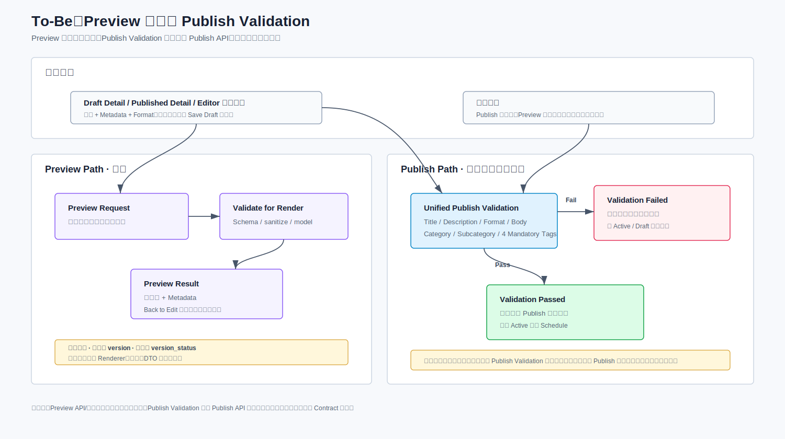
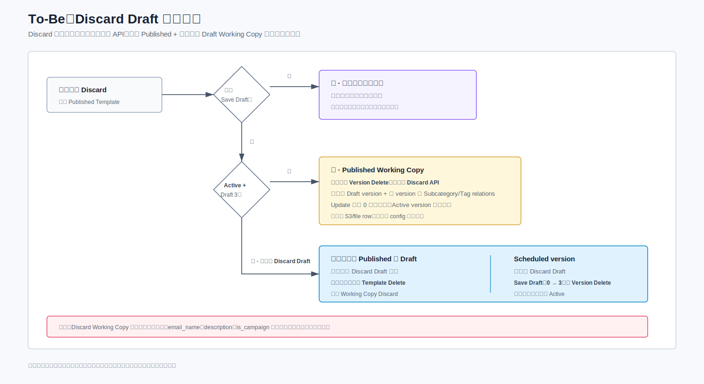
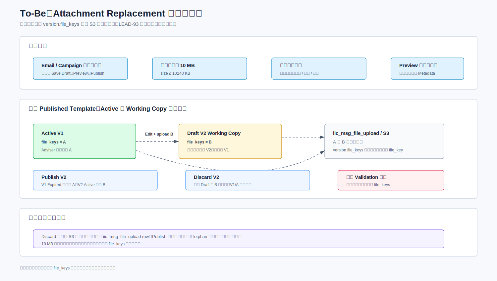

# LEAD-93 Template Management 解决方案设计文档

> 重构预览版 v2  
> 状态：Draft for Technical Review  
> 说明：本文先固化 As-Is，再做 Gap Analysis，最后给出 To-Be 设计。未确认信息统一放在“待确认项”，不作为实施基线。
> 维护约定：后续修改本文、SQL、图或渲染文件前，必须先向 TL 列出拟修改内容、依据、明确不修改的范围和仍存疑点；获得确认后再执行。

本文使用以下确定性标记：

| 标记 | 含义 | 是否可作为开发基线 |
|---|---|---|
| **已确认** | 已由 PRD、TL/BA/PO 明确答复、数据库结构或查询截图支持 | 可以，但仍需遵守相关 API/SQL 门禁 |
| **To-Be 设计约束** | 本文确定的目标技术行为，不代表现有代码已经具备 | 对目标行为有效；实现方式仍需内网核对 |
| **待业务确认（Qxx）** | 需要 BA/PO/TL/DBA 作出业务或数据决策 | 不可以 |
| **待内网核对（Cxx）** | 需要由内网代码、配置或真实数据库证明 | 不可以据此猜测现有实现 |
| **候选/阻塞** | SQL、索引、端点或错误码模板尚未达到可部署状态 | 不可以进入开发或部署基线 |

## 1. 文档目的

本文描述 LEAD-93 Template Management 在现有 DAE 系统上的改造方案，目标是：

- 清楚说明当前 Template 数据模型、版本生命周期、页面查询和核心操作行为。
- 对比 PRD 目标，明确新增能力和现有能力之间的差异。
- 在保留现有模板主表、版本表和生命周期机制的前提下，设计 Category/Subcategory、Tag、Search/Filter 和 Migration 方案。
- 为开发拆分、数据库变更、API 联调、测试和上线提供统一技术基线。

## 2. 结论摘要

本项目应定义为“现有 Template Management 能力增强”，不是新建模板系统。

核心设计结论如下：

1. 保留 `iic_msg_email_config` 和 `iic_msg_email_config_version`，不重建 Template 主模型和版本状态机。
2. `email_code` 继续作为逻辑模板的业务标识；Category/Subcategory/Tag metadata 按 `email_code + version` 随内容版本保存，支持 Active 与 Draft/Schedule 同时拥有不同 metadata。
3. 复用并改造 `iic_msg_category_config`，承载 Template Category/Subcategory 两级 taxonomy。
4. 在 `iic_msg_email_config_version` 增加 `category_id`；新增 Subcategory Relation、Tag Group、Tag Value 和 Template Tag Relation 表，不新增独立 Template Metadata 表。
5. Published/Draft Tab 保留，Content Manager 保留 Status Filter 能力，但 Published Tab 不展示/不允许选择 Status Filter；搜索在现有 Tab 基础查询上叠加 Category、Tag、`is_campaign` 等条件。
6. 不新增数据库外键和 check constraint；关系完整性、层级合法性和必填校验由 Service 层保证。
7. 初始 Category、Tag 及存量模板映射由幂等 SQL 上线，DBA 执行；Tag 后续仍只允许通过 DB 脚本维护。

## 3. As-Is 现状分析

### 3.1 当前数据模型

当前 Template 由主表与版本表共同构成：

| 表 | 当前职责 | 关键字段 |
|---|---|---|
| `iic_msg_email_config` | 逻辑模板主记录、启停状态和软删除状态 | `email_code`, `email_name`, `email_status`, `status`, `is_campaign` |
| `iic_msg_email_config_version` | 模板正文、附件引用、版本和生效状态 | `email_code`, `version`, `version_status`, `effective_from`, `effective_until`, `email_content`, `file_keys`, `status` |
| `iic_msg_file_upload` | 附件元数据及 S3 文件引用 | `file_key`, `file_name`, `file_type`, `size`, `obs_type`, `view_url` |
| `iic_msg_category_config` | 现有消息类别配置 | `category_code`, `category_name`, `tenant_id`, `dae_country_code`, `is_deleted`, `flag` |

当前没有数据库外键。表间业务关系由应用代码维护。

#### 3.1.1 Master 与 Version 字段归属

- `iic_msg_email_config` 表示逻辑模板，保存名称、描述、Email/Campaign 类型、启停和软删除状态。
- `iic_msg_email_config_version` 表示内容版本，保存 Subject、正文、附件引用、生效时间和版本生命周期状态。
- 同一 `email_code` 可以同时存在一个 Active 和一个 Draft Working Copy；Draft 不影响当前 Active 内容。
- Publish 主要修改 version row；Deactivate/Active 只修改 config `email_status`；Delete 软删除 config 和所有 version，但不重写 `version_status`。

### 3.2 Template Identity

`email_code` 是邮件模板的业务标识编码，由后端使用 Snowflake 算法生成，现有业务查询、更新和关联都依赖该字段。

设计约束：

- LEAD-93 不改变 `email_code` 的业务含义和生成方式。
- 新增表使用 `email_code` 关联逻辑模板，不使用 version row `id` 作为 Template Identity。
- Search/Filter 返回结果按 `email_code` 去重。
- 新建模板首次 Save Draft 时由后端生成 `email_code`；更新请求使用已有 `email_code` 定位逻辑模板。真实 Controller/Service 分支和请求字段仍需 C05 定位，但生成责任不再待确认。
- 逻辑唯一性由服务和数据校验保证；不假设历史物理数据天然无重复。

### 3.3 状态字段语义

#### 3.3.1 主表状态

| 字段 | 值 | 含义 | 影响 |
|---|---:|---|---|
| `iic_msg_email_config.status` | `0` | 有效 | 记录可参与正常业务查询 |
| `iic_msg_email_config.status` | `-1` | 已软删除 | 从正常业务查询排除 |
| `iic_msg_email_config.email_status` | `1` | Enabled | 可出现在 Published 可用集合中 |
| `iic_msg_email_config.email_status` | `0` | Disabled | Deactivate 后的模板状态 |

#### 3.3.2 版本状态

| `version_status` | 状态 | 时间字段 | 触发方式 |
|---:|---|---|---|
| `0` | Schedule | 用户在 Publish 时指定未来 `effective_from`；不设置 `effective_until` | Publish 选择未来时间后进入；定时任务到点触发 |
| `1` | Active | `effective_from = now`；`effective_until = NULL` | Publish 或 `changeVersionStatusByEffectiveFrom()` 触发 |
| `2` | Expired | 保留原 `effective_from`；`effective_until = now` | 新版本发布或定时任务触发 |
| `3` | Draft | As-Is Save Draft 可保存用户输入的 `effective_from/effective_until`，但无论时间是否在未来都保持 Draft | 不参与自动状态流转 |

#### 3.3.3 数据快照佐证

以下数量来自本次数据库查询截图，只用于证明状态组合真实存在，不是长期容量或业务约束：

| 表 | 状态组合 | 样本数量 |
|---|---|---:|
| `iic_msg_email_config` | `status=-1, email_status=0` | 54 |
| `iic_msg_email_config` | `status=0, email_status=1` | 228 |
| `iic_msg_email_config` | `status=0, email_status=0` | 52 |
| `iic_msg_email_config` | `status=-1, email_status=1` | 6 |
| `iic_msg_email_config_version` | `version_status=2, status=-1` | 49 |
| `iic_msg_email_config_version` | `version_status=1, status=-1` | 59 |
| `iic_msg_email_config_version` | `version_status=2, status=0` | 329 |
| `iic_msg_email_config_version` | `version_status=0, status=-1` | 3 |
| `iic_msg_email_config_version` | `version_status=1, status=0` | 250 |
| `iic_msg_email_config_version` | `version_status=3, status=0` | 20 |
| `iic_msg_email_config_version` | `version_status=3, status=-1` | 14 |

该快照进一步说明：`status` 与 `version_status` 是独立维度，软删除记录仍保留原生命周期值；不能用一个字段替代另一个字段。

### 3.4 当前状态流转

需要明确区分两类状态：

- `version_status` 描述内容版本的 Draft、Schedule、Active、Expired 生命周期。
- `email_status` 和 `status` 描述逻辑模板是否启用、是否软删除。

Deactivate 和 Delete 均不改变任何 version row 的 `version_status`。

### 3.5 当前页面 Tab 查询

#### 3.5.1 Published Tab

现有 Published list 的核心条件为 `version_status = 1`、`config.status = 0`、`config.email_status = 1`、`config.is_campaign != 1`。这些条件已由查询结果确认；完整 As-Is Mapper、Count、排序、分页和 tenant/country 条件仍待 C02 内网回填。[QUERY_iic_msg_email_config.sql](sql/QUERY_iic_msg_email_config.sql) 是 To-Be 增量设计，不作为 As-Is 代码证据。

说明：

- `version.version_status = 1` 是现有 Published 查询和版本语义上的 Active 条件。
- `version_status = 1` 是版本语义上的 Active 状态，用于发布状态流转。
- 理论上一个 `email_code` 可能出现多个 `version_status = 1`，但现有代码保证不会发生，本期不新增状态机约束。

#### 3.5.2 Draft Tab

现有 Draft Tab 由 `email_status = 0`、非 V1 的 Draft/Schedule，以及 V1 的 Draft/Schedule 三个 OR 分支组成。三个分支已确认，但完整括号、软删除、Count、排序、分页和最终选版仍待 C03/C04 内网回填；不得用 To-Be SQL 反推 As-Is 实现。

因此 Draft Tab 不是简单的 `version_status = 3`，还包含 Schedule 记录和部分 Disabled 模板。LEAD-93 Search/Filter 必须复用这套现有查询语义。

#### 3.5.3 Published/Draft 查询对照图

Published 条件已能够确定返回 Active version。Draft 的三个 OR 分支已经确认，但完整 Mapper 括号、List/Count 条件和多 version 共存时的最终选版仍属于 C03/C04 内网核对内容，本文不作推测。

### 3.6 当前核心操作行为

本节只作为 As-Is 事实基线，详细场景差异见第 5.2 节。

| 操作 | 当前数据库行为 | 状态变化 | 明确不修改 |
|---|---|---|---|
| Save Draft | V1 不存在则 Insert V1；已有 Draft 则 Update 该 Draft；已有 Active/Expired 且无 Draft 则 Insert 下一版本 Draft；Schedule 期间禁止 Save Draft，必须先 Cancel Schedule | 始终保持 `version_status = 3`；As-Is 可把用户输入的 `effective_from/effective_until` 保存在 Draft row，不会因此转为 Schedule | 当前 Active 内容 |
| Cancel Schedule | 更新原 Scheduled version，不创建新 version | `version_status: 0 → 3`；`effective_from = NULL`；`effective_until = NULL` | 旧 Active 和 Template Identity |
| Publish Now | 更新新旧 version 和 effective time；实际事务入口待 C07 核对 | 旧 Active `1 → 2`；目标 Draft `3 → 1`；新 Active 的 `effective_from = now`、`effective_until = NULL` | `config.email_status` |
| Scheduled Activation | Java 定时任务 `changeVersionStatusByEffectiveFrom()` 处理到期版本 | Schedule `0 → 1`；旧 Active `1 → 2` | Template Identity |
| Deactivate | 只更新 `iic_msg_email_config.email_status: 1 → 0` | version 仍保持原 `version_status` | config `status` 和所有 version `version_status` |
| Delete | config 与该模板所有 version 级联软删除 | 修改 config/version 的软删除 `status` | 所有 version `version_status` |

本期保持现有 version control，不引入 Redis lock；Delete 不提供一键恢复。

### 3.7 当前附件机制

- 附件存储到 S3，文件元数据位于 `iic_msg_file_upload`。
- 单个附件最大 10 MB，对应现有 `size` 字段口径为 `size <= 10240 KB`。
- 附件格式维持现状，但明确排除多媒体、视频和音频。
- LEAD-93 不改变正文版本通过 `file_keys` 引用附件的方式。

### 3.8 As-Is 完整度与证据边界

当前材料已经足以描述数据库模型、状态值和核心业务结果，但尚不足以把代码级实现写成已确认事实。系统现状必须分为以下两个层次：

| 现状主题 | 当前完整度 | 已确认内容 | 尚缺证据 |
|---|---|---|---|
| 数据库表和字段 | 基本完整 | config/version/category/file 表结构及主要字段与 `message_structure.sql` 一致 | Entity/Mapper 映射和部署环境索引仍需 C13 核对 |
| Template Identity | 业务语义完整 | `email_code` 为后端生成的 Snowflake 业务 ID，查询、更新和关联依赖该字段 | 新建/更新 API 的真实入口和分支代码，见 C05 |
| 状态值和数据库流转 | 业务结果完整 | Draft/Schedule/Active/Expired、Deactivate、Delete 的字段变化 | Service 执行顺序、事务、锁、失败恢复和错误码，见 C06-C09 |
| Published/Draft Tab | 条件摘要完整 | Published 核心条件和 Draft 三个 OR 分支 | 完整括号、List/Count、排序、分页、软删除及 tenant/country 条件，见 C02-C03 |
| 返回 Version | 不完整 | Published 使用 Active；Draft 包含 Draft/Schedule/Disabled | Active+Draft、Active+Schedule 等组合最终返回哪个 version，见 C04 |
| Detail 字段来源 | 部分完整 | Template Title=`config.email_name`，Email Subject=`version.title`，Description=`config.description`；内容与附件位于 version | Active/Draft/Schedule 共存时的选版规则，见 C04 |
| 附件 | 业务边界完整 | S3、`file_keys`、10 MB、排除多媒体/视频/音频；格式和大小由前端校验；Discard 不清理 S3/file row | 真实上传/删除 API 仍需 C10 定位，但不产生后端校验或清理改造 |
| Preview | 复用方向完整 | 复用现有 Preview/Renderer；只预览正文和 metadata，不支持附件 | 真实入口、DTO 和错误响应仍需 C16 定位 |
| 权限和 API 规范 | 不完整 | 后端强制权限与数据范围已确认；除 LEAD-307 删除留痕外不新增通用 Audit | 真实权限表达式、数据范围、URL/DTO/错误码，见 C11、C14 |

因此，第 3.1-3.7 节可作为“数据库与业务行为 As-Is 基线”；不能据此声称 API Contract、Mapper SQL、事务并发和权限实现已经完整。补齐这些工程事实不需要重新讨论已确认业务规则，但必须完成第 18 章内网代码回填。

## 4. 新需求摘要

LEAD-93 在保留现有 Template 主模型、版本生命周期和附件机制的基础上增加以下能力：

| 能力域 | 新需求 | 关键业务规则 | 主要影响范围 | 验收关注点 |
|---|---|---|---|---|
| Category/Subcategory | 提供可管理的两级 Template 分类树 | 仅允许两级；名称在 Template taxonomy 内全局唯一；Subcategory 必须归属有效 Category；支持创建、编辑、排序和受控软删除 | 前端管理页面、Category API、`iic_msg_category_config` 改造 | 层级合法、全局重名、删除引用、级联软删除、排序稳定 |
| Tag Taxonomy | 提供固定 Tag Group 和 Tag Value | 4 个必填组、2 个可选组；Draft 缺失必填值时使用 `Unclassified`；不提供 Tag 管理 UI | Tag 只读 API、新增 Tag 字典表、DBA seed | 固定值完整、必填组校验、上线后仅 DB 脚本维护 |
| Template Metadata | 建立 Template Version 与主 Category、Subcategory、Tag 的结构化关系 | 主 Category 直接存入 version row；Subcategory/Tag 按 `email_code + version` 保存；不新增独立 metadata 状态 | 扩展 version 表、Save Draft/Publish/编辑流程、新增 relation 表 | 同版本关系一致、无孤儿和重复关系 |
| Search/Filter | 支持按 PRD 定义的 Title、Description、Tag Name 关键词，以及 Category、Subcategory、6 个 Tag Group、Status、`is_campaign` 组合查询 | `is_campaign` 为必传；Published Tab 禁用 Status Filter；跨维度 AND，同维度 OR/ANY；关联当前结果 version 的 metadata | 列表 API、Mapper SQL、前端筛选器和索引 | 关键词范围不超出 PRD、版本 metadata 匹配正确、Count 与分页准确 |
| Published 编辑 | 编辑 Published Template 时区分直接 metadata-only 变更与 Draft Working Copy 变更 | 直接修改 Active 版本 metadata 时立即生效；通过 Draft 保存的 metadata 只对 Draft 生效，Publish 后再替换 Active metadata | 编辑页面、Save Draft、metadata API、Publish validation | Active 内容不中断、Working Copy 隔离、Discard 边界明确 |
| Template 可见性 | 统一 Content Manager Tab 与 Adviser View 的可见性规则 | Adviser 只能读取 Enabled + Active Published 内容；Draft/Schedule 不可见；Deactivate/Delete 保持现有生命周期语义 | Published/Draft 查询、Adviser 查询、权限控制 | 不可通过参数绕过 Published-only；Deactivate 后不可见 |
| Publish Validation | 发布前增加 Title、Description、Category、Mandatory Tag 和正文完整性校验 | 附件不必填且由前端校验；后端不新增附件校验；业务校验失败不修改旧 Active | Publish API、定时任务、错误响应 | 状态更新原子、旧 Active 安全、错误信息可定位 |
| Migration | 对存量模板进行分类、标签映射和必要的数据清理 | PO/BA 提供 79 个模板的保留/合并/淘汰与映射；DBA 执行幂等、可校验、可回滚 SQL | Staging、DDL/DML/QUERY、上线流程 | 数量对账、重复/孤儿检查、Mandatory Tag 完整、批次可追踪 |
| 附件约束 | 延续 S3 和 `file_keys` 机制并收紧文件边界 | Email/Campaign 附件均为可选；单个附件最大 10 MB；维持现有格式能力，排除多媒体、视频和音频 | 前端校验、复用现有附件接口、测试 | 不上传附件可正常发布；非法文件在前端阻止提交 |

明确不在本期范围：

| 排除项 | 本期处理原则 |
|---|---|
| 重建 Template 主表和版本表 | 继续复用 `iic_msg_email_config` 和 `iic_msg_email_config_version` |
| 重写 Draft/Published 状态机 | 保留 Draft、Schedule、Active、Expired 及现有 version control |
| Tag 管理 UI | Tag 首次固定 seed，后续仅通过受控 DB 脚本维护 |
| Redis 分布式锁 | 保持现有并发/version 控制机制 |
| Elasticsearch | 本期使用数据库查询；数据量显著增长后再评估 |
| 一键恢复已删除模板 | Delete 继续按现有软删除语义，不提供业务恢复入口 |
| 多媒体、视频和音频附件 | 明确禁止上传和发布 |

## 5. Gap Analysis

### 5.1 能力差异总览

| 能力 | As-Is | LEAD-93 Gap | 设计决策 |
|---|---|---|---|
| Category | 有通用类别表，无 Template 两级层级及关系 | 需要 Category/Subcategory 管理 | 改造 `iic_msg_category_config` |
| Tag | 无 Template 固定标签体系 | 需要固定组和值及模板关联 | 新增 Tag 字典和关系表，SQL seed |
| Template Metadata | 核心字段分布于主表/版本表 | Version 缺少主 Category，且没有 Subcategory/Tag 结构化关系 | version 表增加 `category_id`，新增 Subcategory/Tag 关系表 |
| Search/Filter | Published/Draft 各自有复杂过滤 | 需要组合过滤但不能改变存量语义 | 复用 Tab Base Query 后扩展 join |
| Lifecycle / Effective Time | Save Draft 保存 `effective_from/effective_until` 但始终保持 Draft；只有执行 Publish 才根据未来 `effective_from` 转为 Schedule | 无生命周期或 effective-time 行为 Gap；LEAD-93 只需把版本 metadata 原子接入现有 Save Draft/Publish/Cancel 流程 | Save Draft、Publish→Schedule、Cancel Schedule 和定时任务全部保持现状，不修改状态触发边界 |
| Migration | 无新 taxonomy 映射 | 需初始化及映射存量模板 | DBA 执行幂等 SQL 和校验报告 |

Gap 结论的确定性边界：

| 能力域 | 已确认差异/方向 | 仍未确认，不能据此实施 |
|---|---|---|
| Category | 复用现有表；有效条件固定为 `is_deleted=0 AND category_level IN (1,2)`；有效节点名称全局唯一；软删除后可同名重建；Active/Draft/Schedule 引用阻止删除，Expired 不阻止 | 权限/API/复用能力 C11/C14/C17 |
| Tag/Metadata | metadata 随 version 保存；主 Category 在 version，Subcategory/Tag 使用版本关系表；仅展示当前 Active metadata；创建 Draft 时从 Active 复制后独立维护 | migration mapping Q5 |
| Search/Filter | `is_campaign` 必传、Published 禁用 Status Filter、同维度 OR/ANY、跨维度 AND；Template Title 使用 `config.email_name` | 完整 Tab SQL 和 result version C02-C04、API 参数行为 C14 |
| Lifecycle | As-Is 与 To-Be 完全一致：Save Draft 保存时间但保持 Draft；Publish 决定立即/预约；Schedule 期间禁止 Save Draft；Cancel Schedule 恢复 Draft | Save/Publish Service、事务和并发 C05-C07；Cancel Contract C08/C14。Scheduler 不改，仅做上线前回归 |
| Preview/附件 | Preview 复用现有能力且只含正文和 metadata；附件可选、前端校验 10 MB 和格式；Discard 不清理 S3/file row | 仅需 C10/C16 回填真实 API/DTO，不构成业务或设计门禁 |
| Migration | DBA 执行幂等、可校验、可回滚脚本 | 79 个模板映射 Q5、执行窗口和发布控制 C15 |

### 5.2 场景状态机对比

本节对比各业务场景的 As-Is 基线、To-Be 保持项及新增差异。对于生命周期及生效时间规则，To-Be 保持现状；LEAD-93 主要新增版本级 Metadata、发布校验及事务一致性处理。第 9 章不再重复状态对比，只定义 To-Be 实现规则。

#### 5.2.1 新建、保存草稿与发布

本场景的生命周期没有 As-Is/To-Be 状态差异，因此图中只保留一条共同状态机，并单独对比状态流转外围的数据和校验变化。To-Be 的核心增量是：Save Draft 将版本级 Metadata 与内容一起保存；Publish 增加 Metadata 完整性校验，并要求内容、状态和 Metadata 在同一事务内一致提交。

业务流转边界、`email_code` 后端生成和 Insert/Update 结果矩阵已确认；真实 Save/Publish Service、事务和并发仍受 C05-C07 约束，Cancel Schedule Contract 受 C08/C14 约束。Scheduler 不属于开发阻塞项。

#### 5.2.2 编辑 Published、Working Copy、Discard 与重新发布

本场景继续使用第 3.4 节的 Active/Draft/Schedule/Expired 状态结果：Active 与 Draft Working Copy 可共存，Discard 不影响 Active，Publish 才切换新旧版本。To-Be 差异仅包括 Working Copy 同步承载版本级 Metadata、Publish/Discard 对新增关系数据的一致处理，以及由 Active + Draft 组合派生 “Draft in Progress” 提示；不新增生命周期状态。

Active/Draft 隔离、Discard 和发布结果已确认；Discard 不清理附件，事务入口、冲突响应和正式 Contract 仍受 C06/C07/C14 阻塞。

#### 5.2.3 Deactivate 与 Delete

本场景的 As-Is 基线直接复用第 3.4 节 Template 可用性与软删除泳道。Deactivate/Active 的 To-Be 保持现有数据库语义：只切换 `config.email_status`，不修改任何 version row 的 `version_status`；页面状态由 config 与 version 组合派生。唯一的数据范围差异是 Delete 需要同步软删除新增的 Subcategory/Tag relations；主 Category 位于 version row，随 version 软删除，但不得删除 Category taxonomy 节点。

真实 API、Mapper、幂等行为和权限仍待 C09/C11/C14，不影响上述数据库结果。

#### 5.2.4 Category、Subcategory 与 Tag 元数据修改

As-Is 只确认 Template Master 与 Version 的字段归属，现有系统没有已确认的 Template Category/Subcategory/Tag 版本关系，因此不构造现状 Metadata 状态机。To-Be 新增 Metadata 按 `email_code + version` 保存：页面只展示当前 Active metadata；首次创建 Working Copy 时从 Active 复制到 Draft，之后两者独立维护；Draft/Schedule Metadata 在对应版本生效前不影响 Active。

版本归属、Draft 初始化复制及 Active/Draft 生效边界已确认；真实 Metadata API 仍待 C14 回填。

#### 5.2.5 页面状态派生

As-Is 查询部分直接复用第 3.5 节：Published Tab 使用已确认的 Active 硬编码条件，Draft Tab 保留 Disabled、Draft、Schedule 三类语义和三个 OR 分支。To-Be 只在现有 Tab base query 上叠加 `is_campaign`、Category/Subcategory、Tag 和 Keyword 条件，并由 Active + Draft 组合显示 “Draft in Progress”；不得把 Draft Tab 简化为 `version_status = 3`，也不得新增独立数据库状态。

最终页面选版、完整组合查询和 List/Count 一致性仍待 C02-C04，Active/Deactivate 页面调用链仍待 C09。

#### 5.2.6 Category/Subcategory 生命周期

As-Is 只确认 `iic_msg_category_config` 是可复用的通用 Category 表，没有证据表明现有系统具备 Template 两级 taxonomy、版本关系或引用保护流程，因此本场景不存在可复用的 As-Is 状态机。图中 To-Be 流程整体属于新增能力，重点展示 Active/Draft/Schedule 引用阻止删除、Expired 不阻止、无阻塞引用时级联软删除，以及软删除后同名重建。

两级结构、有效条件、全局名称唯一、软删除后同名重建及引用保护规则均已确认；权限/API 和可复用代码仍待 C11/C14/C17。

## 6. 设计原则

1. **Backward Compatible**：不改变现有 Published/Draft Tab 的基础返回语义。
2. **Lifecycle Preserved**：不重写 version lifecycle，不修改 Deactivate/Delete 语义。
3. **Version-Aligned Metadata**：`email_code` 标识逻辑模板，`email_code + version` 标识 metadata 所属内容版本。
4. **Service-Enforced Integrity**：由于不允许新增 FK/check constraint，完整性由 Service 层和事务保证。
5. **Controlled Taxonomy**：Category 由管理 API 维护；Tag 只通过受控 SQL seed/patch 维护。
6. **Controlled Migration**：Schema DDL 由版本化脚本单次执行；seed 和 mapping DML 必须幂等、可校验、可追踪。

## 7. To-Be 总体方案

目标方案分为三层：

- UI/API 层增加 Category、Tag、Metadata 和 Search 能力。
- Template Lifecycle Service 继续负责 Save Draft、Publish、Deactivate 和 Delete。
- 数据层复用 Template Master、Version 和 File 表；Version 增加 `category_id`，同时改造 Category 表并新增 relation/tag 表。

图中的 Service/API 方框表示逻辑能力边界，不代表已经确认要新增同名 Java Service、Controller 或独立部署模块；实际类、方法和复用关系必须由 C01/C17 内网核对后确定。

## 8. To-Be 数据库设计

### 8.1 数据库设计全景

本节先用三种视角建立数据库设计直觉，再进入逐表字段和 SQL：

1. **改造范围全景图**回答哪些表复用、修改或新增。
2. **逻辑 ER 图**回答表之间通过哪些业务键关联，以及业务基数是什么。
3. **版本级 Metadata 实例图**回答 Active 与 Draft/Schedule 如何隔离，以及 Draft 如何从 Active 初始化 Metadata。

#### 8.1.1 数据库改造范围

颜色只表示数据库改造类型，不表示 Template 生命周期状态：灰色为 Existing/Reused，黄色为 Existing/Changed，蓝色为 New，紫色为 Migration Support。核心改造路径是 `Template Master → Template Version → Version-Aligned Metadata`；`iic_msg_file_upload` 继续沿用现有附件引用方式，Migration Snapshot 不参与运行时查询。

#### 8.1.2 To-Be 逻辑 ER 图

ER 图中的 `1:N`、`N:1` 表示业务基数，不表示数据库已经存在物理 FK。本方案明确不新增 FK/check constraint，图中虚线关系由 Service 层校验，并由业务事务保证一致性：

- `iic_msg_email_config.email_code` 与多个 version row 建立逻辑一对多关系。
- `version.category_id` 指向主 Category；`iic_msg_template_category_rel` 保存同一 version 的多个 Subcategory。
- `iic_msg_template_tag_rel` 按 version 保存每个 Tag Group 的选择，`group_code` 和 `tag_code` 分别关联固定字典。
- `version.file_keys` 仍是逗号分隔的现有附件引用，不在本期重构为标准关系表。
- Migration Snapshot 只保存上线前 Config/Version JSON 快照，不是运行时 Template ER 模型的一部分。

#### 8.1.3 版本级 Metadata 数据实例

同一 `email_code` 下，Active V1 与 Draft/Schedule V2 分别通过自己的 `email_code + version` 保存 Category、Subcategory 和 Tag。创建 Draft V2 时从当前 Active V1 复制 Metadata，后续独立编辑；Publish 不再次复制 Metadata，而是切换目标 version row 的 `version_status`，其既有关联自然成为新的当前 Metadata。Expired version 数据保留，但产品/API 不提供其 Metadata 查看。

该实例也说明为什么主 Category 直接扩展到 version 表比新建 1:1 Metadata 表更合适：Category 与内容具有同一版本生命周期，Draft 初始化、状态切换、Discard 和 Delete 都可以复用 version row 的既有边界。

#### 8.1.4 表变更总览

| 表 | 类型 | 用途 | 业务键/关联键 |
|---|---|---|---|
| `iic_msg_email_config` | Existing / Reused | Template Master | `email_code` |
| `iic_msg_email_config_version` | Existing / Changed | Template Version / Content / 主 Category | `email_code`, `version` |
| `iic_msg_file_upload` | Existing / Reused | S3 附件元数据 | `file_key` |
| `iic_msg_category_config` | Existing / Changed | Category/Subcategory taxonomy | `id`, `category_code` |
| `iic_msg_template_category_rel` | New | Template Version 与 Subcategory 多选关系 | `email_code`, `version`, `subcategory_id` |
| `iic_msg_tag_group` | New | Tag 分组字典 | `group_code` unique |
| `iic_msg_tag_value` | New | Tag 值字典 | `group_code`, `tag_code` |
| `iic_msg_template_tag_rel` | New | Template Version 与 Tag 关系 | `email_code`, `version`, `group_code` unique |
| `iic_msg_template_migration_snapshot` | New | Migration 前快照及回滚依据 | `source_batch_id`, `record_type`, `record_id` |

### 8.2 `iic_msg_category_config` 改造

**已确认复用现有表。** To-Be 新增以下字段；字段类型和索引仍需 DBA 结合内网实际 DDL 做最终确认：

| 字段 | 用途 |
|---|---|
| `parent_id` | Subcategory 所属 Category；一级节点为 `NULL` |
| `category_level` | `1 = Category`, `2 = Subcategory` |
| `normalized_name` | 大小写、空格归一化后的名称，用于重复校验 |
| `description` | 描述 |
| `sort_order` | 同级排序 |
| `deleted_by`, `deleted_date` | [LEAD-307](https://oldmutualig.atlassian.net/browse/LEAD-307) 明确要求的删除人和删除时间 |
| `source_batch_id` | 初始 taxonomy migration 批次追踪 |
| `active_template_normalized_name` | 生成列；仅有效的 `category_level=1/2` 节点产生值，用于名称唯一约束 |
| `template_category_code` | 生成列；仅 `category_level=1/2` 节点产生值，用于 Category Snowflake 编码唯一约束 |

Template 节点范围由 LEAD-93 新增的 `category_level IN (1, 2)` 确定；现有记录在 DDL 后保持 `category_level IS NULL`，不进入 Template Category Tree、唯一约束或删除流程。PRD 未要求新增业务 taxonomy 标识，因此本方案不复用 `flag`，也不引入额外 namespace。

创建 Category/Subcategory 时，后端生成全局唯一 Snowflake `category_code` 并写入数据库。该字段不由前端传入、编辑或展示；前端操作节点使用数据库 `id`。
首次上线 seed 使用预先生成并经审批的固定 `category_code`；上线后的运行时 Create 使用后端 Snowflake，两者都满足同一唯一约束。

Service 层必须校验：

- 只允许两级结构。
- Subcategory 的 parent 必须为有效一级 Category。
- 有效 Category/Subcategory 名称在全部 `category_level=1/2` 节点中全局唯一，大小写和首尾空格归一化后比较。
- 删除一级 Category 前检查该 Category 及全部有效 Subcategory 是否存在模板关系；无引用时在同一事务级联软删除子节点。
- 软删除节点不参与名称唯一校验，允许创建同名新节点；原 row 保留 ID、Name、删除人和删除时间，以满足 LEAD-307 Data Retention。

对应 SQL：[DDL_iic_msg_category_config.sql](sql/DDL_iic_msg_category_config.sql)。

### 8.3 `iic_msg_email_config_version` 扩展

主 Category 与版本拥有完全相同的生命周期，因此直接在现有 version 表增加 `category_id`，不新增 1:1 metadata 扩展表。

| 字段 | 约束/说明 |
|---|---|
| `category_id` | 主 Category ID；Draft 可为空，Publish 校验必填 |

这样设计的原因：

- Active、Draft、Schedule、Expired 通过既有 version row 天然隔离 Category。
- Publish 只切换 `version_status`，目标 version 的 `category_id` 自动成为当前值，无需复制 metadata。
- 创建 Draft 时可直接从当前 Active version 的 `category_id` 初始化主 Category。
- Discard/Delete 软删除 version 后，不会遗留独立 metadata row 或双重软删除状态。
- Search/Filter 本来就需要选中结果 version，可直接读取 `category_id`，减少一次 JOIN。

Published metadata-only 修改会更新 Active version 的 `category_id` 和 `updated_date`。`updated_date` 是否参与现有 version control 或列表排序仍需 C06/C02 内网核对，但不改变采用直接扩展的设计结论。

对应 SQL：[DDL_iic_msg_email_config_version.sql](sql/DDL_iic_msg_email_config_version.sql)。

### 8.4 `iic_msg_template_category_rel`

用于一个 Template Version 关联多个 Subcategory。唯一性由 `email_code + version + subcategory_id` 保证。

在无 FK 情况下，写入前由 Service 校验 `email_code`、Category 层级和节点有效性。

对应 SQL：[DDL_iic_msg_template_category_rel.sql](sql/DDL_iic_msg_template_category_rel.sql)。

### 8.5 Tag Taxonomy

| 分组 | 必填性 | Draft 默认值 |
|---|---|---|
| Content Type | Mandatory | Unclassified |
| Trigger | Mandatory | Unclassified |
| Lifecycle Stage | Mandatory | Unclassified |
| Financial Need | Mandatory | Unclassified |
| Proposition | Optional | 无 |
| Source | Optional | 无 |

设计规则：

- `iic_msg_tag_group` 保存分组、必填标记和排序。
- `iic_msg_tag_value` 保存固定 Tag 值；`tag_code` 全局唯一。
- `iic_msg_template_tag_rel` 按 `email_code + version` 保存选择结果。
- 每个 Template Version 在每个 Tag Group 下最多选择一个 Tag Value；唯一性由 `email_code + version + group_code` 保证。
- 不提供 Tag 管理 UI。
- 首次上线固定 seed，后续仅允许 DB 脚本维护。
- Publish 前校验 4 个 Mandatory Group 均存在有效选择；Draft 缺失时补 `Unclassified`。

版本化 SQL 已同步：主 Category 直接更新目标 version 的 `category_id`，Subcategory relation 和 Tag relation 使用 `email_code + version`。Migration staging 必须显式提供目标 `version`，脚本不会猜测并复制一套 metadata 到所有历史版本。具体 mapping 数据仍待 Q5。

对应 SQL：[DDL_iic_msg_tag_group.sql](sql/DDL_iic_msg_tag_group.sql)、[DDL_iic_msg_tag_value.sql](sql/DDL_iic_msg_tag_value.sql)、[DDL_iic_msg_template_tag_rel.sql](sql/DDL_iic_msg_template_tag_rel.sql) 及相应 DML 文件。

### 8.6 数据库约束策略

DBA 不允许新增 FK 和 check constraint，因此采用：

- DB：主键、普通索引、必要的唯一索引和软删除字段。
- Service：父子层级、枚举值、关系存在性、必填组、重复关系校验。
- Transaction：version 的 `category_id`、category relation 和 tag relation 的保存必须原子提交。
- Migration Validation：上线脚本后检查孤儿关系、重复关系、缺失 Mandatory Tag 和无效 Category。

### 8.7 SQL 文件组织与执行约定

所有 SQL 以 [SQL Index](sql/README.md) 为入口，按 `DDL_<table>.sql`、`DML_<table>.sql`、`QUERY_<table>.sql` 分类。SQL 文件是执行内容的唯一来源，本文不再复制 SQL，避免设计文档与部署脚本漂移。

- MySQL 8.0、InnoDB、`utf8mb4_bin`。
- 不创建 FK/check constraint。
- DDL 由 DBA 以版本化脚本单次执行。
- Seed/Mapping DML 必须幂等，并使用 `source_batch_id`。
- DML 回滚由 `@lead93_rollback = 1` 显式启用。
- Deactivate migration 由 `@lead93_apply_deactivate = 1` 显式启用；只在业务 mapping 审批后开启，实际仅更新 `email_status = 0`。
- [SQL Index](sql/README.md) 的 `Readiness` 是执行门禁：标记为 Partially Updated 或 Blocked 的文件不得进入部署包。
- Search/Filter SQL 中已写入确认后的增量规则和 `config.email_name` Template Title 条件，但 Draft 返回 version 未确认前，不作为最终 Mapper SQL。
- `iic_msg_email_config` 和 version 表的候选索引必须使用内网真实 List/Count/Scheduler SQL 执行 `EXPLAIN`，并与现有索引比较后由 DBA 批准。

### 8.8 DDL 文件

| 目标表 | 变更 | SQL |
|---|---|---|
| `iic_msg_category_config` | 扩展 taxonomy 字段、有效名称/Category Code 生成列唯一键和树索引 | [DDL_iic_msg_category_config.sql](sql/DDL_iic_msg_category_config.sql) |
| `iic_msg_email_config` | Published 查询复合索引 | [DDL_iic_msg_email_config.sql](sql/DDL_iic_msg_email_config.sql) |
| `iic_msg_email_config_version` | 增加 `category_id`、修正 Draft 注释、增加 Active/Schedule/Category 候选索引 | [DDL_iic_msg_email_config_version.sql](sql/DDL_iic_msg_email_config_version.sql) |
| `iic_msg_template_category_rel` | 新建 Subcategory 关系表 | [DDL_iic_msg_template_category_rel.sql](sql/DDL_iic_msg_template_category_rel.sql) |
| `iic_msg_tag_group` | 新建 Tag Group 表 | [DDL_iic_msg_tag_group.sql](sql/DDL_iic_msg_tag_group.sql) |
| `iic_msg_tag_value` | 新建 Tag Value 表 | [DDL_iic_msg_tag_value.sql](sql/DDL_iic_msg_tag_value.sql) |
| `iic_msg_template_tag_rel` | 新建 Template Tag 关系表 | [DDL_iic_msg_template_tag_rel.sql](sql/DDL_iic_msg_template_tag_rel.sql) |
| `iic_msg_template_migration_snapshot` | 新建 migration snapshot 表 | [DDL_iic_msg_template_migration_snapshot.sql](sql/DDL_iic_msg_template_migration_snapshot.sql) |

### 8.9 DML 文件

| 目标/用途 | 内容 | SQL |
|---|---|---|
| Staging | Mapping 临时表定义 | [DML_lead93_staging.sql](sql/DML_lead93_staging.sql) |
| `iic_msg_tag_group` | 固定 Group seed 与受控回滚 | [DML_iic_msg_tag_group.sql](sql/DML_iic_msg_tag_group.sql) |
| `iic_msg_tag_value` | Unclassified seed 与受控回滚 | [DML_iic_msg_tag_value.sql](sql/DML_iic_msg_tag_value.sql) |
| `iic_msg_category_config` | Category/Subcategory seed 与回滚 | [DML_iic_msg_category_config.sql](sql/DML_iic_msg_category_config.sql) |
| `iic_msg_category_config` Runtime CRUD | 后端 Snowflake Create、Rename/Edit、同级 Reorder Mapper 模板；不属于部署执行序列 | [DML_iic_msg_category_config_runtime.sql](sql/DML_iic_msg_category_config_runtime.sql) |
| `iic_msg_category_config` Runtime Delete | 引用校验通过后的 Category/Subcategory 软删除 Mapper 模板；不属于部署执行序列 | [DML_iic_msg_category_config_delete.sql](sql/DML_iic_msg_category_config_delete.sql) |
| `iic_msg_template_migration_snapshot` | Config/Version 修改前快照 | [DML_iic_msg_template_migration_snapshot.sql](sql/DML_iic_msg_template_migration_snapshot.sql) |
| `iic_msg_template_category_rel` | Subcategory mapping 与回滚 | [DML_iic_msg_template_category_rel.sql](sql/DML_iic_msg_template_category_rel.sql) |
| `iic_msg_template_tag_rel` | Tag mapping 与回滚 | [DML_iic_msg_template_tag_rel.sql](sql/DML_iic_msg_template_tag_rel.sql) |
| `iic_msg_email_config` | 名称/描述/受控 Deactivate migration 与恢复 | [DML_iic_msg_email_config.sql](sql/DML_iic_msg_email_config.sql) |
| `iic_msg_email_config_version` | 版本主 Category、Email Subject mapping 与恢复 | [DML_iic_msg_email_config_version.sql](sql/DML_iic_msg_email_config_version.sql) |
| `iic_msg_email_config_version` Runtime | 新建 Working Copy 复制 Active 主 Category；Cancel Schedule `0 → 3` 并清空时间 | [DML_iic_msg_email_config_version_runtime.sql](sql/DML_iic_msg_email_config_version_runtime.sql) |
| `iic_msg_template_category_rel` Runtime | 新建 Working Copy 复制 Subcategory；Discard 按 version、Template Delete 按 email_code 软删除 relations | [DML_iic_msg_template_category_rel_runtime.sql](sql/DML_iic_msg_template_category_rel_runtime.sql) |
| `iic_msg_template_tag_rel` Runtime | 新建 Working Copy 复制 Tag；Discard 按 version、Template Delete 按 email_code 软删除 relations | [DML_iic_msg_template_tag_rel_runtime.sql](sql/DML_iic_msg_template_tag_rel_runtime.sql) |

### 8.10 QUERY 与校验文件

| 主表 | 用途 | SQL |
|---|---|---|
| `iic_msg_category_config` | 重复检查、树查询、层级校验 | [QUERY_iic_msg_category_config.sql](sql/QUERY_iic_msg_category_config.sql) |
| `iic_msg_email_config` | Published/Draft Search 与分页 | [QUERY_iic_msg_email_config.sql](sql/QUERY_iic_msg_email_config.sql) |
| `iic_msg_email_config_version` | 多 Active/Draft、时间字段一致性和 Schedule 扫描 | [QUERY_iic_msg_email_config_version.sql](sql/QUERY_iic_msg_email_config_version.sql) |
| `iic_msg_template_category_rel` | Subcategory 与主 Category 一致性 | [QUERY_iic_msg_template_category_rel.sql](sql/QUERY_iic_msg_template_category_rel.sql) |
| `iic_msg_tag_value` | 固定 taxonomy 查询 | [QUERY_iic_msg_tag_value.sql](sql/QUERY_iic_msg_tag_value.sql) |
| `iic_msg_template_tag_rel` | Tag group/value 一致性 | [QUERY_iic_msg_template_tag_rel.sql](sql/QUERY_iic_msg_template_tag_rel.sql) |
| `iic_msg_tag_group` | Published Mandatory Tag 缺失校验 | [QUERY_iic_msg_tag_group.sql](sql/QUERY_iic_msg_tag_group.sql) |

### 8.11 执行顺序

1. 执行 QUERY 文件中的部署前检查。
2. 仅执行已解除 `Readiness/REVIEW GATE` 门禁并经 DBA 批准的 DDL 文件；Partially Updated 或 Blocked 文件不得执行。
3. 设置 [SQL Index](sql/README.md) 中的 migration variables。
4. 执行 staging、Tag seed、Category seed。
5. 执行 snapshot DML。
6. 执行 version Category、relation 和 config migration DML。
7. 执行全部一致性校验 QUERY。
8. 仅在批准回滚时设置 `@lead93_rollback = 1` 并按 DML 逆序执行。

## 9. To-Be 实现设计

### 9.1 保存 Draft

第 5.2.1 节用于说明需求差异；下图只描述 To-Be 后端实现顺序和事务边界。

1. 新模板首次 Save Draft 时由后端生成全局唯一 Snowflake `email_code`；前端不生成新 `email_code`。真实 Controller/Service 入口仍待 C05/C14 定位。
2. 点击 Published Edit 时不立即插入 Draft row；首次点击 Save Draft 时按以下已确认矩阵写版本：无 version 时 Insert V1 Draft；已有 Draft 时 Update 该 Draft；已有 Active 或仅有 Expired 且无 Draft 时 Insert 下一版本 Draft；Active + Draft 时 Update 现有 Draft。
3. 从 Active 首次 Insert Working Copy 时，在同一事务复制 Active 的 `category_id`、Subcategory relations 和 Tag relations，再应用本次请求中的用户修改；复制只发生一次，后续 Update Draft 不再从 Active 覆盖。
4. 已有 Schedule 时禁止 Save Draft，也不允许创建并存 Draft。用户必须先执行 Cancel Schedule，将原 version 从 Schedule `0` 恢复为 Draft `3` 并清空 `effective_from/effective_until`，之后 Save Draft 才 Update 该 Draft。
5. Save Draft 只创建或更新 `version_status = 3` 的 Draft，并按现状保存用户输入的 `effective_from/effective_until`；即使 `effective_from > now` 也不创建 Schedule。Template Title (`config.email_name`) 必填，Description (`config.description`) 可为空，其余发布必填字段允许为空。
6. 保存 Email Subject (`version.title`)、正文、附件引用、生效时间和其他版本字段；保存 Template Title/Description 时更新 config 主表。
7. 在目标 version row 更新 `category_id`。
8. 按同一 `email_code + version` Replace 或 Diff Update Subcategory 和 Tag 关系；切换主 Category 时必须清空不属于新 Category 的 Subcategory。
9. 若 Mandatory Tag 未传，Draft 默认写入 `Unclassified`。
10. 所有写操作在同一业务事务中完成。

任一步失败时整体回滚，不允许出现 version 已保存但 Category/Tag relation 未保存的部分成功状态。

### 9.2 Publish

第 5.2.1、5.2.2 节用于说明需求差异；下图定义 To-Be Publish 的校验、立即发布、预约发布和事务边界。

1. 复用现有 Publish 状态机和 version control；Save Draft 可预先保存 `effective_from/effective_until`，但只有执行 Publish 才根据 `effective_from` 决定立即 Active 或转为 Schedule。
2. 发布前校验 Title、Description、Format、Category、Subcategory、4 个 Mandatory Tag 和正文。Email/Campaign 附件均不必填；附件大小和格式由前端校验，后端保持现有 `file_keys` 处理，不新增校验逻辑。
3. `effective_from <= now` 时立即发布：将旧 Active 改为 Expired，将目标 Draft 改为 Active。
4. `effective_from > now` 时预约发布：发布校验通过后将目标 Draft 改为 Schedule，当前 Active 在生效时间前保持不变。
5. 目标 Draft/Schedule 的主 Category 已在同一 version row，Subcategory/Tag 关系也通过 `email_code + version` 对齐；无需复制数据，发布后通过状态切换自然成为当前 Active metadata。

校验失败或状态竞争时不得修改旧 Active。预约发布时，Schedule 正文与 metadata 在 `effective_from` 之前均不影响当前 Active。定时任务到点后继续沿用现有行为完成旧 Active 过期和 Schedule 生效；LEAD-93 不要求开发人员重新设计或调查其内部事务、并发、重试和时区实现。

LEAD-93 不修改 `changeVersionStatusByEffectiveFrom()` 的调度逻辑。C08 只要求在上线前通过现有测试、日志或黑盒用例证明预约版本仍能按已确认状态结果生效；无需为了本需求定位或改造 Scheduler 内部实现。若回归实际失败，再提交差异重新评审，不能在本文中预设改造。

Schedule 属于已通过 Publish Validation 的待生效 Published 版本，不适用 Discard Draft。用户需要修改 Scheduled 内容时必须先执行 Cancel Schedule：原 Scheduled version 执行 `version_status: 0 → 3`，清空 `effective_from/effective_until` 并恢复为可编辑 Draft；旧 Active 保持不变。Cancel Schedule 的真实 API、权限、事务和错误响应待 C08/C11/C14 核对。

### 9.3 编辑 Published Template

第 5.2.2、5.2.4 节用于说明需求差异；下图描述 To-Be 的 content 与 metadata 分流。

**已确认按字段影响分流：**

- 在 Published 版本上执行 metadata-only 修改时，只更新当前 Active version 的 Category/Subcategory/Tag metadata，Published 状态不变且立即影响导航、Search/Filter 和 Adviser 视图。
- 在 Draft Working Copy 中修改 Category/Subcategory/Tag 时，只更新 Draft version metadata，不影响当前 Active；Draft Publish 后由 Draft metadata 替换当前 Active metadata。
- 当 Active 与 Draft 共存时，直接修改 Active metadata 不同步改写 Draft；后续 Draft Publish 时可以用 Draft 版本保存的 metadata 覆盖该即时修改。
- `iic_msg_email_config` 主表字段，包括 `email_name`、`description`、`is_campaign`，不随 version 发布切换，可独立修改并立即生效。本期不提供历史 metadata 查看，因此不设计主表历史值回放。
- Format 继续使用主表 `is_campaign`：`0 = Email`、`1 = Campaign`。Content Manager 列表不再无条件排除 Campaign，改为根据 `is_campaign` 必传条件返回指定类型。

### 9.4 Deactivate / Delete

第 5.2.3 节用于说明现状与 PRD 差异；下图描述已确认的 To-Be 技术实现基线。

- Deactivate 继续只更新 `config.email_status`。
- Active/Reactivate 继续只更新 `config.email_status: 0 → 1`，不修改 version row，不重新执行 Publish Validation。
- Delete 继续软删除 config 和 version；新增 Subcategory/Tag relation 也应同步软删除。
- 两者均不更新 `version_status`。

PRD 将 Deactivate 描述为 `Published → Draft`，但本期按已确认的现有数据库语义实现：Deactivate/Active 只切换 `email_status`，Active version 不变。UI 通过 config 与 version 组合派生状态。

### 9.5 Category / Subcategory 管理

Category 管理包括 Create、Edit/Rename、Reorder 和 Delete。**To-Be 设计约束**是所有操作只处理 `category_level IN (1, 2)` 的 Template 节点，并由 Content Manager 权限保护；不新增或复用 `flag` namespace，真实权限表达式待 C11。

创建与编辑规则：

- 只允许两级结构；一级 Category 的 `parent_id` 为空，二级 Subcategory 必须指向有效一级 Category。
- Name 必填、纯文本、最长 100 字符；归一化后在整个 Template taxonomy 内全局唯一，不只在同一 parent 下唯一。
- `category_code` 由后端使用 Snowflake 生成，对前端不可见；前端使用节点 `id` 执行 Edit/Reorder/Delete。
- 创建成功后立即出现在 Category Tree、模板编辑下拉框和筛选器中。
- Rename 只修改节点本身；Template 通过 ID 关联，因此无需批量更新模板关系，但导航、筛选和搜索应立即展示新名称。
- 本期不支持把既有 Subcategory 移动到另一个 Category；如需调整，先新建节点并迁移模板关系，再删除旧节点。

排序规则：

- Category 只能在一级节点之间排序；Subcategory 只能在同一 parent 下排序，不允许通过拖拽改变父节点。
- Reorder API 一次提交同级完整 ID 顺序，后端校验节点集合和 parent 一致后，在同一事务批量更新 `sort_order`。
- Reorder 必须进行并发冲突检测；复用现有 version control、使用 `updated_date` 还是专用 token，仍待 C06/C17 核对。请求缺少节点、包含重复 ID 或跨 parent 时整体拒绝。

删除采用“引用保护的级联软删除”：不自动迁移 Template metadata，也不修改任何 Template 的 `version_status`。

以下是 **To-Be 删除流程**。`SELECT ... FOR UPDATE` 和同事务父子锁定是目标一致性方案；正式错误码/HTTP 状态待 C14，权限实现待 C11：

1. 校验 Content Manager 权限，并按 `category_level IN (1, 2)` 加载目标节点。
2. 在数据库事务中对目标 Category row 执行 `SELECT ... FOR UPDATE`；节点不存在或已软删除时返回 Category Not Found。`404/CATEGORY_NOT_FOUND` 仅为候选表达，不是已确认 Contract。
3. 删除一级 Category 时，同时锁定其全部未软删除 Subcategory，并检查主 Category 及所有子分类的 Template 引用。
4. 删除二级 Subcategory 时，只检查该节点的 `iic_msg_template_category_rel.subcategory_id` 引用。
5. 任一有效引用存在时返回 Category In Use，Category 和所有 Subcategory 均保持不变；响应包含引用类型和数量但不返回敏感模板内容。`409/CATEGORY_IN_USE` 仅为候选表达，不是已确认 Contract。
6. 一级 Category 及其所有 Subcategory 均无引用时，在同一事务级联软删除父节点和全部子节点；删除 Subcategory 时只软删除该节点，父 Category 保持不变。
7. 每个被删除节点记录 `deleted_by`、`deleted_date` 和更新时间；原 row 的 ID 和 Name 保留。该字段级删除留痕直接满足 LEAD-307，不新增审计事件或审计表。
8. 事务提交后 Category Tree、Search/Filter 和编辑下拉框立即排除已删除节点；本期不提供恢复接口。软删除节点不参与唯一校验，允许创建同名新节点。

引用判断改为检查 version 的 `category_id` 和版本化 relation：

- Active、Draft、Schedule version 的有效 `category_id`/relation 均属于当前或待生效业务引用，阻止删除；Disabled Template 只要 config/version 未软删除仍计入。
- Expired version 引用不阻止删除；Expired version relations 可继续保留，但本期产品/API 不展示其 metadata。
- 已软删除 Template Version 的 `category_id`/relation 不再计入有效引用。
- 不允许通过删除 Category 隐式清空模板关系；管理员必须先将模板迁移至其他有效 Category/Subcategory。

并发控制：新增或修改 Template Category/Subcategory relation 时，也必须在同一事务中锁定目标 Category/Subcategory row 并确认 `is_deleted = 0`。Category Delete 必须按固定顺序锁定父节点和子节点，使 Delete 与关系写入串行，避免“删除检查通过后又新增引用”；不新增 Redis lock。

SQL 已同步到 [QUERY_iic_msg_category_config.sql](sql/QUERY_iic_msg_category_config.sql) 和 [DML_iic_msg_category_config_delete.sql](sql/DML_iic_msg_category_config_delete.sql)：引用保护限定 `version_status IN (0,1,3)`，有效节点限定 `is_deleted=0 AND category_level IN (1,2)`，并保留 Expired version relations。真实 Mapper ID、权限和错误 Contract 仍待 C11/C14/C17。

### 9.6 Template Reassignment

Template Reassignment 只允许通过模板 Edit 表单完成，不允许拖拽模板改变分类。

图中前端清空 Subcategory 只是交互保护，后端仍必须依据目标主 Category 重新校验全部 Subcategory ID。Reassignment 的数据库边界是明确指定的 `email_code + version`，写入失败时主 Category 和 Subcategory relations 整体回滚。

1. 打开 Draft 或 Published Template 时返回当前主 Category 和全部 Subcategory ID。
2. 主 Category 为单选，Subcategory 为多选；未选择主 Category 时 Subcategory 控件禁用。
3. 切换主 Category 后，前端清空原 Subcategory，后端也必须拒绝任何不属于新 Category 的残留 ID。
4. 保存时在同一事务 Upsert 主 Category，并 Replace/Diff Update Subcategory relations。
5. Draft Template 修改后仍为 Draft，关系写入 Draft version；Published metadata-only 修改写入 Active version，保持 Published 并立即更新导航、Search/Filter 和 Adviser 分类。
6. Reassign 本身不创建新 version row、不修改 `version_status`，但必须明确传入并校验目标 `version`；本期不新增 Reassign 审计事件。

### 9.7 Preview 与统一 Publish Validation

Preview 是只读呈现能力，不创建版本、不修改状态，也不等同于发布。

Preview 与 Publish 可以接收同一编辑模型，但从进入后端开始是两条独立路径：Preview 只组装临时渲染结果；Publish 必须通过统一严格校验后才进入现有状态事务。

- Draft Detail 和 Published Detail 均可进入 Preview；编辑器内 Preview 必须使用当前客户端提交的临时内容，因此能够展示尚未 Save Draft 的修改。
- 临时 Preview 请求不得持久化正文或 metadata；服务端只执行 schema 校验、内容净化和渲染模型组装。
- Email/Campaign Preview 只展示正文和 metadata，并复用现有 Preview/Renderer 能力；真实入口、DTO、净化规则和错误响应由 C16 回填，不新增另一套渲染器。
- Preview 不读取、不下载、不渲染附件，不支持 PDF/TXT 或其他附件预览；附件不可预览不影响正文 Preview 成功。
- 关闭 Preview 或点击 Back to Edit 后保留编辑器当前内容。

所有 Publish 入口，包括 Create、Edit 和 Preview，必须调用同一 Publish Validation Service。严格校验至少包括：Title、Description、Format、主 Category、至少一个有效 Subcategory、4 个 Mandatory Tag Group 和正文。附件不必填；10 MB 和格式限制由前端校验，后端沿用现有 `file_keys` 处理且本期不新增附件校验。校验失败返回字段级错误列表，前端高亮对应控件，不修改旧 Active 或目标 Draft 状态。

### 9.8 Discard Draft

Discard 必须区分逻辑模板是否已有 Published/Active version：

Discard Draft 不删除 S3 对象，也不软删除 `iic_msg_file_upload` row；只按现有 version 软删除语义处理 Draft 及新增 Metadata relations。Schedule 必须先 Cancel 为 Draft，不能直接执行 Discard Draft。

| 场景 | 删除范围 | 保留内容 | 返回结果 |
|---|---|---|---|
| Published + Working Copy | 软删除 Working Copy version 及该 version 的 Subcategory/Tag relations；不清理附件对象或文件 row | 当前 Active/Published version 及其 Category/Tag 保持不变 | 返回 Published Detail 或 Template List |
| 新建且从未 Published | 软删除 config、Draft version、category relation、tag relation | 无 | 返回 Template List |
| 编辑页面尚未 Save Draft | 仅丢弃前端未保存内容，不调用后端删除 | 所有已持久化数据 | 离开页面或返回编辑器 |
| 无有效 Working Copy | 不执行删除 | 当前状态 | 返回幂等成功或明确无 Draft |

Discard 前必须弹出与场景匹配的确认文案。主 Category 已存入 Draft version，随 version 软删除；Draft 的 Subcategory/Tag relation 同步软删除，不需要回滚 Active version；从未 Published 的已保存 Draft 通过 Discard Draft 软删除整个逻辑模板及其版本数据。

Discard Draft 仅适用于 `version_status = 3` 的 Draft。`version_status = 0` 的 Schedule 已完成 Publish Validation，不适用 Discard Draft；Schedule 通过独立 Cancel Schedule 操作恢复为 Draft 后，才可继续 Save Draft 或 Discard Draft。

### 9.9 Publish Failure、Retry 与 Version Conflict

三类失败必须区分处理：Validation Failure 尚未进入事务；Version Conflict 不允许覆盖最新版本；Transaction Failure 必须整体回滚。任何 Retry 都重新读取最新状态并重新执行 Validation，不直接重放旧事务。

- Publish Validation 失败：保留 Draft，返回字段级错误，不进入状态更新事务。
- 数据库、网络或下游失败：整个发布事务回滚；Draft 保留，旧 Active 保持在线，返回可重试错误。
- version control 冲突：不得覆盖他人已发布版本。现有冲突检测字段、错误响应以及是否能够返回冲突用户、更新时间或 latest token，仍待 C06/C14 核对；前端恢复方式也必须据此确定。
- Retry Publish 必须重新读取最新状态并重新执行 Validation，不能直接重放旧事务。
- 是否存在编辑锁、何时释放以及失败后的超时策略必须以 C06 内网代码核对结果为准；本文不假设系统已有编辑锁。
- 本期不新增 Publish 成功、失败或冲突审计事件；失败处理只遵循现有日志和异常规范。

### 9.10 Attachment Replacement 与清理

图中固化已确认的版本引用隔离和保留边界：本期不新增 S3 对象、`iic_msg_file_upload` row 或延迟清理任务的删除逻辑。

- Email 和 Campaign 的附件均为可选；没有附件不影响 Save Draft、Preview 或 Publish。
- 编辑 Published Template 时上传的新附件只关联 Working Copy；旧 Active 的 `file_keys` 和 S3 对象保持不变，直到新版本 Publish。
- Publish 成功后沿用现有附件保留策略，本期不新增物理清理。
- Discard Working Copy 后不清理仅被 Draft 引用的 S3 对象和 `iic_msg_file_upload` 记录，不新增延迟清理或 orphan 状态。
- 上传失败、大小/格式校验失败或 S3 写入失败时，不更新 version 的 `file_keys`。
- 10 MB、维持现有格式并排除多媒体/视频/音频的规则由前端校验；后端不新增对应校验逻辑。C10 仅回填现有附件 API 与 `file_keys` 写入方式。

## 10. Search / Filter 设计

### 10.1 查询构造

该图定义查询阶段和组合语义，不代替 C02-C04 所需的真实 Mapper 证据。核心原则是先得到符合现有 Tab 语义的 `email_code + result_version`，再按该 version 应用 Metadata Filter。

查询分两步：

1. 先复用现有 Published 或 Draft Tab Base Query，确定符合 Tab 状态语义的 `email_code + result_version` 集合。
2. 从结果 version 读取 `category_id`，再按 `email_code + result_version` 关联 category relation 和 tag relation，叠加搜索条件。

最终按 Tab 的逻辑模板语义去重并分页。不能先对多张 relation 表直接 join 后再分页，否则 Subcategory/Tag 会导致重复行和分页数量失真。

### 10.2 Published 场景

保留现有 Published 的 config/version 状态条件，但不再硬编码 `is_campaign != 1`。新查询要求前端必须传入 `is_campaign`：`0 = Email`、`1 = Campaign`；缺失、`NULL` 或非法值返回参数校验错误，不执行无类型的全量查询。

Adviser View 必须强制 Published-only，不允许通过请求参数绕过。

### 10.3 Draft 场景

复用现有 Draft Tab 多分支条件，不将其简化为 `version_status = 3`。

### 10.4 推荐实现

- 主查询先产出 distinct `email_code` 或使用 `EXISTS` 过滤多值关系。
- Category、Subcategory、Tag relation 建立以 `email_code + version` 开头的索引。
- Keyword 仅部分匹配 PRD 定义的 Template Title (`iic_msg_email_config.email_name`)、Description (`iic_msg_email_config.description`) 和 Tag Name，不搜索 Email Subject 或 Category/Subcategory Name。
- 排序必须稳定；`updated_date DESC, email_code DESC` 只是候选实现，最终需在 C02/C03 核对现有 List/Count 排序后确定，避免改变 Tab 的既有顺序。

### 10.5 Search / Filter SQL 文件

Search/Filter 的 SQL 设计模板位于 [QUERY_iic_msg_email_config.sql](sql/QUERY_iic_msg_email_config.sql)。已确认的增量条件和 Template Title 字段已经写入，但 Draft selected-version、完整 List/Count/排序仍受 C02-C04 阻塞，因此该文件当前不是可直接绑定 Mapper 的最终 SQL。模板包括：

- Published Base Scope 与强制 Published-only 条件。
- Draft Tab 已确认的三个 OR 分支。
- `is_campaign` 类型条件、Category/Subcategory/Tag Filter，以及 Template Title/Description/Tag Name Keyword 组合过滤。
- 按 `email_code` 去重、稳定排序、分页和 Count。
- 使用 `FIELD()` 恢复详情 mapper 的分页顺序。
- 组内 ANY 的动态 SQL 模板。

其他查询与一致性校验按主表拆分：

| 查询 | SQL |
|---|---|
| Category tree / hierarchy | [QUERY_iic_msg_category_config.sql](sql/QUERY_iic_msg_category_config.sql) |
| Active/Schedule version | [QUERY_iic_msg_email_config_version.sql](sql/QUERY_iic_msg_email_config_version.sql) |
| Subcategory relation | [QUERY_iic_msg_template_category_rel.sql](sql/QUERY_iic_msg_template_category_rel.sql) |
| Tag taxonomy | [QUERY_iic_msg_tag_value.sql](sql/QUERY_iic_msg_tag_value.sql) |
| Tag relation consistency | [QUERY_iic_msg_template_tag_rel.sql](sql/QUERY_iic_msg_template_tag_rel.sql) |
| Mandatory Tag completeness | [QUERY_iic_msg_tag_group.sql](sql/QUERY_iic_msg_tag_group.sql) |

参数由 MyBatis/JDBC 安全绑定，`IN` 列表必须展开为独立占位符。Category、Subcategory、Tag、Keyword 之间固定使用 AND；同一维度或同一 Tag Group 内多选固定使用 OR/ANY，即任一选中值匹配即可。

`LIKE %keyword%` 无法有效利用普通 B-Tree 索引。本期模板数量较小，接受数据库扫描；数据量显著增长时再评估全文索引或搜索引擎。

### 10.6 查询交互与边界场景

- Category 未选择时，Subcategory Filter 禁用或仅显示空集合；切换 Category 后自动清除不属于新 Category 的已选 Subcategory。
- 每个已选条件显示为可单独移除的筛选标签；Clear All 同时清除 Keyword 和全部 Filter，并恢复当前 Tab 默认查询。
- 无匹配结果时返回空列表和 `total = 0`，不是业务异常；前端显示统一空状态。
- Content Manager 保留 Published/Draft Tab 和 Status Filter 能力，但 Published Tab 不展示/不允许 Status Filter。后端收到 Published + Status Filter 参数时是拒绝、忽略还是由统一 DTO 根本不接收，仍待 C14 API Contract 核对；无论采用哪种方式，都不得改变 Published-only 语义。Adviser 不展示 Status Filter，后端强制 Published-only。
- Filter Panel 展示 4 个 Mandatory Tag Group 以及 Optional `Proposition`/`Source`。
- Keyword 与 Filter 组合使用 AND；同一维度内多值使用 OR/ANY；请求包含重复值时后端先去重。
- 实时搜索的防抖属于前端行为；后端必须支持请求取消后安全完成，且不得改变任何数据。

## 11. API 变更设计

API Contract 的独立澄清、字段模型和内网回填表见 [LEAD-93_API_Contract_Clarification_CN.md](LEAD-93_API_Contract_Clarification_CN.md)。本章只保留能力变更摘要；Method、Path、DTO、响应包络、错误码和并发字段以独立 Contract 文档回填结果为冻结依据。

### 11.1 变更对比

| 能力 | As-Is | To-Be API 变更 | 兼容策略 |
|---|---|---|---|
| Published List | 现有硬编码排除 `is_campaign=1` | 增加 `is_campaign`、Category/Tag/Search 参数，不再无条件排除 Campaign | 保留原 config/version 状态条件 |
| Draft List | 现有多分支查询 | 增加 `is_campaign`、Category/Tag/Search 参数 | 复用原 Base Query，metadata 关联返回 version |
| Save Draft | 保存 config/version | 同事务保存 version metadata；新 Working Copy 首次从 Active 复制后应用请求修改 | 不改变现有版本选择逻辑 |
| Publish | 更新 version lifecycle | 增加 Category/Tag publish validation | 状态流转保持不变 |
| Cancel Schedule | 已有 Schedule 取消行为，真实 API 待 C08 核对 | 保持 `0 → 3` 并清空 `effective_from/effective_until`；取消后才允许 Save Draft | 不修改旧 Active，不新增 version |
| Deactivate | 更新 `email_status` | 无核心变更 | 保持现状 |
| Delete | config/version 软删除 | 同步软删除 Subcategory/Tag relations | 不修改 `version_status` |
| Category | 无 Template 两级管理 API | 新增 tree/create/update/delete/reorder | 复用并改造 category 表 |
| Tag | 无 Template Tag API | 新增只读 taxonomy API | 无 Tag 管理 API |
| Reassign | 修改存量字段/关系 | 原子更新目标 version 的 Category/Subcategory/Tag relations | 不修改 Published/Draft 状态 |
| Preview | 已确认可复用现有正文预览能力 | 扩展临时请求以携带 metadata | 不新增 Renderer；Preview 不持久化、不改变状态、不支持附件 |
| Discard Draft | 存量 Draft 删除路径 | 区分新建 Draft 与 Published Working Copy | 保留现有 Active；新建 Draft 级联软删除 |
| Publish Failure | 现有错误处理待核对 | 标准化 Validation、Retry 和 Version Conflict | 失败保留 Draft 和旧 Active |

### 11.2 建议端点

以下端点仅表达能力边界，不是已确认 API Contract。Method、Path、DTO、错误码、权限和幂等行为必须由 C01/C11/C14 回填后才能冻结；在此之前不得据此直接修改 Controller。

| Method | Endpoint | 用途 |
|---|---|---|
| `GET` | `/template-management/categories/tree` | 查询两级 Category 树 |
| `POST` | `/template-management/categories` | 创建 Category/Subcategory |
| `PUT` | `/template-management/categories/{id}` | 编辑名称、描述等 |
| `DELETE` | `/template-management/categories/{id}` | 软删除并做引用校验 |
| `PUT` | `/template-management/categories/reorder` | 同级排序 |
| `GET` | `/template-management/tags` | 查询固定 Tag taxonomy |
| `GET` | `/template-management/templates` | Search/Filter；`is_campaign` 必传；Published Tab 禁止 Status Filter |
| `PUT` | `/template-management/templates/{emailCode}/versions/{version}/metadata` | 更新指定 version metadata；Reassign Category/Subcategory/Tag |
| `POST` | `/template-management/templates/{emailCode}/publish-validation` | 发布前完整性校验 |
| `PUT` | `/template-management/templates/{emailCode}/versions/{version}/cancel-schedule` | Cancel Schedule；同一 version `0 → 3` 并清空生效时间 |
| `POST` | `/template-management/templates/preview` | 使用当前临时正文和 metadata 生成只读 Preview；忽略附件且不持久化 |
| `DELETE` | `/template-management/templates/{emailCode}/draft` | Discard Working Copy 或从未发布的新建 Draft |
| `PUT` | `/template-management/templates/{emailCode}/active` | Active/Reactivate；仅恢复 `email_status = 1`，不重新 Publish Validation |

具体路径应与内网现有 Controller 命名和统一网关规范对齐，本文端点用于定义能力边界。

## 12. Migration 设计

### 12.1 执行方式

DBA 在上线前或上线窗口执行 SQL：

1. Schema change。
2. Category/Subcategory seed。
3. Tag Group/Value 固定 seed。
4. 按存量目标 version 的 `email_code + version` 更新 `version.category_id`，并写入 Subcategory/Tag relation。
5. 执行一致性校验 SQL。
6. 输出 migration report，并由 PO/BA/Tech 共同确认。

### 12.2 脚本要求

- Schema DDL：由版本化 migration 单次执行，执行前使用第 8.7 节 SQL 做前置检查。
- Seed/Mapping DML：幂等，重复执行不会产生重复数据。
- 可追踪：写入 `source_batch_id` 或等价批次标记。
- 可校验：每一步有 count、duplicate、orphan 和 mandatory-tag 检查。
- 可回滚：回滚只针对 LEAD-93 新增/改造数据，不恢复被业务删除的模板。
- 不直接修改现有 `version_status` 生命周期数据。

完整 SQL 见 [SQL Index](sql/README.md)。

### 12.3 业务输入

PO/BA 需提供并确认：

- 79 个存量模板的保留、合并或淘汰结论。
- 每个保留模板对应的 Category、Subcategory 和 Tag。
- 重复/过期模板的目标 `email_code` 及处理方式。

### 12.4 Migration 失败恢复与重跑

- 正式执行前必须运行 dry-run/pre-check，输出 staging 数量、未知 `email_code`、重复映射、缺失 Category/Subcategory/Tag 和目标名称冲突。
- 每个阶段按 `source_batch_id` 记录开始、成功、失败和数量；阶段失败后停止后续 DML，不产生“部分模板已迁移但报告成功”的状态。
- 重跑使用同一批次时必须幂等；需要修正 mapping 时使用新批次，并保留旧批次报告。
- snapshot 必须在任何存量 config/version 更新前完成；snapshot 不完整时禁止执行 rename/deactivate DML。
- Validation Report 未经 PO/BA/Tech 签字，不开放新 UI 和 Adviser 新分类入口。

## 13. 权限与删除留痕

本章描述 To-Be 权限边界和 [LEAD-307](https://oldmutualig.atlassian.net/browse/LEAD-307) 明确要求的 Category/Subcategory 删除留痕。**后端强制权限和 tenant/country 数据范围校验已经确认**；现有权限表达式、角色常量和数据范围实现仍受 C11 内网核对约束。

- Category 管理、Template Metadata 编辑、Publish 和 Delete 必须由后端使用现有 Content Manager 权限体系强制校验。
- Adviser 必须由后端强制只读取 Published 可用模板，不允许依赖前端参数或页面隐藏保证安全边界。
- Tag API 只读；Tag 维护权收敛到 DBA 脚本流程。
- Category/Subcategory 删除时，每个被软删除的父/子 row 都写入 `deleted_by`、`deleted_date`，并保留原 ID 和 Name。
- Jira Story 未要求 Category Create/Rename/Reorder、Template Reassign、Tag 修改、Discard、Publish、Deactivate 或 Template Delete 的新增审计事件，本期不建设独立审计表或通用 Audit 能力。
- South Africa/Namibia 的 tenant/country 隔离必须沿用现有访问控制，Category Tree、Tag Taxonomy 和 Template Search 不得跨范围返回数据。
- 新表中的 `created_by/updated_by` 继续作为普通数据维护字段，不代表新增业务审计功能。

## 14. 测试策略

重点回归范围：

- 首次 Save Draft 才 Insert Working Copy；已存在 Draft 时 Update；Save Draft 保存 `effective_from/effective_until`，但始终保持 Draft `3`。
- Publish 选择未来 `effective_from` 时先完成强校验，再转为 Schedule；Schedule 期间禁止 Save Draft，Cancel Schedule 后恢复 Draft 并清空生效时间。
- Publish 时新旧版本状态和 effective time 的原子更新。
- Deactivate/Delete 不修改 `version_status`。
- 保留原 config/version 状态条件；分别传入 `is_campaign=0/1` 时 Email/Campaign 范围正确。
- 多 Category/Tag join 后按 `email_code` 去重，分页总数准确。
- Category 两级层级、taxonomy 内全局重名、删除引用和排序校验。
- Category 名称全局唯一、Rename 即时生效、同级 Reorder、无阻塞引用时父子级联软删除和并发新增引用冲突；补充软删除后同名重建、`deleted_by/deleted_date` 写入和 Expired 不阻止删除的用例。
- Reassign 切换主 Category 自动清空旧 Subcategory，并拒绝跨 Category Subcategory。
- Preview 使用未保存临时正文和 metadata、不持久化、不读取/渲染附件、只读返回，Back to Edit 保留编辑内容。
- Discard 分别覆盖 Published Working Copy、新建未发布 Draft 和重复请求。
- Publish Validation、一般失败、Retry 和 Version Conflict；冲突响应、View Latest Version 和编辑锁相关用例在 C06/C14 核对后补齐，不预设已有锁。
- Mandatory Tag 缺失、Draft 默认 `Unclassified` 和 Publish validation。
- Email/Campaign 无附件发布、Working Copy 可选附件替换、10 MB 边界及多媒体/视频/音频前端校验；验证 Discard 后不清理 S3/file row，后端不新增附件校验。
- Search 同维度 OR、跨维度 AND、Status 权限、Clear All、空结果和分页 Count。
- Migration 幂等、孤儿关系、重复关系和数据量对账。
- Migration dry-run、中断恢复、同批次重跑、snapshot 缺失和报告未签字阻断。

## 15. 上线与回滚

建议上线顺序：

1. 执行向后兼容的数据库变更和固定 seed。
2. 部署后端 API；是否能够通过现有 feature control 关闭新 UI/API 入口待 C15 核对，没有现成机制时必须在上线方案中另行明确流量控制方式。
3. 执行存量 mapping 和 validation。
4. 部署前端并开放 Content Manager 功能。
5. 验证 Published/Draft、Adviser View 和 Publish 定时任务。

回滚原则：

- 应用可回退到旧版本，新增表保留但不被旧代码读取。
- 新增/改造数据通过批次标识回滚。
- 不回滚或重写现有 Template version lifecycle 数据。
- Tag seed 的后续变更通过新 SQL patch 修正，不在应用中直接编辑。

## 16. 风险与待确认项

已确认的设计决策：

- Format 继续使用 `is_campaign`，To-Be 列表支持按 Email/Campaign 类型查询，不再无条件排除 Campaign。
- Category/Subcategory/Tag metadata 按 `email_code + version` 保存；Draft 在 Publish 前、Schedule 在 `effective_from` 前均不影响 Active metadata。
- Published metadata-only 变更立即修改 Active metadata；已存在 Draft 时不同步 Draft，后续 Draft Publish 可按 Draft metadata 覆盖。
- Published Working Copy 和从未 Published 的已保存 Draft 均支持 Discard Draft，采用软删除；未 Save Draft 的 Discard 仅是前端未保存内容丢弃。
- Description 在 Draft Save 时可空，Publish 时必填。
- Title 在 Draft Save 和 Publish 时均必填；Template Title=`iic_msg_email_config.email_name`，Email Subject=`iic_msg_email_config_version.title`，Description=`iic_msg_email_config.description`。
- Schedule metadata 在 `effective_from` 到达时与内容版本一起生效。
- Save Draft 按现状保存 `effective_from/effective_until` 并保持 Draft；只有 Publish 才根据时间执行立即 Active 或转 Schedule。Schedule 期间禁止 Save Draft；Cancel Schedule 将原 version 执行 `0 → 3` 并清空时间。
- Published/Draft Tab 和 Content Manager Status Filter 能力均保留，但 Published Tab 禁用 Status Filter。
- `is_campaign` 为列表必传参数；6 个 Tag Group 均在 Filter Panel 展示。
- Published Edit 在首次 Save Draft 时才插入 Working Copy；Active 仅恢复 `email_status = 1`，不重新 Publish Validation。
- `iic_msg_email_config` 主表字段可独立修改并立即生效，不参与 version 发布切换；Email/Campaign 附件不必填，Preview 只支持正文和 metadata。
- 同一 Tag Group 对单个 Template Version 只允许一个 Tag Value；Filter 中的同维度多选仍按 OR/ANY。
- Template Category/Subcategory 以 `category_level=1/2` 定界，不新增或复用 `flag` namespace；`category_code` 由后端生成 Snowflake，对前端不可见。
- Category/Subcategory 软删除后允许同名重建，只检查 `is_deleted=0 AND category_level IN (1,2)` 的有效节点；Active/Draft/Schedule 引用阻止删除，Expired 不阻止。
- 页面和 API 只展示当前 Active version 的 metadata；创建 Draft 时复制 Active metadata，之后独立维护；Expired metadata 不提供查看入口。
- Preview 复用现有能力；附件由前端校验，Discard 不清理附件；除 LEAD-307 删除留痕外不新增审计事件或审计表。
- Content Manager、Adviser 和写操作的权限及 tenant/country 数据范围由后端强制；具体权限表达式和实现位置待 C11 内网核对。
- Scheduler 状态机和任务实现保持现状，不属于 LEAD-93 改造范围；上线前只做预约发布回归验证。

| ID | 问题 | 当前建议 | 影响 |
|---|---|---|---|
| Q5 | 79 个模板的分类、标签、重复和过期映射 | 由 PO/BA 提供并签字确认 | 决定 migration 数据 |
| Q6 | 在 Template Library 创建 Campaign 后进入哪个页面查看和继续管理 | 暂未确认，由 BA/PO 决定页面入口、路由和导航归属 | 阻止 Campaign 前端流程冻结，不阻止后端按 `is_campaign=1` 查询能力调查 |

### 16.1 SQL 未决边界

| 未决项 | 暂不可定稿的 SQL | 当前已完成部分 |
|---|---|---|
| Q5 migration mapping | Config/Version/Category/Tag 的具体迁移数据和执行开关 | version-aware staging 与幂等 DML 机制已完成 |
| C02-C04 内网列表核对 | Draft selected-version、最终 List/Count/Detail SQL | `is_campaign` 必传、版本 metadata 关联、OR/ANY 和 Keyword 排除范围已更新 |

SQL 文件中的 `REVIEW STATUS`、`REVIEW GATE`、`NOT READY` 注释属于强制门禁，不得在问题关闭前删除或绕过。

### 16.2 工程事实未确认汇总

以下内容不是业务规则争议，而是因为代码无法出内网，当前仍缺实现证据。关闭对应 C 项之前，只能确定目标行为，不能冻结类名、方法、SQL、事务、错误码或 API Contract：

| 范围 | 未确认事实 | 对开发的限制 |
|---|---|---|
| C01/C14 API 规范 | Controller 入口、Method/Path、DTO、分页 envelope、日期格式、错误码和幂等规则 | 第 11.2 节端点仅为候选，不得直接建接口 |
| C02-C04 列表与详情 | Published/Draft 完整 List/Count SQL、括号、排序、分页和多版本共存时的 result version | Search Mapper 不得定稿 |
| C05-C07 生命周期写操作 | 已确认 `email_code` 后端生成、Save Draft 结果矩阵和 Publish 状态结果；真实 Service/Mapper、并发 token 和事务边界未定位 | 目标行为可设计；修改核心 Save/Publish Service 和接口联调前必须补齐代码证据 |
| C08 Cancel/Scheduler 回归 | Cancel Schedule 状态结果已确认；真实 Cancel API/响应仍待定位。Scheduler 明确保持现状，不要求为 LEAD-93 调查或修改内部重试实现 | Cancel Contract 在联调前回填；Scheduler 仅作为上线前回归验证，不阻塞其他开发 |
| C09 Active/Deactivate/Delete | 真实 API、Mapper、幂等行为和页面状态派生代码 | 只能保持已确认数据库结果，不能猜接口实现 |
| C10/C16 附件与 Preview | 真实附件 API/`file_keys` 写入方式；Preview 入口、DTO、净化和错误规则 | 复用现有 Preview；附件仅前端校验，Discard 不清理；不新增后端校验或 Renderer |
| C11 权限 | 权限表达式和 tenant/country 数据范围 | 不写死角色常量 |
| C13 数据库映射 | 实际表结构已确认与 `message_structure.sql` 一致；Entity/ResultMap 和候选索引执行计划仍未核对 | 候选索引必须先做 Entity/Mapper compare 和 `EXPLAIN` |
| C15 发布控制 | 测试框架、feature control、任务开关和部署清单 | 上线开关方案尚不能定稿 |
| C17 Category 复用 | 现有 CRUD、排序、唯一校验和删除能力可复用范围 | 不能按名称假设已有组件 |
| C18 字段来源 | 物理字段映射已确认；Form/DTO/Mapper 的真实字段名仍需定位 | Keyword 字段已定；本期无历史 metadata 查看 |

## 17. 设计评审准入条件

进入最终 Technical Design Approval 前应完成：

- Q5 migration mapping 延后到上线数据准备阶段完成；Q6 不阻止后端设计定稿，但在 Campaign 前端流程冻结前必须由 BA/PO 决定。
- 内网代码核对 Published/Draft SQL、Save Draft 分支和事务边界。
- 数据库管理员审核字段类型、索引命名、软删除唯一性方案、执行计划和脚本执行窗口。
- API Request/Response 与前端字段模型对齐。

## 18. 内网代码核对与回填模板

本章用于在内网环境中核实现有 DAE 代码事实。调查结果是设计评审输入，不得用经验或推测替代代码证据。无法确认的项目必须填写“未找到/待人工确认”，并说明已检索的模块和关键词。

### 18.1 内网 AI 调查指令

可将以下任务说明直接交给内网 AI：

> 阅读 DAE Template Management 相关 Controller、DTO、Service、Mapper/Repository、Entity、Scheduler、Preview/Renderer、权限和附件模块，核对本章 C01-C18。每项结论必须给出模块名、文件路径、类/方法或 Mapper statement ID；涉及 SQL 时给出完整 WHERE/JOIN/ORDER BY 条件，涉及 API 时给出脱敏后的真实 Request/Response 样例。区分“代码已确认”“配置决定”“数据库事实”“仍待业务确认”。不要根据命名猜测，不要修改代码，不要输出敏感数据或完整业务内容。

建议输出一个 Markdown 文件，命名为 `LEAD-93_Internal_Code_Clarification.md`，使用第 18.3-18.5 节格式。

### 18.2 证据与脱敏规则

- 代码证据至少包含：模块、文件路径、类/方法或 Mapper ID、关键条件摘要。
- SQL 必须保留表名、字段名、JOIN、WHERE、ORDER BY、事务和锁语义；数据值可以脱敏。
- API 样例必须保留字段名、类型、空值、枚举和嵌套结构；姓名、邮箱、正文和业务数据替换为占位值。
- 若实际行为由配置控制，记录配置 key、默认值、不同环境差异和读取位置。
- 每项给出结论状态：`CONFIRMED`、`PARTIAL`、`NOT_FOUND`、`BUSINESS_DECISION`。
- 不允许只写“与设计一致”；必须写清楚实际实现和与本文的差异。

### 18.3 代码核对清单

| ID | 核对主题 | 内网需要回答的问题 | 必须提供的证据 | 影响章节 |
|---|---|---|---|---|
| C01 | 模块入口与调用链 | Template 管理涉及哪些 Controller、Service、Mapper、Entity 和前端 API client；各操作的入口方法是什么 | 模块、文件路径、类/方法、调用链 | 3、9、11 |
| C02 | Published List | 实际 JOIN、过滤、排序、分页和 Count SQL；究竟使用 `v.status`、`v.version_status` 的哪些值；是否排除 campaign 和软删除数据 | Controller 方法、Mapper ID、完整条件摘要、脱敏样例 | 3.5、10 |
| C03 | Draft List | 三个 OR 分支的精确括号；每个分支是否限制 config/version 软删除；详情与 Count 是否使用相同条件 | Mapper ID、完整 WHERE、分页/Count SQL | 3.5、10 |
| C04 | Template Detail | 根据 `email_code` 如何选择当前 version；Active、Draft、Schedule 共存时返回哪一条或哪些字段 | API、Service 方法、version 选择 SQL | 3.2、9、11 |
| C05 | Save Draft | 在已确认矩阵下定位真实 Service/Mapper：无 version Insert V1、已有 Draft Update、Active/Expired 无 Draft Insert 下一版本、Schedule 拒绝 Save Draft；确认新建时后端生成 `email_code` 的调用点 | Service 分支、Mapper、真实请求样例、回归测试 | 3.6、9.1 |
| C06 | 并发与事务 | Save Draft 当前事务入口、乐观锁/version token、冲突错误；如何把 version `category_id` 和 relations 写入同一事务 | `@Transactional` 或等价机制、锁/版本字段、异常映射 | 6、9.1、11 |
| C07 | Publish Now | 发布前校验、旧 Active 过期和目标版本生效的执行顺序；`effective_from/until` 的精确赋值；失败时是否整体回滚 | Service/Mapper、事务边界、错误码 | 3.4、9.2 |
| C08 | Cancel Schedule / Scheduler Regression | Cancel Schedule 的真实入口、DTO、响应和幂等行为；Scheduler 保持现状，只需用现有测试、日志或黑盒用例证明 Schedule 到点后仍按已确认状态结果生效 | Cancel Controller/Service 证据；Scheduler 回归用例或脱敏执行证据，不要求 LEAD-93 修改任务实现 | 3.4、9.2、14 |
| C09 | Deactivate/Delete/Reactivate | Deactivate 和 Delete 的真实更新表及字段；是否存在 Reactivate/Activate API；页面 Tab 如何派生 Disabled/Draft | API、Service、Mapper、前端调用点 | 3.6、5.2.3、9.4 |
| C10 | 附件 | 上传、删除、下载接口；S3 key 如何写入 version；确认本期前端校验且 Discard 不清理的规则不会与现有接口冲突 | Controller/Service、配置 key、`file_keys` 赋值代码、错误响应 | 3.7、9、14 |
| C11 | 权限 | Content Manager、Adviser、Publish、Delete、Category 管理分别使用什么角色/权限表达式；后端是否强制校验 | 权限注解/拦截器/配置、角色常量 | 11、13 |
| C12 | LEAD-307 删除留痕 | Category/Subcategory Delete 是否可直接写入新增 `deleted_by/deleted_date`；确认无需独立审计事件或审计表 | Delete Service/Mapper、事务与字段赋值 | 9.5、13 |
| C13 | 数据库映射 | 在已确认表结构与 `message_structure.sql` 一致的前提下，核对四张现有表的 Entity/Mapper 字段映射和部署环境索引 | Entity、DDL 查询结果、Mapper result map | 3、8 |
| C14 | API 网关规范 | 统一 URL 前缀、分页模型、响应 envelope、错误码、日期/时区格式、幂等键和字段命名规则 | 现有同类 API、公共 DTO/异常处理器 | 11 |
| C15 | 测试与发布控制 | 现有单元/集成测试框架、Template fixture、feature flag、定时任务测试和回滚开关 | 测试文件、配置 key、部署清单 | 14、15 |
| C16 | Preview/Renderer | 在已确认复用现有 Preview 的前提下，定位未保存正文和 metadata 的请求入口、净化规则、错误处理；证明不加载附件 | Controller/Renderer、Request DTO、正文渲染规则、错误响应 | 9.7、11、14 |
| C17 | Category 管理复用能力 | 是否已有 Category Create/Rename/Reorder/Cascade Delete、全局唯一校验和批量排序能力可复用 | Controller/Service/Mapper、唯一索引、排序和删除事务 | 8.2、9.5、11 |
| C18 | Template 字段存储 | 在已确认 Template Title=`config.email_name`、Email Subject=`version.title`、Description=`config.description` 的前提下，定位 Form/DTO/Mapper；本期不调查历史 metadata 查看 | 前端 Form Model、Request DTO、Service 赋值、Mapper SQL、脱敏请求样例 | 3.1、9.1、9.3、10 |

### 18.3.1 Category 范围与编码实现核对说明

已确认 PRD 不要求额外业务 taxonomy 标识。本方案不复用 `flag`：现有记录保持 `category_level IS NULL`，LEAD-93 Template Category/Subcategory 使用 `category_level=1/2`。`category_code` 由后端使用 Snowflake 生成，对前端不可见。

内网必须核对：

1. 定位 `iic_msg_category_config` 的 Entity、Mapper 和现有 CRUD，确认新增字段不会被通用更新语句错误覆盖；`flag` 保持现状且不参与 LEAD-93 查询。
2. 定位项目已有 Snowflake 工具和 Category Create Service 接入点；Create Request 不得要求前端提供 `category_code`。
3. 确认 Category Tree、Create/Rename/Reorder/Delete 的 Mapper 均以 `category_level IN (1,2)` 定界，并排除 `is_deleted=1` 节点。
4. 使用部署前 QUERY 验证有效名称和 Template `category_code` 无重复，再增加生成列唯一键。

必须回填：Snowflake 工具和调用点、Entity/Mapper 新字段、Create Request、查询范围及部署前重复检查结果。这里是实现证据核对，不再是业务决策。

### 18.3.2 Published/Draft SQL 与返回 Version 核对说明

不只要查“用了哪些状态”，而是要确定列表中每个 `email_code` 最终选中哪个 version，因为 Search/Filter 必须关联该 version 的 metadata。

内网必须核对：

1. 输出 Published List 和 Count 的完整 Mapper SQL：所有 JOIN、WHERE、OR 括号、`status`、`email_status`、`version_status`、`is_campaign`、tenant/country、ORDER BY 和分页条件。
2. 输出 Draft List 和 Count 的完整 SQL，特别标出 `email_status = 0`、V1、非 V1、Draft 和 Schedule 三个 OR 分支的精确括号。
3. 对以下数据组合分别说明列表返回的 `version`：仅 Active、仅 Draft、Active + Draft、Active + Schedule、Disabled + Active、Expired + Draft、多历史 Expired。
4. 确认 Detail API 是返回单个 version、Active 与 Working Copy 两组数据，还是由前端传 `version`；页面只展示 Active metadata，编辑 Draft 时返回 Draft 自身 metadata。
5. 验证 List/Detail/Search 是否遵守已确认映射：Template Title=`config.email_name`、Email Subject=`version.title`、Description=`config.description`；记录任何现有代码差异。

必须回填：Mapper statement ID、完整条件摘要、List/Count 一致性、上述数据组合的 version 选择矩阵和脱敏响应样例。

### 18.3.3 Version Control、编辑锁与事务边界核对说明

Version control 是指“如何防止两个 Content Manager 同时保存/发布时相互覆盖”；编辑锁是指“是否在进入编辑后阻止其他人编辑”；事务边界是指“哪些数据库更新必须全部成功或全部回滚”。三者不是同一件事。

内网必须核对：

1. Save Draft/Publish Request 是否携带 DB `id`、`version`、`updated_date`、专用 revision/token 或其他并发字段。
2. Update SQL 是否在 WHERE 中校验旧 token/时间/版本，受影响行数为 0 时抛出什么错误；是否使用 `SELECT ... FOR UPDATE`、JPA/MyBatis 乐观锁或内存/分布式锁。
3. 点击 Edit 时是否只打开页面，首次 Save Draft 才 Insert Working Copy；是否存在编辑人、锁超时、解锁 API 或“Draft in Progress”字段。
4. 找出 Save Draft、Publish Now、Schedule Publish、Cancel Schedule、Discard Draft、Deactivate、Active、Delete 的事务入口和 propagation/isolation 配置；Scheduler 内部事务不属于本期必查项。
5. Publish 中旧 Active 过期、新 version 生效、Category/Tag relation 保存是否处于同一事务。Scheduler 只按 C08 提供预约发布回归证据，不要求调查整批或单 Template 的内部事务模型。

必须回填：并发 token 字段、Update WHERE、锁类型与超时、冲突异常/错误码、每个操作的事务方法及回滚范围。若没有显式编辑锁，明确写 `NOT_FOUND`，不得把 version 字段当作锁。

### 18.3.4 Active API 与权限核对说明

已确认的业务规则是 Active 只恢复 `iic_msg_email_config.email_status = 1`，不修改 version row，不重新执行 Publish Validation。内网核对的目的是找到真实实现入口和安全边界，不是重新讨论业务规则。

内网必须核对：

1. Active/Enable 的 Controller path、HTTP method、Request DTO、Response DTO、Service 方法和 Mapper statement ID；前端 Active 按钮实际调用哪个 API。
2. Update SQL 是否仅更新 `email_status = 1`，WHERE 是否包含 `email_code`、`status = 0`、tenant/country 和当前 `email_status = 0`；重复 Active 是幂等成功还是报错。
3. Controller/Service 使用什么权限注解、角色常量或拦截器；是否在后端强制 Content Manager 权限和 tenant/country 数据范围。
4. 对 Deactivate、Delete、Publish、Discard Draft、Category CRUD 执行同样的权限核对，列出真实权限表达式和数据范围条件。
5. Category/Subcategory Delete 单独确认 `deleted_by/deleted_date` 赋值；不调查或新增其他业务审计事件。

必须回填：真实 API Contract、Update SQL、幂等行为、权限表达式、数据范围条件及成功/失败样例。

### 18.4 API Contract 回填表

本节表格的独立工作版本位于 [LEAD-93_API_Contract_Clarification_CN.md](LEAD-93_API_Contract_Clarification_CN.md)，该文件是前后端 Contract 回填和冻结的工作入口；本节仅保留主方案内的接口索引。

对 Published List、Draft List、Detail、Save Draft、Publish Now、Schedule Publish、Cancel Schedule、Preview、Discard Draft、Reassign、Category CRUD/Reorder、Deactivate、Delete、附件上传至少各填写一行；存在 Reactivate 时追加一行。

| 接口/操作 | Method + Path | Controller 方法 | Request DTO/字段 | Response DTO/字段 | 校验与错误码 | 权限 | 事务/并发 | 证据位置 | 状态 |
|---|---|---|---|---|---|---|---|---|---|
| Published List | 待回填 | 待回填 | 待回填 | 待回填 | 待回填 | 待回填 | N/A | 待回填 | NOT_FOUND |
| Draft List | 待回填 | 待回填 | 待回填 | 待回填 | 待回填 | 待回填 | N/A | 待回填 | NOT_FOUND |
| Template Detail | 待回填 | 待回填 | 待回填 | 待回填 | 待回填 | 待回填 | 待回填 | 待回填 | NOT_FOUND |
| Save Draft | 待回填 | 待回填 | 待回填 | 待回填 | 待回填 | 待回填 | 待回填 | 待回填 | NOT_FOUND |
| Publish Now | 待回填 | 待回填 | 待回填 | 待回填 | 待回填 | 待回填 | 待回填 | 待回填 | NOT_FOUND |
| Schedule Publish | 待回填 | 待回填 | 待回填 | 待回填 | 待回填 | 待回填 | 待回填 | 待回填 | NOT_FOUND |
| Cancel Schedule | 待回填 | 待回填 | 待回填 | 待回填 | 待回填 | 待回填 | 待回填 | 待回填 | NOT_FOUND |
| Preview | 待回填 | 待回填 | 待回填 | 待回填 | 待回填 | 待回填 | 待回填 | 待回填 | NOT_FOUND |
| Discard Draft | 待回填 | 待回填 | 待回填 | 待回填 | 待回填 | 待回填 | 待回填 | 待回填 | NOT_FOUND |
| Reassign Metadata | 待回填 | 待回填 | 待回填 | 待回填 | 待回填 | 待回填 | 待回填 | 待回填 | NOT_FOUND |
| Category CRUD/Reorder | 待回填 | 待回填 | 待回填 | 待回填 | 待回填 | 待回填 | 待回填 | 待回填 | NOT_FOUND |
| Deactivate | 待回填 | 待回填 | 待回填 | 待回填 | 待回填 | 待回填 | 待回填 | 待回填 | NOT_FOUND |
| Delete | 待回填 | 待回填 | 待回填 | 待回填 | 待回填 | 待回填 | 待回填 | 待回填 | NOT_FOUND |
| Attachment | 待回填 | 待回填 | 待回填 | 待回填 | 待回填 | 待回填 | 待回填 | 待回填 | NOT_FOUND |

每个接口另附一组脱敏 JSON：正常请求/响应、校验失败、权限失败；Save Draft 和 Publish 还应附并发冲突样例。若新建和编辑复用同一接口，必须说明后端通过哪些字段选择 Insert/Update 路径。

### 18.5 核心行为回填表

| 核对项 | 代码事实 | 与本文一致/差异 | 证据位置 | 状态 | 后续动作/负责人 |
|---|---|---|---|---|---|
| Published Base Query | 待回填 | 待回填 | 待回填 | NOT_FOUND | 待回填 |
| Draft Base Query | 待回填 | 待回填 | 待回填 | NOT_FOUND | 待回填 |
| Save Draft version 选择矩阵 | 待回填 | 待回填 | 待回填 | NOT_FOUND | 待回填 |
| Publish Now 原子性 | 待回填 | 待回填 | 待回填 | NOT_FOUND | 待回填 |
| Schedule 激活与重试 | 待回填 | 待回填 | 待回填 | NOT_FOUND | 待回填 |
| Cancel Schedule `0 → 3` 与时间清空 | 待回填 | 待回填 | 待回填 | NOT_FOUND | 待回填 |
| Category Create/Rename/Reorder/Cascade Delete | 待回填 | 待回填 | 待回填 | NOT_FOUND | 待回填 |
| Reassign 的目标 version、Active 即时生效与 Draft 隔离 | 待回填 | 待回填 | 待回填 | NOT_FOUND | 待回填 |
| Preview 临时内容与 Renderer | 待回填 | 待回填 | 待回填 | NOT_FOUND | 待回填 |
| Discard Draft 两种路径 | 待回填 | 待回填 | 待回填 | NOT_FOUND | 待回填 |
| Deactivate/Delete/Reactivate | 待回填 | 待回填 | 待回填 | NOT_FOUND | 待回填 |
| 附件 API 与 `file_keys` 写入 | 待回填 | 前端校验、Discard 不清理 | 待回填 | NOT_FOUND | 定位现有接口，不新增后端校验/清理 |
| 权限与数据范围 | 待回填 | 待回填 | 待回填 | NOT_FOUND | 待回填 |
| API 公共规范 | 待回填 | 待回填 | 待回填 | NOT_FOUND | 待回填 |

### 18.6 回填后的决策规则

- 代码事实与本文一致：将对应 C 项标记为 `CONFIRMED`，补充证据，不重复设计。
- 代码事实与本文冲突：先记录差异和影响，不直接修改现状状态机；由 TL/PO/DBA 选择“保持现状”或“批准变更”。
- 仅缺少方法名、路径或 DTO：由开发负责人补齐 API Contract，不上升为业务决策。
- 涉及尚未确认的 UI 文案、Tab/Status Filter 优先级、Reactivate 或 migration mapping：保持为业务决策，由 PO/BA 签字确认。
- C02-C07、C09、C13、C14 未完成前，不冻结受影响的后端实现和 API Contract；C05-C07 未完成前不进入 Save/Publish lifecycle 联调。C08 中 Scheduler 不阻塞开发，只要求 Cancel Contract 在联调前回填、预约发布在上线前完成回归。
