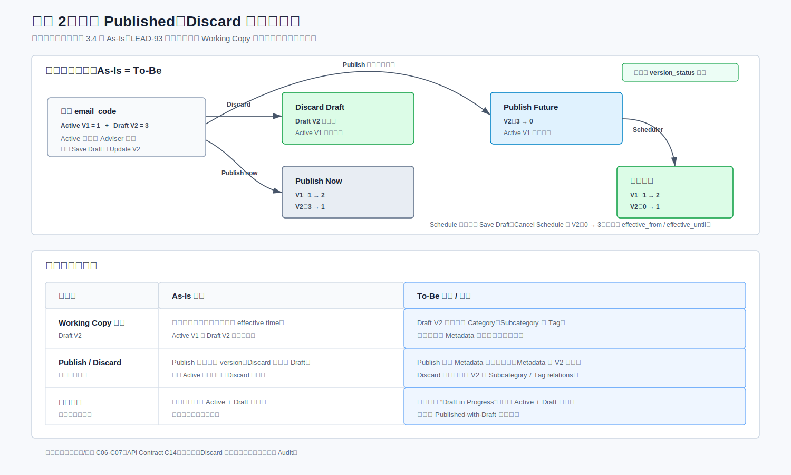
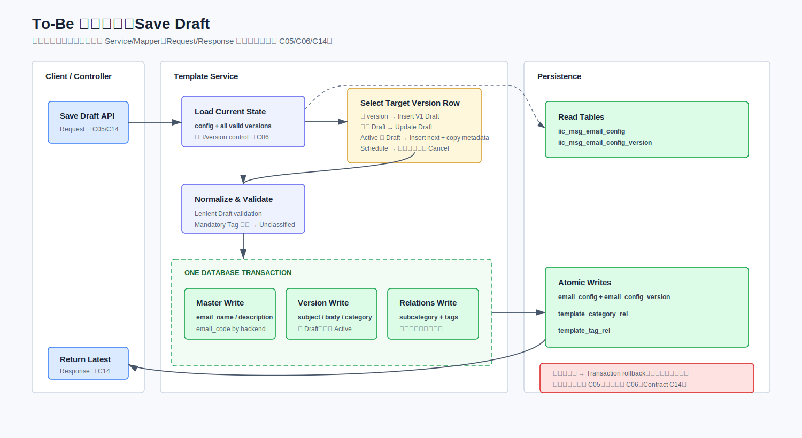
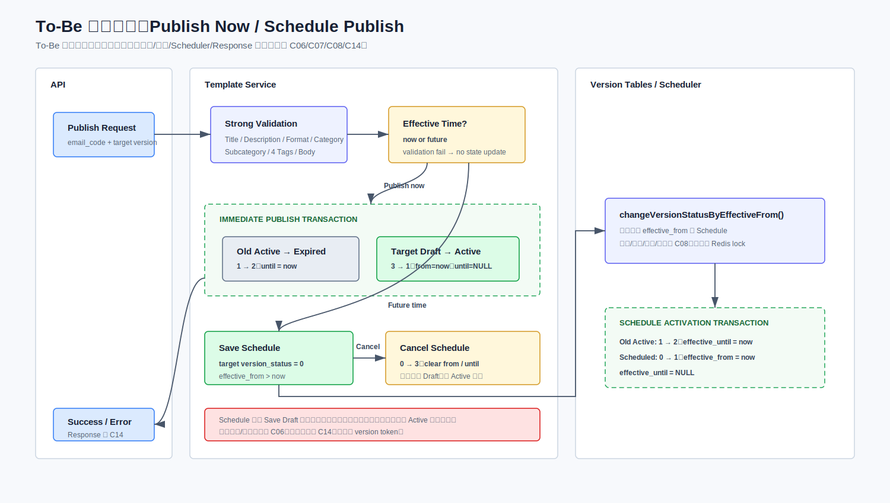
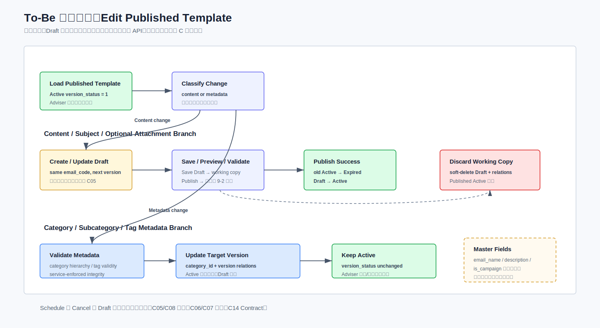
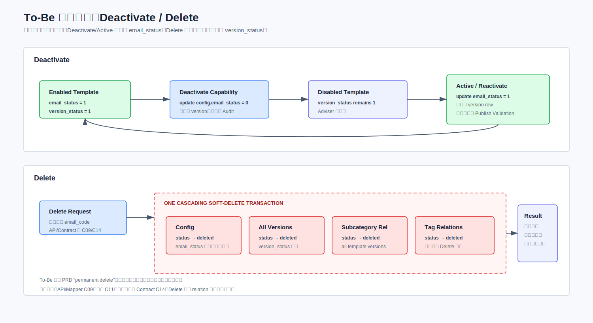

# LEAD-93 Template Management 解决方案设计文档

> 重构预览版 v2  
> 状态：Draft for Technical Review  
> 说明：本文先固化 As-Is，再做 Gap Analysis，最后给出 To-Be 设计。未确认信息统一放在“待确认项”，不作为实施基线。

## 1. 文档目的

本文描述 LEAD-93 Template Management 在现有 DAE 系统上的改造方案，目标是：

- 清楚说明当前 Template 数据模型、版本生命周期、页面查询和核心操作行为。
- 对比 PRD 目标，明确新增能力和现有能力之间的差异。
- 在保留现有模板主表、版本表和生命周期机制的前提下，设计 Category/Subcategory、Tag、Search/Filter 和 Migration 方案。
- 为开发拆分、数据库变更、API 联调、测试和上线提供统一技术基线。

## 2. 结论摘要

本项目应定义为“现有 Template Management 能力增强”，不是新建模板系统。

核心设计结论如下：

1. 保留 `iic_msg_email_config` 和 `iic_msg_email_config_version`，不重建 Template 主模型和版本状态机。
2. `email_code` 继续作为逻辑模板的业务标识。所有新增 metadata、category 和 tag 关系均通过 `email_code` 关联。
3. 复用并改造 `iic_msg_category_config`，承载 Template Category/Subcategory 两级 taxonomy。
4. 新增 Template Metadata、Subcategory Relation、Tag Group、Tag Value 和 Template Tag Relation 表。
5. Published/Draft 搜索必须复用现有 Tab 基础查询，再叠加 Category、Tag 等条件，避免改变存量页面语义。
6. 不新增数据库外键和 check constraint；关系完整性、层级合法性和必填校验由 Service 层保证。
7. 初始 Category、Tag 及存量模板映射由幂等 SQL 上线，DBA 执行；Tag 后续仍只允许通过 DB 脚本维护。

## 3. As-Is 现状分析

### 3.1 当前数据模型

当前 Template 由主表与版本表共同构成：

| 表 | 当前职责 | 关键字段 |
|---|---|---|
| `iic_msg_email_config` | 逻辑模板主记录、启停状态和软删除状态 | `email_code`, `email_name`, `email_status`, `status`, `is_campaign` |
| `iic_msg_email_config_version` | 模板正文、附件引用、版本和生效状态 | `email_code`, `version`, `version_status`, `effective_from`, `effective_until`, `email_content`, `file_keys`, `status` |
| `iic_msg_file_upload` | 附件元数据及 S3 文件引用 | `file_key`, `file_name`, `file_type`, `size`, `obs_type`, `view_url` |
| `iic_msg_category_config` | 现有消息类别配置 | `category_code`, `category_name`, `tenant_id`, `dae_country_code`, `is_deleted`, `flag` |

当前没有数据库外键。表间业务关系由应用代码维护。

### 3.2 Template Identity

`email_code` 是邮件模板的业务标识编码，由 Snowflake 算法生成，现有业务查询、更新和关联都依赖该字段。

设计约束：

- LEAD-93 不改变 `email_code` 的业务含义和生成方式。
- 新增表使用 `email_code` 关联逻辑模板，不使用 version row `id` 作为 Template Identity。
- Search/Filter 返回结果按 `email_code` 去重。
- 新建草稿当前主要校验 `email_name` 是否重复；由于前端可能传入 `email_code` 并进入 update 路径，实施前必须通过接口回归测试保护 insert/update 分支。
- 逻辑唯一性由服务和数据校验保证；不假设历史物理数据天然无重复。

### 3.3 状态字段语义

#### 3.3.1 主表状态

| 字段 | 值 | 含义 | 影响 |
|---|---:|---|---|
| `iic_msg_email_config.status` | `0` | 有效 | 记录可参与正常业务查询 |
| `iic_msg_email_config.status` | `-1` | 已软删除 | 从正常业务查询排除 |
| `iic_msg_email_config.email_status` | `1` | Enabled | 可出现在 Published 可用集合中 |
| `iic_msg_email_config.email_status` | `0` | Disabled | Deactivate 后的模板状态 |

#### 3.3.2 版本状态

| `version_status` | 状态 | 时间字段 | 触发方式 |
|---:|---|---|---|
| `0` | Schedule | 用户指定未来 `effective_from`；不设置 `effective_until` | Publish 选择未来时间，或 Save Draft 时 `effective_from > now`；定时任务到点触发 |
| `1` | Active | `effective_from = now`；`effective_until = NULL` | Publish 或 `changeVersionStatusByEffectiveFrom()` 触发 |
| `2` | Expired | 保留原 `effective_from`；`effective_until = now` | 新版本发布或定时任务触发 |
| `3` | Draft | 用户输入时间可暂存 | 不参与自动状态流转 |

### 3.4 当前状态流转

需要明确区分两类状态：

- `version_status` 描述内容版本的 Draft、Schedule、Active、Expired 生命周期。
- `email_status` 和 `status` 描述逻辑模板是否启用、是否软删除。

Deactivate 和 Delete 均不改变任何 version row 的 `version_status`。

### 3.5 当前页面 Tab 查询

#### 3.5.1 Published Tab

现有 Published list 的核心条件为 `version_status = 1`、`config.status = 0`、`config.email_status = 1`、`config.is_campaign != 1`。完整查询见 [QUERY_iic_msg_email_config.sql](sql/QUERY_iic_msg_email_config.sql)。

说明：

- `version.version_status = 1` 是现有 Published 查询和版本语义上的 Active 条件。
- `version_status = 1` 是版本语义上的 Active 状态，用于发布状态流转。
- 理论上一个 `email_code` 可能出现多个 `version_status = 1`，但现有代码保证不会发生，本期不新增状态机约束。

#### 3.5.2 Draft Tab

现有 Draft Tab 由 `email_status = 0`、非 V1 的 Draft/Schedule，以及 V1 的 Draft/Schedule 三个 OR 分支组成。完整条件见 [QUERY_iic_msg_email_config.sql](sql/QUERY_iic_msg_email_config.sql)。

因此 Draft Tab 不是简单的 `version_status = 3`，还包含 Schedule 记录和部分 Disabled 模板。LEAD-93 Search/Filter 必须复用这套现有查询语义。

### 3.6 当前核心操作行为

本节只作为 As-Is 事实基线，详细场景差异见第 5.2 节。

| 操作 | 当前数据库行为 | 状态变化 | 明确不修改 |
|---|---|---|---|
| Save Draft | V1 不存在则 Insert V1；V1 为 Draft/Schedule 则 Update V1；已有 Active/Expired 则 Insert 下一版本 Draft；下一版本 Draft 已存在则 Update | 普通草稿为 `3`；`effective_from > now` 时为 Schedule `0` | 当前 Active 内容 |
| Publish Now | 同一事务更新新旧 version 和 effective time | 旧 Active `1 → 2`；目标 Draft `3 → 1`；新 Active 的 `effective_from = now`、`effective_until = NULL` | `config.email_status` |
| Scheduled Activation | Java 定时任务 `changeVersionStatusByEffectiveFrom()` 处理到期版本 | Schedule `0 → 1`；旧 Active `1 → 2` | Template Identity |
| Deactivate | 只更新 `iic_msg_email_config.email_status: 1 → 0` | version 仍保持原 `version_status` | config `status` 和所有 version `version_status` |
| Delete | config 与该模板所有 version 级联软删除 | 修改 config/version 的软删除 `status` | 所有 version `version_status` |

本期保持现有 version control，不引入 Redis lock；Delete 不提供一键恢复。

### 3.7 当前附件机制

- 附件存储到 S3，文件元数据位于 `iic_msg_file_upload`。
- 单个附件最大 10 MB，对应现有 `size` 字段口径为 `size <= 10240 KB`。
- 附件格式维持现状，但明确排除多媒体、视频和音频。
- LEAD-93 不改变正文版本通过 `file_keys` 引用附件的方式。

## 4. 新需求摘要

LEAD-93 在现有能力上增加：

- 可管理的两级 Category/Subcategory 分类树。
- 固定 Tag Taxonomy，包括 4 个必填组和 2 个可选组。
- Template 与 Category、Subcategory、Tag 的结构化关系。
- 按名称、Category、Subcategory、Tag、状态等条件搜索与过滤。
- 存量模板分类、标签和必要的数据清理迁移。
- Content Manager 与 Adviser 场景下明确且一致的模板可见性。

不在本期范围：

- 重建 Template 主表和版本表。
- 重写 Draft/Published 状态机。
- Tag 管理 UI。
- Redis 分布式锁。
- Elasticsearch。
- 一键恢复已删除模板。
- 多媒体、视频、音频附件。

## 5. Gap Analysis

### 5.1 能力差异总览

| 能力 | As-Is | LEAD-93 Gap | 设计决策 |
|---|---|---|---|
| Category | 有通用类别表，无 Template 两级层级及关系 | 需要 Category/Subcategory 管理 | 改造 `iic_msg_category_config` |
| Tag | 无 Template 固定标签体系 | 需要固定组和值及模板关联 | 新增 Tag 字典和关系表，SQL seed |
| Template Metadata | 核心字段分布于主表/版本表 | 缺少独立分类元数据入口 | 新增 `iic_msg_template_metadata` |
| Search/Filter | Published/Draft 各自有复杂过滤 | 需要组合过滤但不能改变存量语义 | 复用 Tab Base Query 后扩展 join |
| Lifecycle | 已有状态机和版本控制 | 新增 metadata 可能影响编辑分流 | 保持状态机；内容变更仍走 Draft/Publish |
| Migration | 无新 taxonomy 映射 | 需初始化及映射存量模板 | DBA 执行幂等 SQL 和校验报告 |

### 5.2 场景状态机对比

本节集中说明每个业务场景从 As-Is 到 To-Be 的变化。第 9 章不再重复状态流转，只定义实现规则。

#### 5.2.1 新建、保存草稿与发布

#### 5.2.2 编辑 Published、Working Copy、Discard 与重新发布

#### 5.2.3 Deactivate 与 Delete

该图中的 Deactivate To-Be 仍是待确认差异，不代表已批准修改 `version_status`。

#### 5.2.4 Category、Subcategory 与 Tag 元数据修改

#### 5.2.5 页面状态派生

#### 5.2.6 Category/Subcategory 生命周期

## 6. 设计原则

1. **Backward Compatible**：不改变现有 Published/Draft Tab 的基础返回语义。
2. **Lifecycle Preserved**：不重写 version lifecycle，不修改 Deactivate/Delete 语义。
3. **Logical Template First**：所有新增关系以 `email_code` 为业务键。
4. **Service-Enforced Integrity**：由于不允许新增 FK/check constraint，完整性由 Service 层和事务保证。
5. **Controlled Taxonomy**：Category 由管理 API 维护；Tag 只通过受控 SQL seed/patch 维护。
6. **Controlled Migration**：Schema DDL 由版本化脚本单次执行；seed 和 mapping DML 必须幂等、可校验、可追踪。

## 7. To-Be 总体方案

目标方案分为三层：

- UI/API 层增加 Category、Tag、Metadata 和 Search 能力。
- Template Lifecycle Service 继续负责 Save Draft、Publish、Deactivate 和 Delete。
- 数据层复用 Template Master、Version 和 File 表，改造 Category 表并新增 metadata/relation/tag 表。

## 8. To-Be 数据库设计

### 8.1 表变更总览

| 表 | 类型 | 用途 | 业务键/关联键 |
|---|---|---|---|
| `iic_msg_email_config` | Existing / Reused | Template Master | `email_code` |
| `iic_msg_email_config_version` | Existing / Reused | Template Version / Content | `email_code`, `version` |
| `iic_msg_file_upload` | Existing / Reused | S3 附件元数据 | `file_key` |
| `iic_msg_category_config` | Existing / Changed | Category/Subcategory taxonomy | `id`, `category_code` |
| `iic_msg_template_metadata` | New | 逻辑模板 metadata 入口及主 Category | `email_code` unique |
| `iic_msg_template_category_rel` | New | Template 与 Subcategory 多选关系 | `email_code`, `subcategory_id` |
| `iic_msg_tag_group` | New | Tag 分组字典 | `group_code` unique |
| `iic_msg_tag_value` | New | Tag 值字典 | `group_code`, `tag_code` |
| `iic_msg_template_tag_rel` | New | Template 与 Tag 关系 | `email_code`, `group_code`, `tag_code` |
| `iic_msg_template_migration_snapshot` | New | Migration 前快照及回滚依据 | `source_batch_id`, `record_type`, `record_id` |

### 8.2 `iic_msg_category_config` 改造

建议复用现有表，新增或确认以下字段：

| 字段 | 用途 |
|---|---|
| `parent_id` | Subcategory 所属 Category；一级节点为空或 0 |
| `category_level` | `1 = Category`, `2 = Subcategory` |
| `normalized_name` | 大小写、空格归一化后的名称，用于重复校验 |
| `description` | 描述 |
| `sort_order` | 同级排序 |
| `deleted_by`, `deleted_date` | 软删除审计 |
| `source_batch_id` | 初始 taxonomy migration 批次追踪 |

隔离策略：使用既有 `flag` 或独立 `category_code` namespace 标识 Template taxonomy，避免与其他消息类别数据混用。具体取值仍需确认。

Service 层必须校验：

- 只允许两级结构。
- Subcategory 的 parent 必须为有效一级 Category。
- 同一 parent 下名称不可重复。
- 删除前检查是否存在有效子节点或模板关系。
- 本期建议软删除名称不允许重新使用，避免历史关系与审计歧义。

对应 SQL：[DDL_iic_msg_category_config.sql](sql/DDL_iic_msg_category_config.sql)。

### 8.3 `iic_msg_template_metadata`

建议关键字段：

| 字段 | 约束/说明 |
|---|---|
| `id` | 主键 |
| `email_code` | 非空、唯一；逻辑模板业务标识 |
| `category_id` | 主 Category；Draft 可为空，Publish 校验必填 |
| `source_batch_id` | Migration 批次追踪，可空 |
| `status` | 软删除标记 |
| audit fields | `created_by/date`, `updated_by/date` |

不建议直接在 `iic_msg_email_config` 增加 `category_id`，以减少对存量核心表和既有 SQL 的影响。

对应 SQL：[DDL_iic_msg_template_metadata.sql](sql/DDL_iic_msg_template_metadata.sql)。

### 8.4 `iic_msg_template_category_rel`

用于一个逻辑模板关联多个 Subcategory。唯一索引建议覆盖 `email_code + subcategory_id + 有效数据范围`。

在无 FK 情况下，写入前由 Service 校验 `email_code`、Category 层级和节点有效性。

对应 SQL：[DDL_iic_msg_template_category_rel.sql](sql/DDL_iic_msg_template_category_rel.sql)。

### 8.5 Tag Taxonomy

| 分组 | 必填性 | Draft 默认值 |
|---|---|---|
| Content Type | Mandatory | Unclassified |
| Trigger | Mandatory | Unclassified |
| Lifecycle Stage | Mandatory | Unclassified |
| Financial Need | Mandatory | Unclassified |
| Proposition | Optional | 无 |
| Source | Optional | 无 |

设计规则：

- `iic_msg_tag_group` 保存分组、必填标记和排序。
- `iic_msg_tag_value` 保存固定 Tag 值；`tag_code` 全局唯一。
- `iic_msg_template_tag_rel` 按 `email_code` 保存选择结果。
- 不提供 Tag 管理 UI。
- 首次上线固定 seed，后续仅允许 DB 脚本维护。
- Publish 前校验 4 个 Mandatory Group 均存在有效选择；Draft 缺失时补 `Unclassified`。

对应 SQL：[DDL_iic_msg_tag_group.sql](sql/DDL_iic_msg_tag_group.sql)、[DDL_iic_msg_tag_value.sql](sql/DDL_iic_msg_tag_value.sql)、[DDL_iic_msg_template_tag_rel.sql](sql/DDL_iic_msg_template_tag_rel.sql) 及相应 DML 文件。

### 8.6 数据库约束策略

DBA 不允许新增 FK 和 check constraint，因此采用：

- DB：主键、普通索引、必要的唯一索引和软删除字段。
- Service：父子层级、枚举值、关系存在性、必填组、重复关系校验。
- Transaction：metadata、category relation 和 tag relation 的保存必须原子提交。
- Migration Validation：上线脚本后检查孤儿关系、重复关系、缺失 Mandatory Tag 和无效 Category。

### 8.7 SQL 文件组织与执行约定

所有 SQL 以 [SQL Index](sql/README.md) 为入口，按 `DDL_<table>.sql`、`DML_<table>.sql`、`QUERY_<table>.sql` 分类。SQL 文件是执行内容的唯一来源，本文不再复制 SQL，避免设计文档与部署脚本漂移。

- MySQL 8.0、InnoDB、`utf8mb4_bin`。
- 不创建 FK/check constraint。
- DDL 由 DBA 以版本化脚本单次执行。
- Seed/Mapping DML 必须幂等，并使用 `source_batch_id`。
- DML 回滚由 `@lead93_rollback = 1` 显式启用。
- Deactivate migration 由 `@lead93_apply_deactivate = 1` 显式启用，Q6 确认前保持 0。

### 8.8 DDL 文件

| 目标表 | 变更 | SQL |
|---|---|---|
| `iic_msg_category_config` | 扩展 taxonomy 字段、唯一键和树索引 | [DDL_iic_msg_category_config.sql](sql/DDL_iic_msg_category_config.sql) |
| `iic_msg_email_config` | Published 查询复合索引 | [DDL_iic_msg_email_config.sql](sql/DDL_iic_msg_email_config.sql) |
| `iic_msg_email_config_version` | Draft 注释、Active/Schedule 索引 | [DDL_iic_msg_email_config_version.sql](sql/DDL_iic_msg_email_config_version.sql) |
| `iic_msg_template_metadata` | 新建 metadata 表 | [DDL_iic_msg_template_metadata.sql](sql/DDL_iic_msg_template_metadata.sql) |
| `iic_msg_template_category_rel` | 新建 Subcategory 关系表 | [DDL_iic_msg_template_category_rel.sql](sql/DDL_iic_msg_template_category_rel.sql) |
| `iic_msg_tag_group` | 新建 Tag Group 表 | [DDL_iic_msg_tag_group.sql](sql/DDL_iic_msg_tag_group.sql) |
| `iic_msg_tag_value` | 新建 Tag Value 表 | [DDL_iic_msg_tag_value.sql](sql/DDL_iic_msg_tag_value.sql) |
| `iic_msg_template_tag_rel` | 新建 Template Tag 关系表 | [DDL_iic_msg_template_tag_rel.sql](sql/DDL_iic_msg_template_tag_rel.sql) |
| `iic_msg_template_migration_snapshot` | 新建 migration snapshot 表 | [DDL_iic_msg_template_migration_snapshot.sql](sql/DDL_iic_msg_template_migration_snapshot.sql) |

### 8.9 DML 文件

| 目标/用途 | 内容 | SQL |
|---|---|---|
| Staging | Mapping 临时表定义 | [DML_lead93_staging.sql](sql/DML_lead93_staging.sql) |
| `iic_msg_tag_group` | 固定 Group seed 与受控回滚 | [DML_iic_msg_tag_group.sql](sql/DML_iic_msg_tag_group.sql) |
| `iic_msg_tag_value` | Unclassified seed 与受控回滚 | [DML_iic_msg_tag_value.sql](sql/DML_iic_msg_tag_value.sql) |
| `iic_msg_category_config` | Category/Subcategory seed 与回滚 | [DML_iic_msg_category_config.sql](sql/DML_iic_msg_category_config.sql) |
| `iic_msg_template_migration_snapshot` | Config/Version 修改前快照 | [DML_iic_msg_template_migration_snapshot.sql](sql/DML_iic_msg_template_migration_snapshot.sql) |
| `iic_msg_template_metadata` | 主 Category mapping 与回滚 | [DML_iic_msg_template_metadata.sql](sql/DML_iic_msg_template_metadata.sql) |
| `iic_msg_template_category_rel` | Subcategory mapping 与回滚 | [DML_iic_msg_template_category_rel.sql](sql/DML_iic_msg_template_category_rel.sql) |
| `iic_msg_template_tag_rel` | Tag mapping 与回滚 | [DML_iic_msg_template_tag_rel.sql](sql/DML_iic_msg_template_tag_rel.sql) |
| `iic_msg_email_config` | 名称/描述/受控 Deactivate migration 与恢复 | [DML_iic_msg_email_config.sql](sql/DML_iic_msg_email_config.sql) |
| `iic_msg_email_config_version` | Active subject migration 与恢复 | [DML_iic_msg_email_config_version.sql](sql/DML_iic_msg_email_config_version.sql) |

### 8.10 QUERY 与校验文件

| 主表 | 用途 | SQL |
|---|---|---|
| `iic_msg_category_config` | 重复检查、树查询、层级校验 | [QUERY_iic_msg_category_config.sql](sql/QUERY_iic_msg_category_config.sql) |
| `iic_msg_email_config` | Published/Draft Search 与分页 | [QUERY_iic_msg_email_config.sql](sql/QUERY_iic_msg_email_config.sql) |
| `iic_msg_email_config_version` | 多 Active 校验、Schedule 扫描 | [QUERY_iic_msg_email_config_version.sql](sql/QUERY_iic_msg_email_config_version.sql) |
| `iic_msg_template_metadata` | Template/Category 孤儿校验 | [QUERY_iic_msg_template_metadata.sql](sql/QUERY_iic_msg_template_metadata.sql) |
| `iic_msg_template_category_rel` | Subcategory 与主 Category 一致性 | [QUERY_iic_msg_template_category_rel.sql](sql/QUERY_iic_msg_template_category_rel.sql) |
| `iic_msg_tag_value` | 固定 taxonomy 查询 | [QUERY_iic_msg_tag_value.sql](sql/QUERY_iic_msg_tag_value.sql) |
| `iic_msg_template_tag_rel` | Tag group/value 一致性 | [QUERY_iic_msg_template_tag_rel.sql](sql/QUERY_iic_msg_template_tag_rel.sql) |
| `iic_msg_tag_group` | Published Mandatory Tag 缺失校验 | [QUERY_iic_msg_tag_group.sql](sql/QUERY_iic_msg_tag_group.sql) |

### 8.11 执行顺序

1. 执行 QUERY 文件中的部署前检查。
2. 执行全部 DDL 文件。
3. 设置 [SQL Index](sql/README.md) 中的 migration variables。
4. 执行 staging、Tag seed、Category seed。
5. 执行 snapshot DML。
6. 执行 metadata/relation/config/version migration DML。
7. 执行全部一致性校验 QUERY。
8. 仅在批准回滚时设置 ` = 1` 并按 DML 逆序执行。

## 9. To-Be 实现设计

### 9.1 保存 Draft

第 5.2.1 节用于说明需求差异；下图只描述 To-Be 后端实现顺序和事务边界。

1. 按现有逻辑定位本次应 Insert 或 Update 的 version row。
2. 保存正文、附件引用和版本字段。
3. Upsert `iic_msg_template_metadata`。
4. Replace 或 Diff Update Subcategory 和 Tag 关系。
5. 若 Mandatory Tag 未传，Draft 默认写入 `Unclassified`。
6. 所有写操作在同一业务事务中完成。

任一步失败时整体回滚，不允许出现 version 已保存但 metadata/relation 未保存的部分成功状态。

### 9.2 Publish

第 5.2.1、5.2.2 节用于说明需求差异；下图定义 To-Be Publish 的校验、立即发布、预约发布和事务边界。

1. 复用现有 Publish 状态机和 version control。
2. 发布前校验 Category、Mandatory Tag、正文和附件。
3. 将旧 Active 改为 Expired，将目标 Draft 改为 Active。
4. 更新 effective time。
5. Metadata 关系不复制到 version 表，继续归属逻辑模板 `email_code`。

校验失败或状态竞争时不得修改旧 Active；预约发布由现有 Java 定时任务处理，任务执行时仍需保证旧 Active 过期与 Schedule 生效的原子性。

### 9.3 编辑 Published Template

第 5.2.2、5.2.4 节用于说明需求差异；下图描述 To-Be 的 content 与 metadata 分流。

建议按字段影响分流：

- 不影响渲染、发送和合规校验的管理 metadata，可直接修改 metadata 表，Published 内容保持不变。
- 影响正文 schema、Preview、发送行为或 Publish 校验的字段，必须创建/更新 Draft，再走 Publish。
- `Format = Email/Campaign` 的最终分流需待业务影响确认。
- Category/Subcategory/Tag 按 `email_code` 即时保存并立即影响 Adviser 分类与搜索；Discard content working copy 不回滚这些已保存 metadata。

### 9.4 Deactivate / Delete

第 5.2.3 节用于说明现状与 PRD 差异；下图描述当前 To-Be 技术实现基线和仍待确认的边界。

- Deactivate 继续只更新 `config.email_status`。
- Delete 继续软删除 config 和 version；新增 metadata/relation 也应同步软删除。
- 两者均不更新 `version_status`。

PRD 将 Deactivate 描述为 `Published → Draft`，但现状数据库行为只是 `email_status: 1 → 0`，Active version 不变。该差异暂不通过新增状态或修改 `version_status` 解决，最终 UI 文案与 Reactivate/Activate 行为列入待确认项。

## 10. Search / Filter 设计

### 10.1 查询构造

查询分两步：

1. 先复用现有 Published 或 Draft Tab Base Query，确定符合现有状态语义的 `email_code` 集合。
2. 再关联 metadata、category relation 和 tag relation，叠加搜索条件。

最终按 `email_code` 去重并分页。不能先对多张 relation 表直接 join 后再分页，否则多值 Category/Tag 会导致重复行和分页数量失真。

### 10.2 Published 场景

沿用现有硬编码过滤，完整 SQL 见 [QUERY_iic_msg_email_config.sql](sql/QUERY_iic_msg_email_config.sql)。

Adviser View 必须强制 Published-only，不允许通过请求参数绕过。

### 10.3 Draft 场景

复用现有 Draft Tab 多分支条件，不将其简化为 `version_status = 3`。

### 10.4 推荐实现

- 主查询先产出 distinct `email_code` 或使用 `EXISTS` 过滤多值关系。
- Category、Subcategory、Tag relation 建立以 `email_code` 开头的索引。
- 名称搜索使用现有数据库支持的匹配方式，本期不引入 Elasticsearch。
- 排序字段必须稳定，建议 `updated_date DESC, email_code DESC`。

### 10.5 Search / Filter SQL 文件

Search/Filter 的完整 SQL 位于 [QUERY_iic_msg_email_config.sql](sql/QUERY_iic_msg_email_config.sql)，包括：

- Published Base Scope 与强制 Published-only 条件。
- Draft Tab 已确认的三个 OR 分支。
- Category/Subcategory/Tag/Keyword 组合过滤。
- 按 `email_code` 去重、稳定排序、分页和 Count。
- 使用 `FIELD()` 恢复详情 mapper 的分页顺序。
- 组内 ANY 的动态 SQL 模板。

其他查询与一致性校验按主表拆分：

| 查询 | SQL |
|---|---|
| Category tree / hierarchy | [QUERY_iic_msg_category_config.sql](sql/QUERY_iic_msg_category_config.sql) |
| Active/Schedule version | [QUERY_iic_msg_email_config_version.sql](sql/QUERY_iic_msg_email_config_version.sql) |
| Metadata orphan | [QUERY_iic_msg_template_metadata.sql](sql/QUERY_iic_msg_template_metadata.sql) |
| Subcategory relation | [QUERY_iic_msg_template_category_rel.sql](sql/QUERY_iic_msg_template_category_rel.sql) |
| Tag taxonomy | [QUERY_iic_msg_tag_value.sql](sql/QUERY_iic_msg_tag_value.sql) |
| Tag relation consistency | [QUERY_iic_msg_template_tag_rel.sql](sql/QUERY_iic_msg_template_tag_rel.sql) |
| Mandatory Tag completeness | [QUERY_iic_msg_tag_group.sql](sql/QUERY_iic_msg_tag_group.sql) |

参数由 MyBatis/JDBC 安全绑定，`IN` 列表必须展开为独立占位符。Category、Subcategory、Tag、Keyword 之间固定使用 AND。组内多选使用 ANY 还是 ALL 仍为 Q8；SQL 文件当前保留 ANY 模板，Q8 确认为 ALL 时按同文件说明替换为 `COUNT(DISTINCT ...) = selected_count`。

`LIKE %keyword%` 无法有效利用普通 B-Tree 索引。本期模板数量较小，接受数据库扫描；数据量显著增长时再评估全文索引或搜索引擎。

## 11. API 变更设计

### 11.1 变更对比

| 能力 | As-Is | To-Be API 变更 | 兼容策略 |
|---|---|---|---|
| Published List | 现有硬编码过滤 | 增加 Category/Tag/Search 参数 | 默认无新参数时结果保持一致 |
| Draft List | 现有多分支查询 | 增加 Category/Tag/Search 参数 | 复用原 Base Query |
| Save Draft | 保存 config/version | 同事务保存 metadata/relations | 不改变现有版本选择逻辑 |
| Publish | 更新 version lifecycle | 增加 Category/Tag publish validation | 状态流转保持不变 |
| Deactivate | 更新 `email_status` | 无核心变更 | 保持现状 |
| Delete | config/version 软删除 | 同步软删除 metadata/relations | 不修改 `version_status` |
| Category | 无 Template 两级管理 API | 新增 tree/create/update/delete/reorder | 复用并改造 category 表 |
| Tag | 无 Template Tag API | 新增只读 taxonomy API | 无 Tag 管理 API |

### 11.2 建议端点

| Method | Endpoint | 用途 |
|---|---|---|
| `GET` | `/template-management/categories/tree` | 查询两级 Category 树 |
| `POST` | `/template-management/categories` | 创建 Category/Subcategory |
| `PUT` | `/template-management/categories/{id}` | 编辑名称、描述等 |
| `DELETE` | `/template-management/categories/{id}` | 软删除并做引用校验 |
| `PUT` | `/template-management/categories/reorder` | 同级排序 |
| `GET` | `/template-management/tags` | 查询固定 Tag taxonomy |
| `GET` | `/template-management/templates` | Search/Filter，支持 Tab 语义 |
| `PUT` | `/template-management/templates/{emailCode}/metadata` | 更新逻辑模板 metadata |
| `POST` | `/template-management/templates/{emailCode}/publish-validation` | 发布前完整性校验 |

具体路径应与内网现有 Controller 命名和统一网关规范对齐，本文端点用于定义能力边界。

## 12. Migration 设计

### 12.1 执行方式

DBA 在上线前或上线窗口执行 SQL：

1. Schema change。
2. Category/Subcategory seed。
3. Tag Group/Value 固定 seed。
4. 按 `email_code` 写入 Template Metadata 和 relation。
5. 执行一致性校验 SQL。
6. 输出 migration report，并由 PO/BA/Tech 共同确认。

### 12.2 脚本要求

- Schema DDL：由版本化 migration 单次执行，执行前使用第 8.7 节 SQL 做前置检查。
- Seed/Mapping DML：幂等，重复执行不会产生重复数据。
- 可追踪：写入 `source_batch_id` 或等价批次标记。
- 可校验：每一步有 count、duplicate、orphan 和 mandatory-tag 检查。
- 可回滚：回滚只针对 LEAD-93 新增/改造数据，不恢复被业务删除的模板。
- 不直接修改现有 `version_status` 生命周期数据。

完整 SQL 见 [SQL Index](sql/README.md)。

### 12.3 业务输入

PO/BA 需提供并确认：

- 79 个存量模板的保留、合并或淘汰结论。
- 每个保留模板对应的 Category、Subcategory 和 Tag。
- 重复/过期模板的目标 `email_code` 及处理方式。

## 13. 权限与审计

- Category 管理、Template Metadata 编辑、Publish 和 Delete 应使用现有 Content Manager 权限体系。
- Adviser 只读取 Published 可用模板。
- Tag API 只读；Tag 维护权收敛到 DBA 脚本流程。
- 记录 Category、Subcategory、Tag、Deactivate 和 Delete 的操作者与时间。
- 若现有系统已有统一审计日志，应复用；具体接入点待内网代码确认。

## 14. 测试策略

重点回归范围：

- V1/V2 在 Draft、Schedule、Active、Expired 各状态下的 Save Draft insert/update 分支。
- Publish 时新旧版本状态和 effective time 的原子更新。
- Deactivate/Delete 不修改 `version_status`。
- 无新筛选参数时 Published/Draft 列表结果与改造前一致。
- 多 Category/Tag join 后按 `email_code` 去重，分页总数准确。
- Category 两级层级、同级重名、删除引用和排序校验。
- Mandatory Tag 缺失、Draft 默认 `Unclassified` 和 Publish validation。
- 10 MB 附件边界及多媒体/视频/音频排除。
- Migration 幂等、孤儿关系、重复关系和数据量对账。

## 15. 上线与回滚

建议上线顺序：

1. 执行向后兼容的数据库变更和固定 seed。
2. 部署后端 API，默认关闭新 UI 入口或使用现有 feature control。
3. 执行存量 mapping 和 validation。
4. 部署前端并开放 Content Manager 功能。
5. 验证 Published/Draft、Adviser View 和 Publish 定时任务。

回滚原则：

- 应用可回退到旧版本，新增表保留但不被旧代码读取。
- 新增/改造数据通过批次标识回滚。
- 不回滚或重写现有 Template version lifecycle 数据。
- Tag seed 的后续变更通过新 SQL patch 修正，不在应用中直接编辑。

## 16. 风险与待确认项

| ID | 问题 | 当前建议 | 影响 |
|---|---|---|---|
| Q1 | `Format = Email/Campaign` 是否影响正文 schema、Preview、发送或 Publish 校验 | 若有影响，必须走 Draft/Publish；否则可作为 metadata 直接改 | 决定 Published 编辑分流 |
| Q2 | `iic_msg_category_config.flag` 或 `category_code` 用什么值隔离 Template taxonomy | 建议使用明确、不可与现有数据冲突的固定 namespace | 决定数据查询和唯一索引范围 |
| Q3 | 附件类型和 10 MB 校验目前在后端、前端还是两端 | 后端必须作为最终校验，前端同步提示 | 决定改造范围和安全边界 |
| Q4 | 现有统一审计机制的表、事件和调用方式 | 优先复用，不另建平行审计体系 | 决定审计实现 |
| Q5 | 79 个模板的分类、标签、重复和过期映射 | 由 PO/BA 提供并签字确认 | 决定 migration 数据 |
| Q6 | PRD 的 `Published → Draft` 是否只是 Deactivate 后的 UI/Tab 表述 | 建议保持 `email_status: 1 → 0`、`version_status` 不变，通过查询结果派生 UI 状态 | 决定 PRD 文案、迁移脚本和验收口径 |
| Q7 | Disabled 模板如何 Reactivate/Activate | 需确认是仅恢复 `email_status = 1`，还是必须重新走 Publish validation | 决定恢复可见性的 API 与状态流转 |
| Q8 | Subcategory/同一 Tag Group 多选值采用 ANY 还是 ALL | [QUERY_iic_msg_email_config.sql](sql/QUERY_iic_msg_email_config.sql) 当前保留 ANY 模板；不同维度和不同 Tag Group 固定为 AND | 决定 Search/Filter 结果集合 |

## 17. 设计评审准入条件

进入最终 Technical Design Approval 前应完成：

- Q1-Q4、Q6-Q8 技术问题确认。
- Q5 migration mapping 至少形成可评审版本。
- 内网代码核对 Published/Draft SQL、Save Draft 分支和事务边界。
- DBA 确认字段类型、索引命名、软删除唯一性方案和脚本执行窗口。
- API Request/Response 与前端字段模型对齐。

## 18. 内网代码核对与回填模板

本章用于在内网环境中核实现有 DAE 代码事实。调查结果是设计评审输入，不得用经验或推测替代代码证据。无法确认的项目必须填写“未找到/待人工确认”，并说明已检索的模块和关键词。

### 18.1 内网 AI 调查指令

可将以下任务说明直接交给内网 AI：

> 阅读 DAE Template Management 相关 Controller、DTO、Service、Mapper/Repository、Entity、Scheduler、权限、审计和附件模块，核对本章 C01-C15。每项结论必须给出模块名、文件路径、类/方法或 Mapper statement ID；涉及 SQL 时给出完整 WHERE/JOIN/ORDER BY 条件，涉及 API 时给出脱敏后的真实 Request/Response 样例。区分“代码已确认”“配置决定”“数据库事实”“仍待业务确认”。不要根据命名猜测，不要修改代码，不要输出敏感数据或完整业务内容。

建议输出一个 Markdown 文件，命名为 `LEAD-93_Internal_Code_Clarification.md`，使用第 18.3-18.5 节格式。

### 18.2 证据与脱敏规则

- 代码证据至少包含：模块、文件路径、类/方法或 Mapper ID、关键条件摘要。
- SQL 必须保留表名、字段名、JOIN、WHERE、ORDER BY、事务和锁语义；数据值可以脱敏。
- API 样例必须保留字段名、类型、空值、枚举和嵌套结构；姓名、邮箱、正文和业务数据替换为占位值。
- 若实际行为由配置控制，记录配置 key、默认值、不同环境差异和读取位置。
- 每项给出结论状态：`CONFIRMED`、`PARTIAL`、`NOT_FOUND`、`BUSINESS_DECISION`。
- 不允许只写“与设计一致”；必须写清楚实际实现和与本文的差异。

### 18.3 代码核对清单

| ID | 核对主题 | 内网需要回答的问题 | 必须提供的证据 | 影响章节 |
|---|---|---|---|---|
| C01 | 模块入口与调用链 | Template 管理涉及哪些 Controller、Service、Mapper、Entity 和前端 API client；各操作的入口方法是什么 | 模块、文件路径、类/方法、调用链 | 3、9、11 |
| C02 | Published List | 实际 JOIN、过滤、排序、分页和 Count SQL；究竟使用 `v.status`、`v.version_status` 的哪些值；是否排除 campaign 和软删除数据 | Controller 方法、Mapper ID、完整条件摘要、脱敏样例 | 3.5、10 |
| C03 | Draft List | 三个 OR 分支的精确括号；每个分支是否限制 config/version 软删除；详情与 Count 是否使用相同条件 | Mapper ID、完整 WHERE、分页/Count SQL | 3.5、10 |
| C04 | Template Detail | 根据 `email_code` 如何选择当前 version；Active、Draft、Schedule 共存时返回哪一条或哪些字段 | API、Service 方法、version 选择 SQL | 3.2、9、11 |
| C05 | Save Draft | V1 不存在、V1 Draft、V1 Schedule、V1 Active/Expired、V2 Draft 各走 Insert 还是 Update；`email_code` 由谁生成，前端传入时如何判断新建/更新 | Service 分支、Mapper、真实请求样例、回归测试 | 3.6、9.1 |
| C06 | 并发与事务 | Save Draft 当前事务入口、乐观锁/version token、冲突错误；如何把 metadata/relation 写入同一事务 | `@Transactional` 或等价机制、锁/版本字段、异常映射 | 6、9.1、11 |
| C07 | Publish Now | 发布前校验、旧 Active 过期和目标版本生效的执行顺序；`effective_from/until` 的精确赋值；失败时是否整体回滚 | Service/Mapper、事务边界、错误码 | 3.4、9.2 |
| C08 | Schedule Publish | 未来时间由哪个 API 保存为 Schedule；`changeVersionStatusByEffectiveFrom()` 的扫描条件、批次、事务、并发保护、失败重试和时区 | Scheduler 类/方法、SQL、配置、日志/重试机制 | 3.4、9.2、14 |
| C09 | Deactivate/Delete/Reactivate | Deactivate 和 Delete 的真实更新表及字段；是否存在 Reactivate/Activate API；页面 Tab 如何派生 Disabled/Draft | API、Service、Mapper、前端调用点 | 3.6、5.2.3、9.4 |
| C10 | 附件 | 上传、删除、下载/预览接口；S3 key 如何写入 version；格式白名单/黑名单和 10 MB 校验位于哪一层 | Controller/Service、配置 key、校验代码、错误响应 | 3.7、9、14 |
| C11 | 权限 | Content Manager、Adviser、Publish、Delete、Category 管理分别使用什么角色/权限表达式；后端是否强制校验 | 权限注解/拦截器/配置、角色常量 | 11、13 |
| C12 | 审计 | 当前统一审计机制记录到哪里；可否覆盖 Category、Tag、metadata、Deactivate、Delete；事务失败是否会留下成功审计 | 审计组件、事件、表或日志、调用示例 | 13 |
| C13 | 数据库映射 | 四张现有表的 Entity/Mapper 字段类型、主键、唯一键、软删除、字符集和实际索引；与 `message_structure.sql` 是否一致 | Entity、DDL 查询结果、Mapper result map | 3、8 |
| C14 | API 网关规范 | 统一 URL 前缀、分页模型、响应 envelope、错误码、日期/时区格式、幂等键和字段命名规则 | 现有同类 API、公共 DTO/异常处理器 | 11 |
| C15 | 测试与发布控制 | 现有单元/集成测试框架、Template fixture、feature flag、定时任务测试和回滚开关 | 测试文件、配置 key、部署清单 | 14、15 |

### 18.4 API Contract 回填表

对 Published List、Draft List、Detail、Save Draft、Publish Now、Schedule Publish、Deactivate、Delete、附件上传至少各填写一行；存在 Reactivate 时追加一行。

| 接口/操作 | Method + Path | Controller 方法 | Request DTO/字段 | Response DTO/字段 | 校验与错误码 | 权限 | 事务/并发 | 证据位置 | 状态 |
|---|---|---|---|---|---|---|---|---|---|
| Published List | 待回填 | 待回填 | 待回填 | 待回填 | 待回填 | 待回填 | N/A | 待回填 | NOT_FOUND |
| Draft List | 待回填 | 待回填 | 待回填 | 待回填 | 待回填 | 待回填 | N/A | 待回填 | NOT_FOUND |
| Template Detail | 待回填 | 待回填 | 待回填 | 待回填 | 待回填 | 待回填 | 待回填 | 待回填 | NOT_FOUND |
| Save Draft | 待回填 | 待回填 | 待回填 | 待回填 | 待回填 | 待回填 | 待回填 | 待回填 | NOT_FOUND |
| Publish Now | 待回填 | 待回填 | 待回填 | 待回填 | 待回填 | 待回填 | 待回填 | 待回填 | NOT_FOUND |
| Schedule Publish | 待回填 | 待回填 | 待回填 | 待回填 | 待回填 | 待回填 | 待回填 | 待回填 | NOT_FOUND |
| Deactivate | 待回填 | 待回填 | 待回填 | 待回填 | 待回填 | 待回填 | 待回填 | 待回填 | NOT_FOUND |
| Delete | 待回填 | 待回填 | 待回填 | 待回填 | 待回填 | 待回填 | 待回填 | 待回填 | NOT_FOUND |
| Attachment | 待回填 | 待回填 | 待回填 | 待回填 | 待回填 | 待回填 | 待回填 | 待回填 | NOT_FOUND |

每个接口另附一组脱敏 JSON：正常请求/响应、校验失败、权限失败；Save Draft 和 Publish 还应附并发冲突样例。若新建和编辑复用同一接口，必须说明后端通过哪些字段选择 Insert/Update 路径。

### 18.5 核心行为回填表

| 核对项 | 代码事实 | 与本文一致/差异 | 证据位置 | 状态 | 后续动作/负责人 |
|---|---|---|---|---|---|
| Published Base Query | 待回填 | 待回填 | 待回填 | NOT_FOUND | 待回填 |
| Draft Base Query | 待回填 | 待回填 | 待回填 | NOT_FOUND | 待回填 |
| Save Draft version 选择矩阵 | 待回填 | 待回填 | 待回填 | NOT_FOUND | 待回填 |
| Publish Now 原子性 | 待回填 | 待回填 | 待回填 | NOT_FOUND | 待回填 |
| Schedule 激活与重试 | 待回填 | 待回填 | 待回填 | NOT_FOUND | 待回填 |
| Deactivate/Delete/Reactivate | 待回填 | 待回填 | 待回填 | NOT_FOUND | 待回填 |
| 附件格式与大小校验 | 待回填 | 待回填 | 待回填 | NOT_FOUND | 待回填 |
| 权限与审计 | 待回填 | 待回填 | 待回填 | NOT_FOUND | 待回填 |
| API 公共规范 | 待回填 | 待回填 | 待回填 | NOT_FOUND | 待回填 |

### 18.6 回填后的决策规则

- 代码事实与本文一致：将对应 C 项标记为 `CONFIRMED`，补充证据，不重复设计。
- 代码事实与本文冲突：先记录差异和影响，不直接修改现状状态机；由 TL/PO/DBA 选择“保持现状”或“批准变更”。
- 仅缺少方法名、路径或 DTO：由开发负责人补齐 API Contract，不上升为业务决策。
- 涉及 UI 文案、ANY/ALL、Format 分流、Reactivate 或 migration mapping：保持为业务决策，由 PO/BA 签字确认。
- C02-C09、C13、C14 未完成前，不冻结后端实现和 API Contract；C05-C08 未完成前，不进入 Template lifecycle 联调。
