# LEAD-93 / LEAD-405 / LEAD-406 Template Management 总体解决方案设计文档

> 技术方案评审版 v3  
> 状态：开发基线
> 需求基线：`DAE_PRD_LEAD-93 Template Management_v2.0 - updated July 21st.docx`（PRD v2.0）、2026-07-17 Jira Feature 拆分及 2026-07-21 LEAD-278 Jira/OM Copy and Create 澄清
> 交叉需求参考：`PRD_LEAD-308 Advisor-Template Management_v1.3 -updated July 20th.docx`
> 说明：本文先固化 As-Is，再做 Gap Analysis，最后给出 To-Be 设计。未确认信息统一放在“待确认项”，不作为实施基线。
> 统一未确认项：[未确认项与现状核对登记册](LEAD-93_Open_Questions_Register_CN.md)。登记册中的开放项及状态为唯一有效索引。

## 1. 文档目的

本文描述 LEAD-93、LEAD-405、LEAD-406 三个 Feature 在现有 DAE Template Management 上的总体改造方案，目标是：

- 清楚说明当前 Template 数据模型、版本生命周期、页面查询和核心操作行为。
- 对比 PRD 目标，明确新增能力和现有能力之间的差异。
- 建立 Jira Story、As-Is/Gap、To-Be 设计和实施产物之间的双向可追溯关系。
- 在保留现有模板主表、版本表和生命周期机制的前提下，设计 Category/Subcategory、Tag、Search/Filter 和 Migration 方案。
- 为开发拆分、数据库变更、API 联调、测试和上线提供统一技术基线。

三个 Feature 共享同一套 Master/Version、Metadata、Category、Tag 和生命周期设计，按 Jira 当前归属拆分交付：

| Feature | 定位 | Story |
|---|---|---|
| LEAD-93（1 of 3） | 数据模型、分类基础和新建草稿 | LEAD-277、LEAD-301、LEAD-306、LEAD-307 |
| LEAD-405（2 of 3） | 分类治理、Published 编辑和 Tag | LEAD-276、LEAD-278、LEAD-293、LEAD-300 |
| LEAD-406（3 of 3） | 发布、删除、预览、搜索和迁移 | LEAD-279、LEAD-296、LEAD-326、LEAD-327、LEAD-328 |

## 2. 结论摘要

本项目应定义为“现有 Template Management 能力增强”，不是新建模板系统。

核心设计结论如下：

1. 保留 `iic_msg_email_config` 和 `iic_msg_email_config_version`，不重建 Template 主模型和版本状态机。
2. `email_code` 继续作为逻辑模板的业务标识；Category、Subcategory、Tag 与模板基本信息均属于 Template 当前属性，按 `email_code` 保存，不随内容版本复制或切换。
3. 新增 Template 专用表 `iic_msg_email_category`，承载 Category/Subcategory 两级 taxonomy。
4. 在 `iic_msg_email_config` 增加 `category_id`；新增 Template 级 Subcategory Relation、Tag Group、Tag Value、Template Tag Relation 和 Template Change History 表。
5. Published/Draft Tab 保留，Content Manager 保留 Status Filter 能力，但 Published Tab 不展示/不允许选择 Status Filter；本期 Web Template Library 固定查询 Email（`is_campaign = 0`），搜索在现有 Tab 基础查询上叠加 Category、Tag 等条件。
6. 不新增数据库外键和 check constraint；关系完整性、层级合法性和必填校验由 Service 层保证。
7. 初始 Category、Tag 及存量模板映射由幂等 SQL 上线，DBA 执行；Tag 后续仍只允许通过 DB 脚本维护。
8. Subcategory 支持一次最多 5 条的原子批量创建；删除 Category/Subcategory 时，只要 Template 存在 Active、Draft 或 Schedule version，后端就在同一事务中迁移该 Template 的当前 Metadata 后软删除节点；仅有 Expired version 的 Template 不迁移。
9. 不新增 Template 编辑锁、revision token 或 Redis lock；现有 Version Conflict 的精确触发条件尚未核实，不将推测的比较字段或触发时点写入本期基线。
10. Template 基本信息或 Metadata 每次成功修改都写入不可变的前后快照；Category/Subcategory 删除另写一条操作级 Audit，并为每个受影响 Template 写一条 Template Change History。一次性 Migration Log 只记录部署批次结果，三者用途不混用。
11. Template Title 非空、最长 120，仅允许字母、数字、空格及 `- , . & ' ’`；Copy 场景额外允许系统生成的结尾 ` (Copy)`；禁止 HTML 和 `@ # $ %`，并在同一主 Category 内保持唯一。
12. Trigger Tag 允许多选但每个版本最多选择 5 个；该上限是后端 Service 常量，并通过 Taxonomy API 返回，前后端执行同一规则。
13. 首次发布不额外插入版本行：同一 V1 从 Draft 变为 Active，并作为 V1 历史记录出现在 Version History 中。
14. Template Change History 记录 `email_name`、Description、Email/Campaign 类型（`is_campaign`）、Channel、Channel Name、Custom Branding、Category、Subcategory、Tag、`email_status` 与软删除状态；不新增独立 `format` 字段；Subject、正文、附件、生效时间和 `version_status` 继续由 Version History 表达。

## 3. As-Is 现状分析

### 3.1 当前数据模型

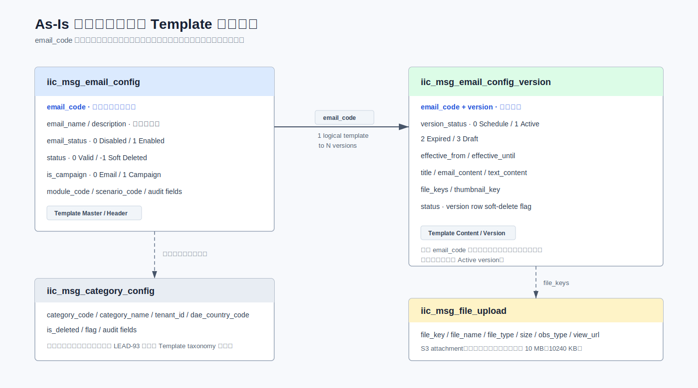

当前 Template 由主表与版本表共同构成：

| 表 | 当前职责 | 关键字段 |
|---|---|---|
| `iic_msg_email_config` | 逻辑模板主记录、启停状态和软删除状态 | `email_code`, `email_name`, `email_status`, `status`, `is_campaign` |
| `iic_msg_email_config_version` | 模板正文、附件引用、版本和生效状态 | `email_code`, `version`, `version_status`, `effective_from`, `effective_until`, `email_content`, `file_keys`, `status` |
| `iic_msg_file_upload` | 附件元数据及 S3 文件引用 | `file_key`, `file_name`, `file_type`, `size`, `obs_type`, `view_url` |

当前没有数据库外键。表间业务关系由应用代码维护。

图中只包含现有 Template Management 范围内的表，并只连接已有证据支持的关系：`iic_msg_email_config` 通过 `email_code` 对应多个 version，version 通过 `file_keys` 引用附件记录。

#### 3.1.1 Master 与 Version 字段归属

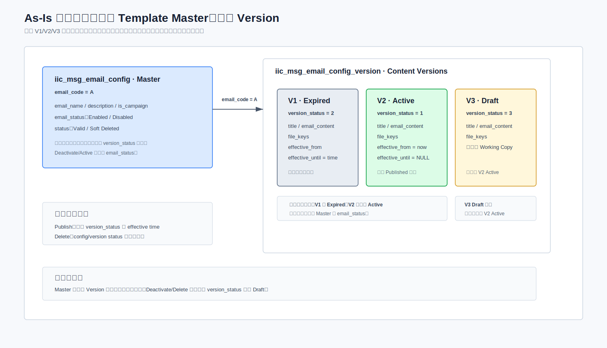

- `iic_msg_email_config` 表示逻辑模板，保存名称、描述、Email/Campaign 类型、启停和软删除状态。
- `iic_msg_email_config_version` 表示内容版本，保存 Subject、正文、附件引用、生效时间和版本生命周期状态。
- 正常页面流程允许同一 `email_code` 同时存在一个 Active 和一个 Draft Working Copy；Draft 不影响当前 Active 内容。一个 Draft 是前端流程约束，现有后端和数据库未强制该不变量。
- Publish 主要修改 version row；Deactivate/Active 只修改 config `email_status`；Delete 软删除 config 和所有 version，但不重写 `version_status`。

### 3.2 Template Identity

`email_code` 是邮件模板的业务标识编码，由后端使用 Snowflake 算法生成，现有业务查询、更新和关联都依赖该字段。

设计约束：

- LEAD-93 不改变 `email_code` 的业务含义和生成方式。
- 新增表使用 `email_code` 关联逻辑模板，不使用 version row `id` 作为 Template Identity。
- Search/Filter 返回结果按 `email_code` 去重。
- 新建模板首次 Save Draft 时由后端生成 `email_code`；更新请求使用已有 `email_code` 定位逻辑模板。
- 逻辑唯一性由服务和数据校验保证；不假设历史物理数据天然无重复。

### 3.3 状态字段语义

#### 3.3.1 主表状态

| 字段 | 值 | 含义 | 影响 |
|---|---:|---|---|
| `iic_msg_email_config.status` | `0` | 有效 | 记录可参与正常业务查询 |
| `iic_msg_email_config.status` | `-1` | 已软删除 | 从正常业务查询排除 |
| `iic_msg_email_config.email_status` | `1` | Enabled | 可出现在 Published 可用集合中 |
| `iic_msg_email_config.email_status` | `0` | Disabled | Deactivate 后的模板状态 |

#### 3.3.2 版本状态

| `version_status` | 状态 | 时间字段 | 触发方式 |
|---:|---|---|---|
| `0` | Schedule | 用户在 Publish 时指定未来 `effective_from`；不设置 `effective_until` | Publish 选择未来时间后进入；定时任务到点触发 |
| `1` | Active | `effective_from = now`；`effective_until = NULL` | Publish 或 `changeVersionStatusByEffectiveFrom()` 触发 |
| `2` | Expired | 保留原 `effective_from`；`effective_until = now` | 新版本发布或定时任务触发 |
| `3` | Draft | As-Is Save Draft 可保存用户输入的 `effective_from/effective_until`，但无论时间是否在未来都保持 Draft | 不参与自动状态流转 |

所有接口时间字段使用 `yyyy-MM-dd HH:mm:ss`，服务器、业务和用户统一按南非业务时区 `Africa/Johannesburg`（UTC+02:00）解释。

#### 3.3.3 状态维度关系

数据库样本中同时存在不同 `status`、`email_status` 和 `version_status` 组合，说明软删除、模板启停和版本生命周期是三个独立维度。软删除记录仍保留原生命周期值，任何查询或更新都不能用其中一个字段替代另一个字段。

### 3.4 当前状态流转


需要明确区分两类状态：

- `version_status` 描述内容版本的 Draft、Schedule、Active、Expired 生命周期。
- `email_status` 和 `status` 描述逻辑模板是否启用、是否软删除。

Deactivate 和 Delete 均不改变任何 version row 的 `version_status`。

### 3.5 当前页面 Tab 查询

#### 3.5.1 Published Tab

现有 Published list 的核心条件为 `version_status = 1`、`config.status = 0`、`config.email_status = 1`、`config.is_campaign != 1`。这些条件已由查询结果确认。

说明：

- `version.version_status = 1` 是现有 Published 查询和版本语义上的 Active 条件。
- `version_status = 1` 是版本语义上的 Active 状态，用于发布状态流转。
- 理论上一个 `email_code` 可能出现多个 `version_status = 1`，但现有代码保证不会发生，本期不新增状态机约束。

#### 3.5.2 Draft Tab

现有 Draft Tab 由 `email_status = 0`、非 V1 的 Draft/Schedule，以及 V1 的 Draft/Schedule 三个 OR 分支组成。三个分支和最终选版业务结果均已确认。

因此 Draft Tab 不是简单的 `version_status = 3`，还包含 Schedule 记录和部分 Disabled 模板。LEAD-93 Search/Filter 必须复用这套现有查询语义。

#### 3.5.3 Published/Draft 查询对照图

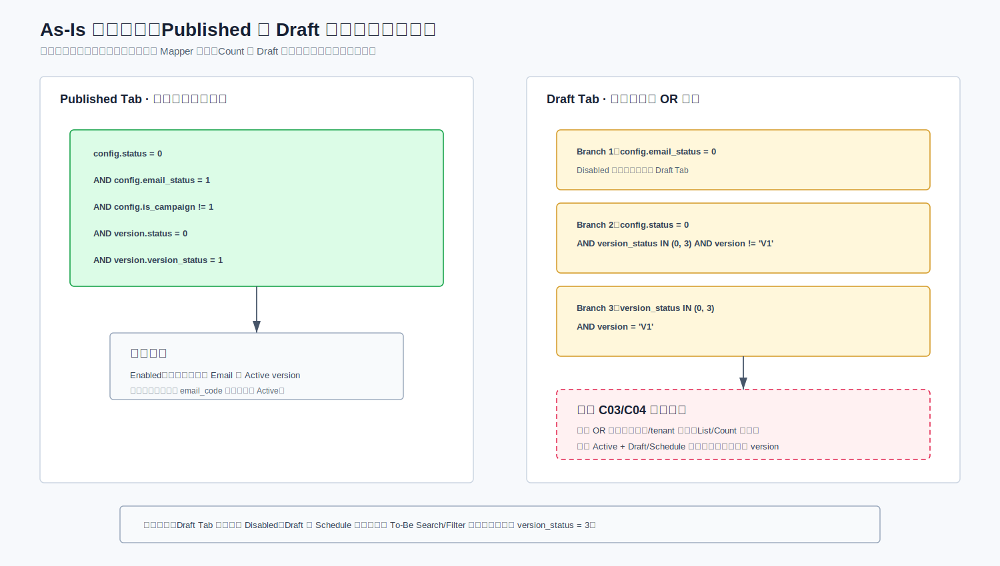

Published 固定返回 Active version。Draft Tab 在命中其 OR 分支后返回最大数字版本 V(N)；Active version 本身一定是当前最大数字版本。组合结果如下：

| 数据组合 | Published Tab | Draft Tab |
|---|---|---|
| Active + Draft | Active | 最大版本 Draft |
| Active + Schedule | Active | 最大版本 Schedule |
| Disabled + Active | 不显示 | 最大版本 Active |
| Active + 多个 Expired | Active | 不显示 Expired |
| Disabled + 多个 Expired | 不显示 | 最大版本 Expired |
| Expired + Draft | 不显示 | 最大版本 Draft |

该矩阵是已确认的页面查询结果，选版规则不再作为业务待确认项。它不代表 Save Draft Service 在异常多 Draft 数据下也一定选择最大版本；该代码路径见第 3.6 节风险说明。

### 3.6 当前核心操作行为

本节只作为 As-Is 事实基线，详细场景差异见第 5.2 节。

| 操作 | 当前数据库行为 | 状态变化 | 明确不修改 |
|---|---|---|---|
| Save Draft：无 version / 已有 Draft | V1 不存在则 Insert V1；已有 Draft V(N) 则 Update V(N) | 目标 version 保持 `version_status = 3`；用户输入的 `effective_from/effective_until` 写入 Draft row | 当前 Active 内容 |
| Save Draft：Active、无 Draft | Insert V(N+1) Working Copy | 新 version 为 Draft `3`；Active V(N) 保持 `1` | 当前 Active 内容和生效时间 |
| Save Draft：仅 Expired、无 Draft | 保留 Expired V(N)，Insert V(N+1) Draft | 旧 V(N) 保持 `2`；新 V(N+1) 为 `3` | Template Identity 和 Expired 历史版本 |
| Save Draft：Schedule | 复用并 Update V(N)，不创建并存 Draft | 同一 version `0 → 3`；保留原 `effective_from/effective_until` | 旧 Active 和 Template Identity |
| Delete Scheduled Version | 按现有 Version Delete 路径软删除 Scheduled V(N) | `version.status → -1`；保留 `version_status = 0` 和原生效时间 | 旧 Active、config 和其他 version |
| Publish Now | 更新新旧 version 和 effective time | 旧 Active `1 → 2`；目标 Draft `3 → 1`；新 Active 的 `effective_from = now`、`effective_until = NULL` | `config.email_status` |
| Scheduled Activation | Java 定时任务 `changeVersionStatusByEffectiveFrom()` 处理到期版本 | Schedule `0 → 1`；旧 Active `1 → 2` | Template Identity |
| Deactivate | 只更新 `iic_msg_email_config.email_status: 1 → 0` | version 仍保持原 `version_status` | config `status` 和所有 version `version_status` |
| Delete | config 与该模板所有 version 级联软删除 | 修改 config/version 的软删除 `status` | 所有 version `version_status` |

现有 Template version 写操作未使用乐观锁、revision token 或 Redis lock，存在并发覆盖风险。一个逻辑 Template 只能有一个 Draft 目前也只由前端页面限制：后端未做唯一 Draft 校验，数据库无对应唯一约束；直接调用接口、并发请求或既有异常数据可能产生多个 Draft。实测代码在已存在 V2/V3 Draft、请求 V4 不存在时，可能先查到较早 Draft，再按最大版本插入 V5。To-Be 暂时保持现状，不把多 Draft 作为正常状态机分支，仅登记为已接受风险；Delete 不提供一键恢复。

### 3.7 当前附件机制

- 附件存储到 S3，文件元数据位于 `iic_msg_file_upload`。
- 单个附件最大 10 MB，对应现有 `size` 字段口径为 `size <= 10240 KB`。
- 附件格式维持现状，但明确排除多媒体、视频和音频。
- LEAD-93 不改变正文版本通过 `file_keys` 引用附件的方式。

### 3.8 As-Is 适用边界

第 3.1-3.7 节作为数据库与业务行为的现状基线。后续设计不得改写本章已确认的状态、选版和数据行为。

2026-07-16 QA 黑盒回归覆盖了 15 个本次交付范围内的现有接口及 2 个辅助查询接口，共完成 22 个有序调用场景。HTTP、公共包络、业务码和已记录状态结果符合预期。已实测的关键状态结果包括：新建 V1 Draft、更新 V1、同一 V1 立即 Publish、Deactivate/Reactivate、增加 V2 后 V2 Active/V1 Expired、Draft/Schedule version 删除成功、Active version 删除被拒绝，以及 Template Delete 成功。

以下行为未由本轮黑盒回归覆盖，不能仅凭本次结果标记为接口事实已冻结：Publish Future、Scheduler 到点生效、Expired/Schedule Save Draft、Active 首次 Save Draft 创建 Working Copy，以及 Version Conflict。其后续内网代码核对已确认：仅 Expired 且无 Draft 时 Insert V(N+1) Draft；Schedule Save Draft 仍更新同一 V(N)。Version Conflict 仅确认“现有实现会返回业务失败”，其比较基线、触发命令、检测时点和真实错误码仍需专项核实。

本轮还确认：在 v1 `POST /version/add` 提交目标 `version="V2"` 的完整 payload 后，可观察结果是 V2 Active、V1 Expired。该接口保留“增加同一 Template 内容版本并切换 Active”的现有语义；v2 只增加发布时对 Template 当前 Metadata 的校验，不把 Metadata 写入 Version。Copy and Create 是独立的新建命令：它以当前最新 Published/Active Version 为来源，首次 Save Draft 时通过新增 v2 API 创建新的 Template B，不能由 `/version/add` 承载。

## 4. 新需求摘要

LEAD-93、LEAD-405、LEAD-406 在保留现有 Template 主模型、版本生命周期和附件机制的基础上增加以下能力：

| 能力域 | 新需求 | 关键业务规则 | 主要影响范围 | 验收关注点 |
|---|---|---|---|---|
| Category/Subcategory | 提供可管理的两级 Template 分类树 | 仅允许两级；名称在 Template taxonomy 内全局唯一；Subcategory 必须归属有效 Category；单次原子批量创建最多 5 条；删除前自动迁移 Active/Draft/Schedule Metadata | 前端管理页面、Category API、新增 `iic_msg_email_category`、Metadata relation | 层级合法、全局重名、批量原子性、迁移与软删除原子性、排序稳定 |
| Tag Taxonomy | 提供固定 Tag Group 和 Tag Value | 4 个必填组；每个 Group 可多选，Trigger 最多 5 个；Draft 可不选择 Tag，Publish 时再校验 4 个必填组；不提供 Tag 管理 UI | Tag 只读 API、新增 Tag 字典表、DBA seed | 固定值完整、组内多选、Trigger 上限、Draft 空值、Publish 必填、上线后仅 DB 脚本维护 |
| Template Metadata | 建立 Template 与主 Category、Subcategory、Tag 的结构化当前关系 | 主 Category 存入 config；Subcategory/Tag 按 `email_code` 保存；与 Version 生命周期解耦 | 扩展 config、新增 relation 与 Template Change History 表 | 当前关系一致、历史快照完整、无孤儿和重复关系 |
| Search/Filter | 支持按 PRD 定义的 Template Name、Email Subject、Description、Tag Name 关键词，以及 Category、Subcategory、4 个 Tag Group、Status 组合查询 | Web 查询固定 `is_campaign=0`；Published Tab 禁用 Status Filter；跨维度 AND，同维度 OR/ANY；Email Subject 来自结果 version，Metadata 来自 Template 当前关系 | 列表 API、Mapper SQL、前端筛选器和索引 | 四类关键词字段均可命中、Template Metadata 匹配正确、Count 与分页准确 |
| Template Metadata 编辑 | 已取得 `email_code` 的 Template 当前 Category/Subcategory/Tag 通过独立命令更新并记录修改历史 | 不创建 Draft、不修改 `version_status`；Save Draft 不接收 Metadata，Version 状态不决定 Metadata 归属 | 编辑页面、Template Metadata API、Change History、Publish validation | Library 位置立即更新、Version 生命周期保持、历史快照完整 |
| Template 可见性 | 统一 Content Manager Tab 与 Adviser View 的可见性规则 | Adviser 只能读取 Enabled + Active Published 内容；Draft/Schedule 不可见；Deactivate/Delete 保持现有生命周期语义 | Published/Draft 查询、Adviser 查询、权限控制 | 不可通过参数绕过 Published-only；Deactivate 后不可见 |
| Publish Validation | 发布前增加 Title、Description、Category、Mandatory Tag 和正文完整性校验 | Title 非空、最长 120、字符白名单、同一主 Category 内唯一；Trigger 最多 5 个；附件不必填且由前端校验；失败返回错误数量和字段错误，本次页面内容不保存 | Publish API、定时任务、错误响应 | 原 Draft/旧 Active 不变、不产生版本条目、字段错误可定位 |
| Migration | 对存量模板进行分类、标签映射和必要的数据清理 | PO/BA 提供 79 个模板的保留/合并/淘汰与映射；DBA 在发布事务中执行幂等、可校验 SQL；独立记录一次性迁移批次结果 | Staging、Migration Log、DDL/DML/QUERY、上线流程 | 数量对账、重复/孤儿检查、Mandatory Tag 完整、批次与执行结果可追踪 |
| 附件约束 | 延续 S3 和 `file_keys` 机制并收紧文件边界 | Email/Campaign 附件均为可选；单个附件最大 10 MB；维持现有格式能力，排除多媒体、视频和音频 | 前端校验、复用现有附件接口、测试 | 不上传附件可正常发布；非法文件在前端阻止提交 |
| Copy and Create | 从当前最新 Published/Active Version 复制出独立的新 Template | 点击时仅预填；首次 Save Draft 调用新增 API 原子创建 B 的主记录、V1 Draft、当前 Metadata 和历史，并写 `copy_from_email_code=A`；附件复用原 `file_keys`；B 发布前仅提示 CM 按需停用 A | 新增 Copy API、主表来源字段、创建事务、Metadata relation、Template Change History、前端 Publish Popup | A/B 独立查询、发布和版本管理；A 未停用时 CM/Adviser 均看到两条；不自动修改 A；失败不产生残留 B；不物理复制 S3 对象 |

明确不在本期范围：

| 排除项 | 本期处理原则 |
|---|---|
| 重建 Template 主表和版本表 | 继续复用 `iic_msg_email_config` 和 `iic_msg_email_config_version` |
| 重写 Draft/Published 状态机 | 保留 Draft、Schedule、Active、Expired 及现有 version control |
| Tag 管理 UI | Tag 首次固定 seed，后续仅通过受控 DB 脚本维护 |
| 乐观锁、revision token、编辑锁、Redis lock、`requestId` | 本期不新增；现有 Version Conflict 的精确行为列为待核实风险 |
| Elasticsearch | 本期使用数据库查询；数据量显著增长后再评估 |
| 一键恢复已删除模板 | Delete 继续按现有软删除语义，不提供业务恢复入口 |
| 多媒体、视频和音频附件 | 明确禁止上传和发布 |

## 5. Gap Analysis

### 5.1 能力差异总览


| 能力 | As-Is | LEAD-93 Gap | 设计决策 |
|---|---|---|---|
| Category | Template Management 当前没有 Category/Subcategory 数据模型或管理流程 | 需要 Category/Subcategory 管理、批量创建和删除前自动迁移 | 新增专用表 `iic_msg_email_category`、Template 当前关系、管理 API 及原子 Reassign-and-Delete 命令 |
| Tag | 无 Template 固定标签体系 | 需要固定组和值及模板关联 | 新增 Tag 字典和关系表，SQL seed |
| Template Metadata | 基本信息位于主表，但没有 Category/Subcategory/Tag 结构化关系及统一修改历史 | 需要可查询的当前关系，并保留每次修改前后值 | config 增加 `category_id`；按 `email_code` 新增关系表；新增 Template Change History 快照表 |
| Search/Filter | Published/Draft 各自有复杂过滤 | 需要组合过滤但不能改变存量语义 | 复用 Tab Base Query 后扩展 join |
| Lifecycle / Effective Time | Save Draft 保存时间并得到 Draft：Active 无 Draft时 Insert V(N+1)；仅 Expired 且无 Draft时保留 Expired V(N) 并 Insert V(N+1)；Schedule 则复用 V(N) 执行 `0 → 3`；Publish 才根据未来时间转 Schedule；Scheduled version 也可通过 Version Delete 软删除 | Version 生命周期无行为 Gap；新增 Template Metadata 不参与 Save Draft、Version Delete 或定时任务 | 保留现有版本选择与状态触发边界；Publish 只读取当前 Metadata 做校验；不新增 Cancel Schedule API |
| Migration | 无新 taxonomy 映射 | 需初始化及映射存量模板，并保留一次性执行结果 | DBA 执行幂等 SQL、Migration Log 和校验报告 |

### 5.2 场景状态机对比

本节对比各业务场景的 As-Is 基线、To-Be 保持项及新增差异。生命周期及生效时间规则保持现状；LEAD-93 的主要增量是 Template 当前 Metadata、修改历史、发布校验及分类删除事务。第 8 章不再重复状态对比，只定义 To-Be 实现规则。

#### 5.2.1 新建、保存草稿与发布

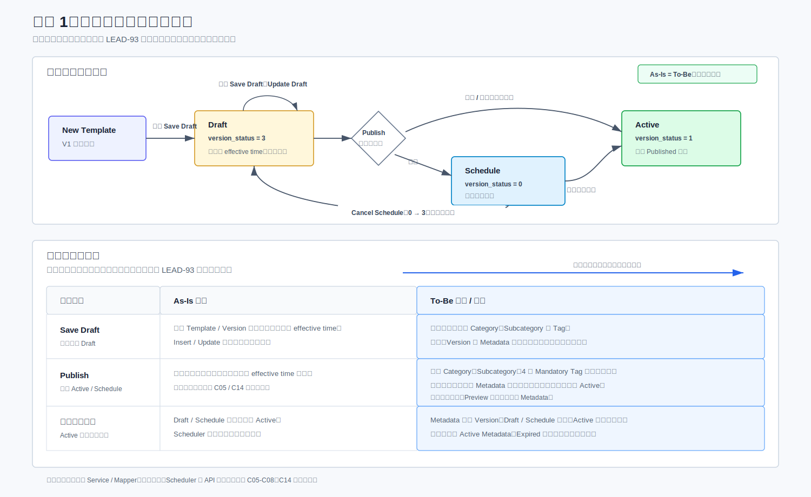

本场景的生命周期没有 As-Is/To-Be 状态差异，因此图中只保留一条共同状态机，并单独标出外围差异。Save Draft 仍只写 Template Master 的现有字段和目标 Version；Category/Tag 不随草稿保存。Publish 前读取 Template 当前 Metadata 进行完整性校验，但不复制或切换 Metadata。

业务流转边界、`email_code` 后端生成和 Insert/Update 结果矩阵已确认。现状无独立 Cancel Schedule API，Scheduler 只需在上线前做回归验证。

#### 5.2.2 Cancel 边界

5.2.1 已定义 Save Draft 的目标版本定位、Insert/Update 和发布状态流转，本节不重复该状态机。Cancel 只是离开当前编辑流程的页面动作，不新增 Version 状态、后端 Endpoint 或 Metadata 语义：

| Cancel 时点 | 后端行为 | 不受影响的数据 |
|---|---|---|
| 首次 Save Draft 之前 | 不调用后端，仅丢弃页面输入 | 所有已持久化 Template/Version 数据 |
| 已保存 Working Copy | 复用 Version Delete 软删除目标 Draft | Active Version、Template 当前 Metadata、主表字段、附件对象 |
| Scheduled Version | 复用 Save Draft `0 → 3` 或 Version Delete | 旧 Active 与 Template 当前 Metadata |

Cancel 不回滚独立持久化的 Template 主表字段，也不复制、回滚或清理 Category/Subcategory/Tag。Copy and Create 不属于 Working Copy 的分支，见 5.2.7 和 8.2.2。

#### 5.2.3 Deactivate 与 Delete

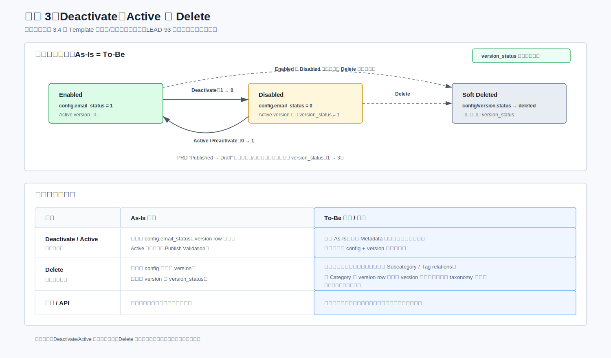

本场景的 As-Is 基线直接复用第 3.4 节 Template 可用性与软删除泳道。Deactivate/Active 仍只切换 `config.email_status`，Template Delete 仍软删除 config/version 且不重写 `version_status`。新增要求是为启停和删除写 Template Change History；Category/Subcategory/Tag 当前关系保留以支持历史追溯，不删除 taxonomy 节点。

#### 5.2.4 Category、Subcategory 与 Tag 元数据修改

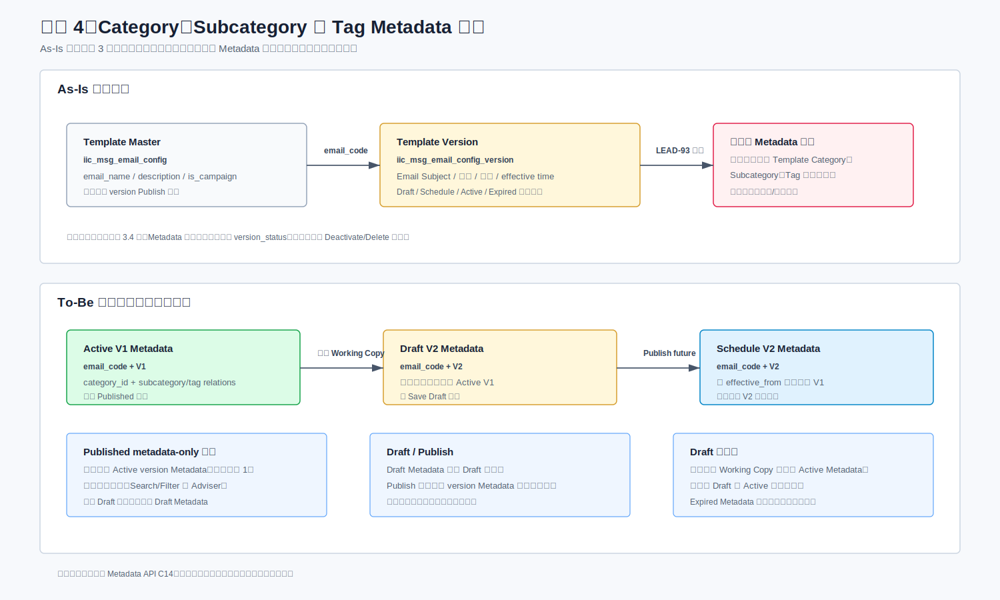

As-Is 只确认 Template Master 与 Version 的字段归属，现有系统没有 Template Category/Subcategory/Tag 关系。To-Be 为每个 `email_code` 保存一套当前 Metadata，并在每次修改时保存完整前后快照。Metadata 不属于 Draft 或任何内容 Version：Save Draft、Publish、Cancel 和 Version Delete 均不写入它。只有 Template 已取得 `email_code` 后，页面才可通过独立 Metadata API 保存当前 Category/Subcategory/Tag；该命令不使用 `version`，也不改变 `version_status`。

#### 5.2.5 页面状态派生

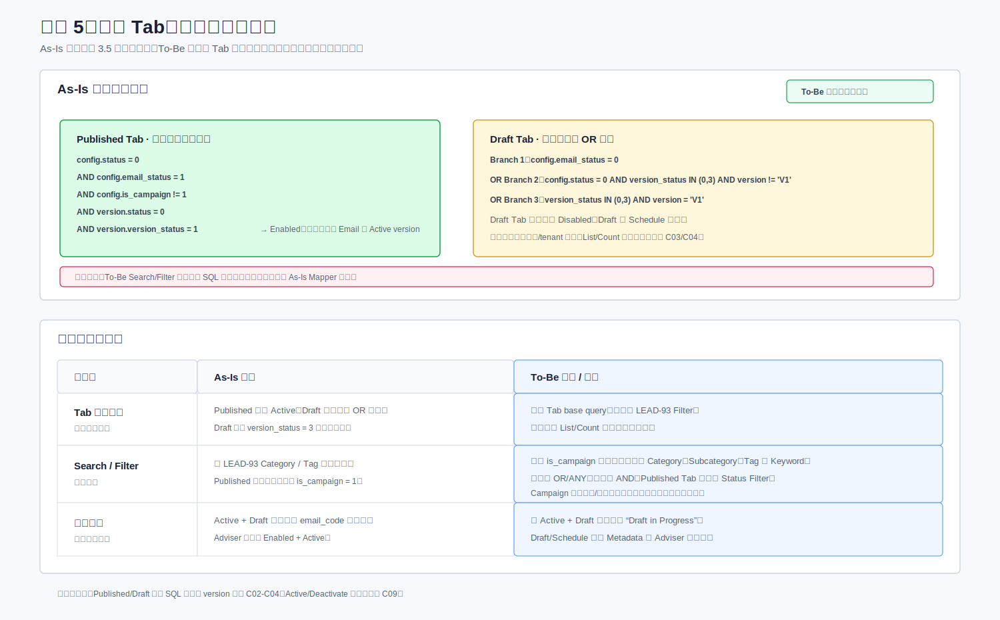

As-Is 查询部分直接复用第 3.5 节：Published Tab 使用已确认的 Active 硬编码条件，Draft Tab 保留 Disabled、Draft、Schedule 三类语义和三个 OR 分支。To-Be 在现有 Tab base query 上固定 `is_campaign = 0`，再叠加 Category/Subcategory、Tag 和 Keyword 条件；不得把 Draft Tab 简化为 `version_status = 3`，也不得新增独立数据库状态。

#### 5.2.6 Category/Subcategory 生命周期

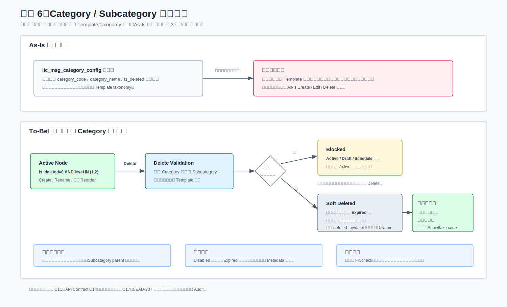

As-Is Template Management 没有两级 taxonomy、Template 关系或删除迁移流程，因此本场景不存在可复用的 As-Is 状态机。To-Be 使用专用表 `iic_msg_email_category`，支持一次最多 5 条 Subcategory 的原子创建。删除时，存在 Active/Draft/Schedule version 的 Template 只迁移一次当前 Metadata；仅有 Expired version 的 Template 不迁移。每个受影响 Template 写一条修改历史，整个删除操作再写一条删除审计。

两级结构、有效条件、全局名称唯一、软删除后同名重建、批量创建和 Reassign-and-Delete 规则均已确认。

#### 5.2.7 Copy and Create 独立模板


As-Is 的 `/version/add` 在同一 `email_code` 下增加内容版本并切换 Active，不能用于本需求。To-Be 的 Copy and Create 从 A 的当前最新 Active Version 预填编辑页面，点击动作不写数据库；首次 Save Draft 才调用新增 Copy API，一次性创建新 `email_code` 的 Template B、V1 Draft、当前 Category/Subcategory/Tag 和修改历史，并在 B 主记录保存 `copy_from_email_code=A`。该字段只是不可变的内部来源追踪值，不形成父子、替代、可见性或级联状态关系。B 从创建起拥有独立生命周期；A、B 后续均 Published 且 A 未停用时，Content Manager 和 Adviser 都按普通独立模板看到两条。B 点击 Publish 时前端显示非阻断提醒，说明发布 B 不会自动停用 A，CM 可继续发布并按需通过现有 Deactivate 操作单独停用 A。

### 5.3 Jira Story 与 To-Be Solution 可追溯关系

本节作为 Gap Analysis 与 To-Be Design 之间的导航层，覆盖 LEAD-93、LEAD-405、LEAD-406 三个 Feature 的 13 个 Story。差异来源以当前第 5 章、PRD v2.0、对应 Jira Story及已确认的方案决策为准。矩阵中的实心圆表示该 Story 的主要解决方案，空心圆表示复用、依赖或间接影响；空白表示没有直接改造。矩阵只用于快速定位，下面的明细表是开发和评审使用的正式追踪入口。

Jira AC 与已确认方案不一致时，本文采用以下已确认目标规则，并将 Jira 文案同步作为需求管理动作，不再把这些规则列为技术待确认项：

| Story | Jira 当前文字差异 | 已确认总体方案 |
|---|---|---|
| LEAD-307 | 有关联 Template 时阻止删除 | 自动迁移 Active/Draft/Schedule Metadata 后软删除；Expired 不迁移 |
| LEAD-301 AC7 | Published 修改 Category/Subcategory 后变 Draft | Metadata-only 修改直接更新 Template 当前属性，Active version 不变，状态保持 Published |
| LEAD-277 Trigger | 字段规则为最多 5 个，但错误文案出现最多 4 个 | 统一为最多 5 个，错误文案同步为 5 个 |
| LEAD-278 / PRD v2.0 | Copy and Create 的业务结果为独立 Template B，发布后 A/B 均可保持可见 | A/B 是两个独立 Template；B 保存独立 V1 Draft，发布后 A/B 均可见；只保存内部 `copy_from_email_code` 并在 B 发布前提醒 CM 按需停用 A，不改变内容级版本管理 |

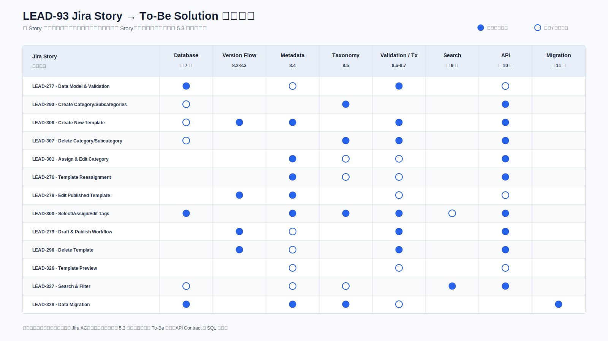

| Jira Story | 解决方案摘要 | As-Is / Gap 来源 | To-Be 设计位置 | 主要实施产物 | 当前状态 |
|---|---|---|---|---|---|
| [LEAD-277](https://oldmutualig.atlassian.net/browse/LEAD-277) Template Data Model & Validation | 保留 Master/Version；在 Master 增加当前主 Category，按 Template 增加 Subcategory/Tag relations 与修改历史；Trigger 最多 5 个；统一 Publish Validation | 3.1、3.3、5.1 | 7.1-7.6、8.3、11 | [Config DDL](sql/DDL_iic_msg_email_config.sql)、[Change History DDL](sql/DDL_iic_msg_email_template_change_history.sql)、[API Contract](LEAD-93_API_Contract_Clarification_CN.md) | 数据归属已确认；字段错误通过 `IICException` 交由 API 统一返回 |
| [LEAD-293](https://oldmutualig.atlassian.net/browse/LEAD-293) Create Category/Subcategories | 新增专用 Category 表构建两级树；全局重名由 Service 校验；支持一次最多 5 条 Subcategory 原子批量创建 | 3.1、5.2.6 | 7.2、9.2.1、11 | [Category DDL](sql/DDL_iic_msg_email_category.sql)、[Runtime CRUD DML](sql/DML_iic_msg_email_category_runtime.sql)、[Taxonomy 图](diagrams/lead93-tobe-taxonomy-management.svg) | 业务规则和 Endpoint Contract 已冻结 |
| [LEAD-306](https://oldmutualig.atlassian.net/browse/LEAD-306) Create New Template | 首次 Save Draft 后端生成 `email_code` 并 Insert V1；Draft 允许内容和 Metadata 不完整；首次 Publish 将同一 V1 激活并产生 Version History 记录 | 3.2、3.6、5.2.1 | 8.1-8.3、10.1、11 | [Write Pipeline 图](diagrams/lead93-tobe-write-command-pipeline.svg)、[Version Runtime DML](sql/DML_iic_msg_email_config_version_runtime.sql) | 本期 Web 固定 Email-only，后端新建主记录固定 `is_campaign=0` |
| [LEAD-307](https://oldmutualig.atlassian.net/browse/LEAD-307) Delete Category/Subcategory | 后端原子迁移 Active/Draft/Schedule Metadata 后级联软删除；Expired 不迁移；记录删除人和时间 | 5.2.6 | 7.2、8.4、9.2.1、11 | [Category Delete 图](diagrams/lead93-tobe-category-delete-design.svg)、[Delete DML](sql/DML_iic_msg_email_category_delete.sql)、[Reference QUERY](sql/QUERY_iic_msg_email_category.sql) | 总体方案已冻结；Jira AC 需同步为迁移后删除 |
| [LEAD-301](https://oldmutualig.atlassian.net/browse/LEAD-301) Assign & Edit Category | Category/Subcategory/Tag 按 Template 保存；已取得 `email_code` 后由独立 Metadata 命令更新并写历史 | 5.2.4 | 9.1、9.2.1、11 | [Metadata 图](diagrams/lead93-tobe-template-reassignment.svg)、[API Contract](LEAD-93_API_Contract_Clarification_CN.md)、[Category Relation DML](sql/DML_iic_msg_template_category_rel_runtime.sql) | 不以 Draft 状态定义 Metadata；Save Draft 不接收 Metadata |
| [LEAD-276](https://oldmutualig.atlassian.net/browse/LEAD-276) Template Reassignment | Reassignment 复用 Template Metadata Update；显式指定 `email_code`；Category/Subcategory/Tag 当前值全量替换并写历史 | 5.2.4 | 9.1、11 | [Reassignment 图](diagrams/lead93-tobe-template-reassignment.svg)、[API Contract](LEAD-93_API_Contract_Clarification_CN.md)、[Tag Relation DML](sql/DML_iic_msg_template_tag_rel_runtime.sql) | 目标行为和 Contract 已冻结 |
| [LEAD-278](https://oldmutualig.atlassian.net/browse/LEAD-278) Edit Published Template / Copy and Create | Working Copy 保留现有同一 Template 版本管理；Copy and Create 首次 Save Draft 创建独立 B，并写内部来源字段；B 发布前提醒 CM 按需停用 A，发布后不自动归档或隐藏 A | 3.6、5.2.2、5.2.7 | 6.2、7.3、8.1-8.4、11 | [Working Copy 场景图](diagrams/lead93-scenario-edit-published.svg)、[Copy 场景图](diagrams/lead93-scenario-copy-and-create.svg)、[Config DDL](sql/DDL_iic_msg_email_config.sql)、[API Contract](LEAD-93_API_Contract_Clarification_CN.md) | 2026-07-21 Jira/OM 结论已冻结；A/B 内容级版本管理保持独立 |
| [LEAD-300](https://oldmutualig.atlassian.net/browse/LEAD-300) Select/Assign/Edit Tags | 固定 Tag Taxonomy；每组多选；按 Template 保存当前 relation；Mandatory Group 发布校验；修改写历史 | 5.2.4 | 7.5、8.3、9.1、9.2.2、10、11 | [Tag 管理图](diagrams/lead93-tobe-tag-taxonomy-management.svg)、[Tag Relation DDL](sql/DDL_iic_msg_template_tag_rel.sql)、[Tag DML](sql/DML_iic_msg_template_tag_rel_runtime.sql)、[Tag QUERY](sql/QUERY_iic_msg_template_tag_rel.sql) | 业务规则、29 个初始 Tag Value 和 Seed DML 已确定 |
| [LEAD-279](https://oldmutualig.atlassian.net/browse/LEAD-279) Draft & Publish Workflow | 保持现有 Insert/Update 和状态机；Publish Now/Future 统一校验；失败不保存本次内容并保留原 Draft/旧 Active | 3.4、3.6、5.2.1-5.2.2 | 8.1-8.4、11 | [As-Is State Flow](diagrams/lead93-as-is-state-flow.svg)、[Command Pipeline](diagrams/lead93-tobe-write-command-pipeline.svg)、[Version Runtime DML](sql/DML_iic_msg_email_config_version_runtime.sql) | 旧 Active→Expired、Draft→Active，不覆盖旧 row |
| [LEAD-296](https://oldmutualig.atlassian.net/browse/LEAD-296) Delete Template | 复用 Template Delete 级联软删除；保留当前 Metadata relations，增加删除历史；不重写 `version_status` | 3.6、5.2.3 | 6.2、8.2、8.4、11 | [Delete 场景图](diagrams/lead93-scenario-deactivate-delete.svg)、[Change History DML](sql/DML_iic_msg_email_template_change_history.sql) | 业务规则已确认；在现有 Delete 事务中增加历史写入 |
| [LEAD-326](https://oldmutualig.atlassian.net/browse/LEAD-326) Template Preview | 完全复用现有 Preview；展示当前临时正文和 Metadata；不持久化、不预览附件 | 5.1 | 6.2、8.3、10.1、11 | [API Contract](LEAD-93_API_Contract_Clarification_CN.md)；复用现有 Preview API/Renderer，无新增 SQL | 复用边界已确认；本期不改 Preview |
| [LEAD-327](https://oldmutualig.atlassian.net/browse/LEAD-327) Search & Filter | 先确定 Tab 的 `email_code + result_version`，再按 `email_code` 应用当前 Metadata Filter；同组 OR、跨组 AND | 3.5、5.2.5 | 10、11 | [Search Pipeline 图](diagrams/lead93-search-filter-query-pipeline.svg)、[Template QUERY SQL](sql/QUERY_iic_msg_email_config.sql)、[API Contract](LEAD-93_API_Contract_Clarification_CN.md) | 查询语义已确认；开发时合并到现有 Mapper |
| [LEAD-328](https://oldmutualig.atlassian.net/browse/LEAD-328) Data Migration | Staging、批次 Migration Log、Seed、Template 级 Mapping、Validation 和事务回滚 | 5.1 | 12.1-12.9 | [SQL Index](sql/README.md)、[Staging DML](sql/DML_lead93_staging.sql)、[Migration Log DML](sql/DML_iic_msg_template_migration_log.sql) | 脚本框架已确定；正式业务 Mapping 由 `BUS-01` 管理 |

追踪原则：Story 只作为需求来源和导航，不复制其 AC 到每个技术章节；同一技术规则只在一个 To-Be 章节定义，其他 Story 通过本表引用。实现期间如 Story AC、PRD 或 API Contract 发生变化，必须同步更新对应行的设计位置、实施产物和状态。

## 6. To-Be 总体方案

### 6.1 目标架构


目标方案分为三层：

- UI/API 层增加 Category、Tag、Metadata 和 Search 能力。
- Template Lifecycle Service 继续负责 Save Draft、Publish、Deactivate 和 Delete。
- 数据层复用 Template Master、Version 和 File 表；Master 增加 `category_id`，同时新增专用 Category、Template 级 relation、Tag 和 Template Change History 表。

API 采用双版本兼容策略：Mobile App 不属于本期交付，现有 v1 仅作为不可破坏兼容基线；Web 端 28 个接口统一使用 v2。`EX-06/07/12/14/15` 仅增加 v2 Controller 路由并复用现有 Service/DTO 行为，不复制业务逻辑。v1/v2 共享底层 Template/Version 数据，因此通过 v2 Publish、Deactivate 或正式数据迁移产生的业务数据变化仍会被 v1 客户端看到。

| API 层 | 范围 | 处理 |
|---|---|---|
| v1 | Mobile App 兼容基线（不交付 LEAD-93 新能力） | Endpoint、请求和响应保持现状；详见 [v1 As-Is 基线](LEAD-93_API_V1_AsIs_CN.md) |
| v2 行为复用 | `EX-06/07/12/14/15` | 新增 v2 路由，复用现有 Service/DTO，不改变核心行为 |
| v2 增强 | `EX-01`—`EX-05`、`EX-08`—`EX-11`、`EX-13`、`EX-16` | 复用现有能力并增加 Metadata、Filter、变更历史、校验或明确发布命令 |
| v2 新增 | `NEW-01`—`NEW-12` | Category、Tag、Metadata、Reassign 和独立 Template Copy 新能力 |

图中的 Service/API 方框表示逻辑能力边界，不要求新增同名 Java Service、Controller 或独立部署模块；实现应优先复用现有模块。

后续章节按一种固定阅读路径组织，每类决策只在一个章节定义：

| 关注点 | 唯一设计位置 |
|---|---|
| 数据存在哪里、表之间如何关联 | 第 7 章 数据模型与归属 |
| Save Draft、Publish、Delete 如何写入 | 第 8 章 Template 写模型与生命周期 |
| Category、Tag、Assignment 如何管理 | 第 9 章 Taxonomy 与 Metadata |
| List、Detail、Preview、Search 如何选 version 和返回 Metadata | 第 10 章 Template 读模型 |
| 哪些 API、Controller、Service、Mapper 需要修改 | 第 11 章 实施影响 |
| SQL 如何组织、迁移和回退 | 第 12 章 Migration 与 SQL 执行 |

### 6.2 现有能力与改造边界

**Jira Coverage：** LEAD-278、LEAD-296、LEAD-326

| 能力 | 本期处理 | 明确边界 |
|---|---|---|
| Schedule Scheduler | Unchanged | 不修改 `changeVersionStatusByEffectiveFrom()`；只验证到点后的既有状态结果 |
| Preview | Unchanged | 复用现有 API/Renderer/DTO；只展示正文和 Metadata，不持久化、不预览附件 |
| Attachment Upload/S3 | Reused | Email/Campaign 附件均可选；10 MB 和格式规则由前端校验，后端继续保存 `file_keys` |
| Active/Deactivate | Reused | 只切换 `config.email_status`，不改 version、不重新 Publish |
| Version Delete | Reused | 复用现有 API；Template 当前 Metadata 与 Version 无关，不清理 relations |
| Template Delete | Reused/Changed | 复用现有级联软删除；保留当前 Metadata 关系并写一条 Template 删除历史 |
| Existing Version Control | Reused / Risk | 不新增 Redis lock、锁字段或独立 revision token；现有 Conflict 的精确触发条件待专项核实 |

附件继续按 version 隔离：Working Copy 新附件不修改旧 Active `file_keys`；Publish 成功后沿用现有保留策略；Cancel/Delete 不删除 S3 对象或 `iic_msg_file_upload` row，也不新增延迟清理和 orphan 状态。


### 6.3 组件与职责边界

第 5 章已经按业务场景说明 As-Is 与 To-Be 差异。本节只定义逻辑组件及职责归属；具体写、管理和读规则分别在第 8-10 章定义。

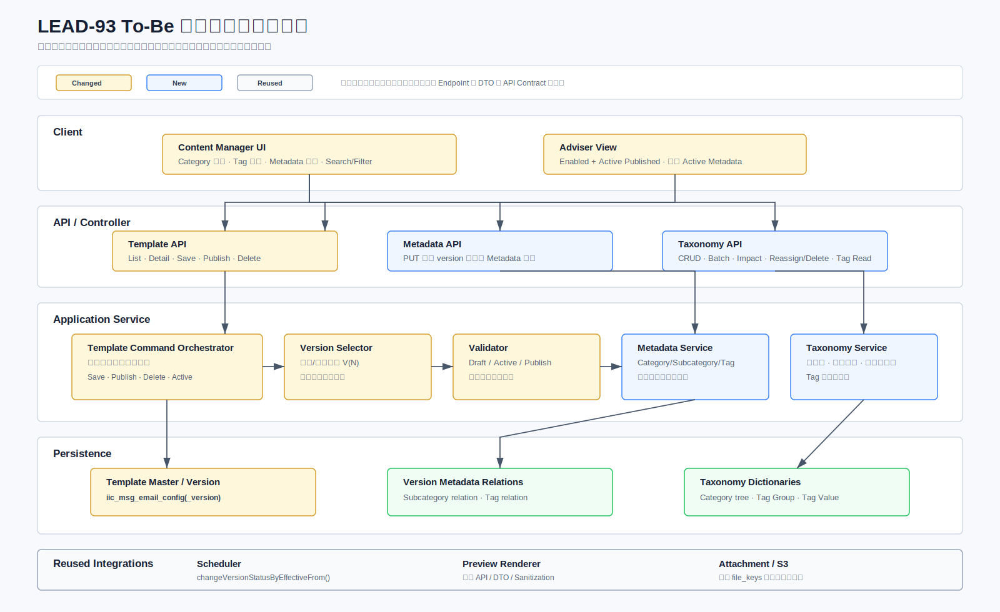

图中的组件名称表示逻辑职责，不要求必须新增同名代码类。正式接口地址、请求响应字段和错误语义以[接口约定](LEAD-93_API_Contract_Clarification_CN.md)为准。

| 逻辑组件 | 类型 | To-Be 职责 |
|---|---|---|
| Content Manager UI | Changed | Category 管理、Tag Group 多选、Metadata 编辑、Search/Filter、Working Copy 操作 |
| Adviser View | Changed | 只读取 Enabled + Active Published Template，并展示 Template 当前 Metadata |
| Template API / Controller | Changed | 保留现有 Template 命令入口，接入统一校验、目标 version 定位和 Template 当前 Metadata |
| Metadata API | New | 对明确的 `email_code` 执行 Category/Subcategory/Tag 当前值全量替换，并写 Template Change History |
| Taxonomy API | New | Category CRUD/Reorder/Delete；Tag Group/Value 只读查询 |
| Template Command Orchestrator | Changed | 编排 Save Draft、Publish、Version Delete、Template Delete、Active/Deactivate；业务可见主记录修改写历史 |
| Version Selector | Changed | 依据已确认矩阵定位或创建目标 V(N)，不由前端猜测 version |
| Metadata Service | New | 校验并写入 `config.category_id`、Template Subcategory/Tag relations，并生成完整前后快照 |
| Taxonomy Service | New | Category 两级规则、原子批量创建、排序、Reassign-and-Delete，以及 Tag Group/Value 有效性校验 |
| Validator | Changed | 区分 Template Metadata Update 与 Publish 的完整性规则；Metadata 可暂时不完整，Publish 才执行完整校验 |
| Repository / Mapper | Changed/New | 复用 config/version Mapper，新增 Category/Tag 字典及 relation Mapper |
| Scheduler / Preview / Attachment | Reused | Scheduler、Preview Renderer 和附件后端机制保持现状，仅接入已保存的 To-Be 数据 |


## 7. 数据模型与归属

本章按已确认方案设计：新增 Template 专用 Category 表 `iic_msg_email_category`。该表只承载 Email/Campaign Template taxonomy，不复用或改造其他业务模块的 Category 表。

### 7.1 数据库设计全景

**Jira Coverage：** LEAD-277、LEAD-293、LEAD-307、LEAD-300、LEAD-328

本节先用三种视角建立数据库设计直觉，再进入逐表字段和约束：

1. **改造范围全景图**回答哪些表复用、修改或新增。
2. **逻辑 ER 图**回答表之间通过哪些业务键关联，以及业务基数是什么。
3. **Template Metadata 与修改历史实例图**回答当前关系和历史快照如何配合，以及一对多关系如何完整记录。

#### 7.1.1 数据库改造范围

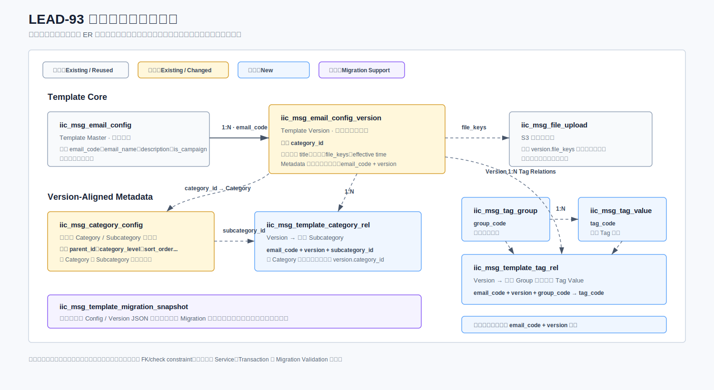

颜色只表示数据库改造类型，不表示 Template 生命周期状态：灰色为 Existing/Reused，黄色为 Existing/Changed，蓝色为 New，紫色为 Migration Support。核心改造路径是 `Template Master → Current Metadata Relations → Template Change History`；Version 继续独立承载内容和生命周期，Migration Log 不参与运行时查询。

#### 7.1.2 To-Be 逻辑 ER 图


ER 图中的 `1:N`、`N:1` 表示业务基数，不表示数据库已经存在物理 FK。本方案明确不新增 FK/check constraint，图中虚线关系由 Service 层校验，并由业务事务保证一致性：

- `iic_msg_email_config.email_code` 与多个 version row 建立逻辑一对多关系。
- `iic_msg_email_config.copy_from_email_code` 是 Copy and Create 时写入 B 的 nullable 内部来源值；它不建立物理 FK，也不参与 A/B 的查询、状态或 Version 级联。
- `config.category_id` 指向当前主 Category；`iic_msg_template_category_rel` 按 `email_code` 保存多个当前 Subcategory。
- `iic_msg_email_category.id` 是 Category/Subcategory 唯一持久化标识；正式表、API 和历史快照均不保存 `category_code`。一次性迁移只在临时表使用 `seed_key`，并在业务写入前解析为数据库 `id`。
- `iic_msg_template_tag_rel` 按 `email_code` 保存当前多选结果；relation 冗余保存 `group_code`，Service 写入时校验它与 `iic_msg_tag_value.group_code` 一致。
- `version.file_keys` 仍是逗号分隔的现有附件引用，不在本期重构为标准关系表。
- Template Change History 保存每次业务修改的完整前后快照；Category Delete Audit 保存一次删除操作的范围和结果；Migration Log 只保存一次性执行批次。三类记录均不参与 Template 列表、详情或 Search/Filter 主查询。

#### 7.1.3 Template 当前 Metadata 与修改历史实例

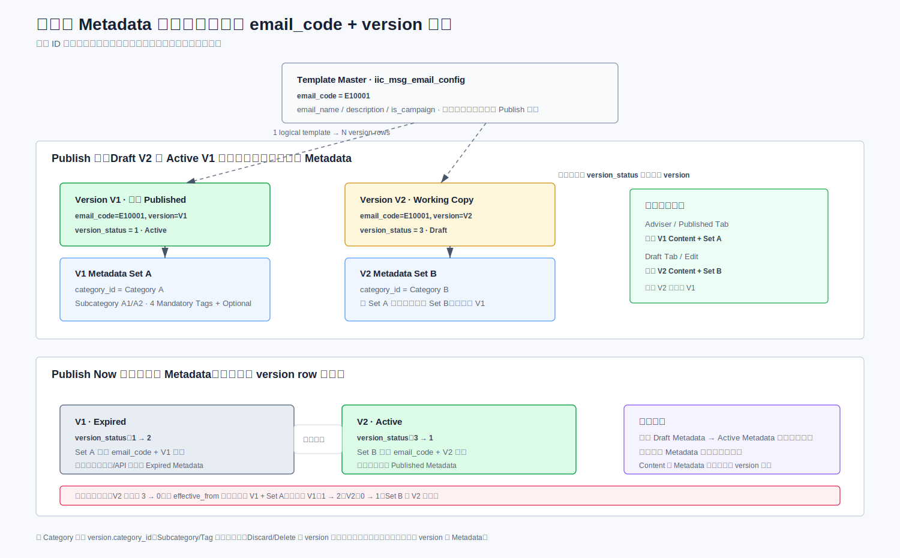

同一 `email_code` 始终只有一套当前 Category、Subcategory 和 Tag。Active V1、Draft/Schedule V2 共享这套 Template 当前属性；Save Draft、Publish、Cancel Schedule、Cancel 和 Version Delete 都不会复制、切换或删除 Metadata。

每次成功修改 Template 基本信息或 Metadata 时，后端读取修改前的完整聚合，完成当前表更新，再写入同一 `operation_id` 下的 `before_snapshot` 与 `after_snapshot`。Subcategory 和 Tag 这类一对多值在快照中使用数组保存，并同时记录 ID/Code 与当时显示名称，使后续 taxonomy Rename/Delete 不会改写历史含义。

#### 7.1.4 表变更总览

| 表 | 类型 | 用途 | 业务键/关联键 |
|---|---|---|---|
| `iic_msg_email_config` | Existing / Changed | Template Master、当前主 Category、Copy 来源追踪 | `email_code`, `category_id`, `copy_from_email_code` |
| `iic_msg_email_config_version` | Existing / Reused | Template Version / Content / Lifecycle | `email_code`, `version` |
| `iic_msg_file_upload` | Existing / Reused | S3 附件元数据 | `file_key` |
| `iic_msg_email_category` | New | Category/Subcategory taxonomy | `id`, `parent_id` |
| `iic_msg_template_category_rel` | New | Template 与当前 Subcategory 多选关系 | `email_code`, `subcategory_id` |
| `iic_msg_tag_group` | New | Tag 分组字典 | `group_code` |
| `iic_msg_tag_value` | New | Tag 值字典 | `group_code`, `tag_code` |
| `iic_msg_template_tag_rel` | New | Template 与当前 Tag Value 的多选关系 | `email_code`, `tag_code` |
| `iic_msg_email_template_change_history` | New | Template 基本信息和 Metadata 的不可变前后快照 | `operation_id`, `email_code` |
| `iic_msg_email_category_delete_audit` | New | Category/Subcategory 成功删除的操作级审计 | `operation_id` |

### 7.2 新增 `iic_msg_email_category`

该表是 Template Management 专用的两级 Category/Subcategory 字典。字段类型和索引仍需 DBA Review：

| 字段 | 用途 |
|---|---|
| `id` | 自增物理主键；config/relation 使用该 ID 关联 |
| `category_name` | Category/Subcategory 显示名称 |
| `parent_id` | Subcategory 所属 Category；一级节点为 `NULL` |
| `sort_order` | 同级排序 |
| `is_deleted` | `0 = 有效`, `-1 = 已软删除` |
| `created_by`, `created_date`, `updated_by`, `updated_date` | 创建与修改信息 |
| `deleted_by`, `deleted_date` | [LEAD-307](https://oldmutualig.atlassian.net/browse/LEAD-307) 明确要求的删除人和删除时间 |

节点层级由 `parent_id` 推导：`parent_id IS NULL` 为 Category，非空为 Subcategory。Service 层只允许两级结构，并校验 Subcategory 的 parent 是有效一级节点；数据库不新增 FK 或 CHECK constraint。

Service 层必须校验：

- 只允许两级结构。
- Subcategory 的 parent 必须为有效一级 Category。
- 有效 Category/Subcategory 的 `category_name` 在全部未删除节点中全局唯一；按字段现有 `utf8mb4_bin` 规则比较，由 Service 在 Create/Update 前查询校验，数据库不设名称唯一约束。
- 删除时先锁定受影响 Template 当前关系；仅对存在 Active/Draft/Schedule version 的 Template 执行一次迁移，再在同一事务软删除源节点。一级 Category 同时软删除全部有效子节点；仅有 Expired version 的 Template 不迁移。
- 软删除节点不参与名称唯一校验，允许创建同名新节点；原 row 保留 ID、Name、删除人和删除时间，以满足 LEAD-307 Data Retention。

对应 SQL：[DDL_iic_msg_email_category.sql](sql/DDL_iic_msg_email_category.sql)。

### 7.3 `iic_msg_email_config` 扩展与 Template Change History

在现有 Template Master 增加 `category_id` 保存当前主 Category，并增加 nullable `copy_from_email_code` 保存 Copy and Create 来源。`iic_msg_email_config_version` 不增加 Category/Tag 或 Copy 来源字段，继续只负责 Subject、正文、附件引用、生效时间和版本生命周期。

`iic_msg_email_category` 使用自增 `id` 作为唯一节点标识。运行时创建由数据库生成 `id`，前端不提交业务编码；迁移文件中的 `seed_key/parent_seed_key` 仅用于当前会话建立父子节点及 Template 映射，不写入正式表。

| 表/字段 | 约束/说明 |
|---|---|
| `iic_msg_email_config.category_id` | 当前主 Category ID；可为空，Publish 时校验必填 |
| `iic_msg_email_config.copy_from_email_code` | nullable `varchar(100)`，与现有 `email_code` 类型/字符集一致；普通新建为 `NULL`，Copy 首次 Save Draft 时固定写 A 的 `email_code`，后续不可修改；不建 FK 或索引，不作为列表筛选和生命周期关联 |
| `iic_msg_email_template_change_history.operation_id` | 一次业务操作标识；Category 批量删除时关联操作级 Audit |
| `before_snapshot` / `after_snapshot` | 完整 Template 聚合 JSON；Create 可无 before，Delete 可无 after |
| `change_type` | `CREATE`、`BASIC_INFO`、`METADATA`、`STATUS`、`CATEGORY_REASSIGNMENT`、`DELETE` 等稳定业务类型 |

完整快照包含：`emailCode`、Template Name、Description、Email/Campaign 类型（`isCampaign`，来源为 `is_campaign`）、Channel/Channel Name、Custom Branding、`email_status`、软删除状态、Category、Subcategory 数组和按 Group 组织的 Tag 数组。不存在独立 `format` 快照字段。Subject、正文、附件、生效时间、Version Number 和 `version_status` 不进入该表，它们继续由 Version 数据表达。

```json
{
  "emailCode": "E10001",
  "templateName": "Welcome Email",
  "description": "...",
  "isCampaign": 0,
  "channel": "EMAIL",
  "channelName": "Email",
  "customBranding": "0",
  "emailStatus": 1,
  "status": 0,
  "category": {"id": "1001", "name": "Client Engagement"},
  "subcategories": [{"id": "1101", "name": "Advice Review"}],
  "tagGroups": [{"groupCode": "TRIGGER", "groupName": "Trigger", "values": [{"tagCode": "T01", "tagName": "Annual Review"}]}]
}
```

快照字段使用稳定业务名，不直接序列化整个 Entity/DTO，避免后续新增技术字段时无意扩大历史范围。现有表字段已确认为 `channel`、`channel_name` 和 `is_custom_branding`；历史快照分别保存 Channel Code、当时显示名称和 Custom Branding 值。

当前关系使用列和关系表，历史才使用 JSON，原因是两类数据的访问模式不同：当前值需要列表筛选、关联校验和批量迁移；历史值只需按 Template/时间回放，不参与运行时筛选。这样既避免在 JSON 上承担高频搜索，也避免为每次历史修改复制多张 history detail 表。

对应 SQL：[DDL_iic_msg_email_config.sql](sql/DDL_iic_msg_email_config.sql)、[DDL_iic_msg_email_template_change_history.sql](sql/DDL_iic_msg_email_template_change_history.sql)。

### 7.4 `iic_msg_template_category_rel`

用于一个 Template 关联多个当前 Subcategory。唯一性由 `email_code + subcategory_id` 保证。

在无 FK 情况下，写入前由 Service 校验 `email_code`、`config.category_id`、Category 层级和节点有效性。全量替换采用软替换：原有效关系更新为 `status=-1`，本次选中关系新增或恢复为 `status=0`。

对应 SQL：[DDL_iic_msg_template_category_rel.sql](sql/DDL_iic_msg_template_category_rel.sql)。

### 7.5 Tag Taxonomy

| 分组 | 必填性 | 最大选择数 | Draft 默认值 |
|---|---|---:|---|
| Content Type | Mandatory | 不限制 | 可空 |
| Trigger | Mandatory | 5 | 可空 |
| Lifecycle Stage | Mandatory | 不限制 | 可空 |
| Financial Need | Mandatory | 不限制 | 可空 |

设计规则：

- `iic_msg_tag_group` 只保存分组、必填标记和排序；Trigger 最多 5 个是 Service 常量，不持久化为字典字段。
- `iic_msg_tag_value` 保存固定 Tag 值及可选 Description；`tag_code` 全局唯一。Description 来自批准后的 Tag Taxonomy 数据文件，并由只读 Taxonomy API 返回。
- `iic_msg_template_tag_rel` 按 `email_code` 保存当前选择结果，同一 Tag Group 可关联多个 Tag Value；relation 冗余保存 `group_code` 以支持筛选并减少额外解析。
- 同一 Template 和 Tag Value 不得重复；唯一性由 `email_code + tag_code` 保证。写入时必须校验 relation `group_code` 与 Tag Value 归属一致；删除使用 `status=-1` 软删除。
- 不提供 Tag 管理 UI。
- 首次上线固定 seed，后续仅允许 DB 脚本维护。
- Draft 缺失 Tag Group 时不补默认值，以零条 relation row 表示未选择；Publish 前校验 4 个 Mandatory Group 均至少存在一个选择。

Migration SQL 只为每个 `email_code` 写一套当前 Category/Subcategory/Tag，不再要求目标 `version`。一次性初始迁移只写 `iic_msg_template_migration_log`，不写 Template Change History；具体 mapping 数据仍待 `BUS-01`。

对应 SQL：[DDL_iic_msg_tag_group.sql](sql/DDL_iic_msg_tag_group.sql)、[DDL_iic_msg_tag_value.sql](sql/DDL_iic_msg_tag_value.sql)、[DDL_iic_msg_template_tag_rel.sql](sql/DDL_iic_msg_template_tag_rel.sql) 及相应 DML 文件。

### 7.6 数据库约束策略

DBA 不允许新增 FK 和 check constraint，因此采用：

- DB：主键、普通索引、必要的唯一索引和软删除字段。
- Service：父子层级、枚举值、关系存在性、必填组、重复关系校验。
- Transaction：config 的 `category_id`、category relation、tag relation 和 Template Change History 必须原子提交。
- Migration Validation：上线脚本后检查孤儿关系、重复关系、缺失 Mandatory Tag 和无效 Category。


## 8. Template 写模型与生命周期


### 8.1 Save Draft 目标版本定位与写入规则

**Jira Coverage：** LEAD-306、LEAD-278、LEAD-279

本节对应第 3.6 节 As-Is Save Draft 数据库行为，并由第 5.2.1 节说明需求差异。To-Be 完整保留现有目标版本选择、Insert/Update 和状态变化规则。Category/Subcategory/Tag 是 Template 当前属性，不属于 Save Draft payload，也不随目标 version 写入；Save Draft 若实际新增或修改 config 基本信息，仍要写 `CREATE` 或 `BASIC_INFO` Template Change History。

新模板首次 Save Draft 时由后端生成全局唯一 Snowflake `email_code`；前端不得生成。Published 页面不提供 Edit 操作；进入其他合法编辑流程不写数据库，只有首次 Save Draft 才持久化 Working Copy。

| 持久化现状 | Version 写入 | 状态结果 | Template Metadata 影响 |
|---|---|---|---|
| 尚无 version | Insert V1 | V1 Draft (`3`) | 不写 Category/Tag；创建 config 时写 `CREATE` History；取得 `email_code` 后可通过 `NEW-07` 立即设置 Category/Subcategory |
| Draft 已存在，包括 Active + Draft | Update 当前 Draft | 保持 Draft (`3`) | 不修改 Category/Tag；config 基本信息有变化时写 `BASIC_INFO` History |
| Active、无 Draft | Insert V(N+1) | 新 Draft (`3`)，Active 保持 (`1`) | 不复制 Category/Tag；config 基本信息有变化时写 History |
| 仅 Expired、无 Draft | 保留最大数字版本 V(N)，Insert V(N+1) | V(N) 保持 Expired (`2`)；V(N+1) 为 Draft (`3`) | 不复制 Category/Tag；config 基本信息有变化时写 History |
| Schedule 存在 | Update Scheduled V(N) | 同一 version `0 → 3` | 不修改 Category/Tag；config 基本信息有变化时写 History |

Expired 分支不复用或改写旧 V(N)，而是新建 V(N+1) Draft；Schedule 分支复用 V(N) 并保留原 `effective_from/effective_until`。即使 `effective_from > now`，Save Draft 也不会自动生成 Schedule。正常页面在已有 Draft 或 Schedule 时禁止再次创建 Draft；现有后端不新增相同约束。

### 8.2 生命周期命令与统一写入管线

**Jira Coverage：** LEAD-306、LEAD-278、LEAD-279、LEAD-296

所有 Template 写命令都遵循同一处理管线：识别命令、读取最新持久化状态、定位目标 version、执行命令级校验、在事务中写入目标表，最后提交或整体回滚。Version 命令与 Template Metadata 命令分别持有自己的事务边界。


| 命令 | 前置条件/目标 | Version 状态写入 | Master/Relations 写入 | 结果与边界 |
|---|---|---|---|---|
| Save Draft | 按 8.1 矩阵定位目标 version | 结果为 Draft (`3`) | 按现有逻辑更新 Master/Version；不写 Category/Tag；Master 有变化时写 History | Future time 只保存，不生成 Schedule |
| Publish Now | 目标为有效 Draft | 旧 Active `1 → 2`；目标 Draft `3 → 1` | 读取当前 Metadata 校验，不复制、不更新 | `effective_from <= now`；校验和状态切换原子完成 |
| Publish Future | 目标为有效 Draft | 目标 Draft `3 → 0` | 读取当前 Metadata 校验，不复制、不更新 | `effective_from > now`；旧 Active 到点前保持 |
| Schedule → Save Draft | 目标为 Scheduled V(N) | `0 → 3` | 不修改 Metadata | 保留 `effective_from/effective_until` |
| Version Delete | 明确目标 Draft/Schedule version | 不修改 `version_status`；version `status → -1` | 不修改 Metadata relations | Published Working Copy Cancel 和 Scheduled Delete 复用此命令 |
| Deactivate | 逻辑 Template 存在 | 不修改 version row | `config.email_status: 1 → 0`；写状态变更历史 | Active version 保留，仅从可见范围排除 |
| Active/Reactivate | Disabled Template 存在 | 不修改 version row | `config.email_status: 0 → 1`；写状态变更历史 | 不重新执行 Publish Validation |
| Template Delete | 明确逻辑 Template | 不修改 `version_status`；config/version `status → -1` | 保留当前 relations，写删除历史 | 沿用主记录级联软删除语义 |

Publish 只有在命令执行时才根据 `effective_from` 决定立即 Active 或 Schedule。发布校验读取 `email_code` 对应的 Template 当前 Category/Subcategory/Tag；状态切换不会生成 Metadata 历史，除非同一请求实际修改了 Template 当前字段。

上表的旧 Active `1 → 2`、目标 Draft `3 → 1` 是已确认的 As-Is 和 To-Be，不表示覆盖或删除旧 Version row。版本编辑器可以展示按 `email_code` 读取的 Template 当前 Metadata，但不得把该数据标记或暗示为所选历史 Version 的 Metadata 快照；本期不实现物理 row 替换或历史 Metadata 绑定。

首次发布时没有旧 Active：同一 V1 只执行 `version_status: 3 → 1`，不 Insert V2 或额外历史 row。发布完成后，该 V1 作为 Active 版本进入现有 Version History 查询结果；“产生历史记录”指现有版本记录可被历史页面查询，不表示复制一条新的数据库版本。

`changeVersionStatusByEffectiveFrom()` 继续负责 Scheduled version 到点生效，本期不修改其调度逻辑。上线前仅通过现有测试、日志或黑盒用例验证状态结果；回归失败时再依据真实代码差异评审改造范围。

#### 8.2.1 Cancel 与 Working Copy

Cancel 是前端业务动作，不新增 `/cancel` API：

| UI 情况 | 后端处理 | 保留内容 |
|---|---|---|
| 编辑页面尚未 Save Draft | 只丢弃客户端内容，不调用后端 | 全部持久化数据 |
| Published + 已持久化 Working Copy | 复用 Version Delete 软删除 Draft version | Active version、Template 当前 Metadata、主表字段和附件对象 |
| 新建且从未 Published 的 Draft | 页面不提供 Cancel；删除时复用 Template Delete | 不增加专用处理 |
| Schedule | 使用 Save Draft `0 → 3` 或 Version Delete | 旧 Active 保持 |

`email_name`、`description`、`is_campaign` 是主表字段，Cancel 已保存 Working Copy 不回滚这些已经独立持久化的修改。

Copy and Create 不是 Cancel 或 Working Copy 的分支，也不复用 `/version/add`，其独立创建规则见 8.2.2。

#### 8.2.2 Copy and Create

Copy and Create 创建与来源 A 完全独立的新 Template B。来源只能是 A 的当前最新 Published/Active Version；Expired、Draft 和 Schedule 不能作为来源。点击 Copy and Create 时，前端加载并预填全部可编辑数据，不调用写接口；用户首次点击 Save Draft 时调用新增 v2 Copy API。

| 数据范围 | B 的创建规则 |
|---|---|
| Template 主记录 | 后端生成新 `email_code`；复制并允许提交前编辑 Template Name、Description、Channel 和 Custom Branding；`is_campaign` 不由页面/API 提交，后端固定写 `0`；默认名称为原名称加 `(Copy)` |
| Version 内容 | 创建独立 `V1 Draft`；复制 Email Subject、正文、`edit_mode`、缩略图和附件 `file_keys`；不复制来源的 version 编号、状态、生效时间和发送统计 |
| 当前 Metadata | 复制并允许提交前编辑主 Category、全部 Subcategory 和全部 Tag；只保存当前仍有效的 Category/Tag ID |
| 附件 | B 的 V1 复用同一组 S3 `file_keys` 引用；不复制 S3 对象，也不新增附件上传记录 |
| 来源追踪 | B 的 `copy_from_email_code` 固定保存 A 的 `email_code`；普通新建为 `NULL`。该字段只支持管理端发布前提醒，不形成可导航、可筛选、可级联的 A→B 业务关系 |
| 历史 | B 只写自己的 `CREATE` 修改历史，不继承 A 的 Version History 或 Template Change History；`copy_from_email_code` 不扩展为独立关系表或历史版本关系 |

B 首次 Save Draft 成功后，管理端 Detail 返回 `copyFromEmailCode`。B 点击 Publish 时，前端在调用普通 Publish API 前显示非阻断确认框，说明发布 B 不会自动停用 A；用户可取消或继续发布。继续发布不增加确认字段、不调用新的后端接口，也不要求 A 已停用。A 是否停用由 CM 通过现有 Deactivate 操作独立决定。

B 的 Save Draft、Publish、Schedule、Deactivate、Delete 和 Version History 与普通 Template 完全一致。`copy_from_email_code` 不参与选版、Version Conflict、旧 Active 过期、Advisor 可见性或 Template Delete 级联。

新增 Copy API 必须在单一数据库事务内完成：重新确认来源仍为当前最新 Active → 校验 B 的 Draft 字段和 Template Name 唯一性 → Insert B config → Insert B V1 Draft → Insert B 的 Subcategory/Tag relations → Insert B CREATE History。任一步失败均整体回滚，不允许留下只有 config 或只有 version 的半成品。默认名称重名时返回字段错误，由用户修改后重试；后端不自动生成 `(Copy 2)`。A 在整个事务中只读，状态、内容、Metadata 和附件引用均不得被修改。


### 8.3 统一校验设计

**Jira Coverage：** LEAD-277、LEAD-306、LEAD-300、LEAD-279、LEAD-326

Validator 按命令类型执行不同完整性规则，不能把 Publish 的严格校验提前应用到 Save Draft。Metadata Update 以 `email_code` 为唯一业务目标，不依赖 Draft/Schedule/Active 的 Version 状态；Metadata 可以暂时不完整，Publish 时再执行严格校验。

历史 Active Template 不享受发布兼容豁免：重新 Publish 必须读取已持久化 Template 当前值和目标 Version 内容，重新执行完整 Published Validation。缺少 PRD v2.0 新必填 Metadata 的历史数据必须补齐后才能重新发布。

| 校验项 | Save Draft | Template Metadata Update | Publish Now/Future |
|---|---|---|---|
| Template Title (`config.email_name`) | 必填；最长 120 字符；字符白名单 | 使用 config 当前值校验 | 必填；最长 120 字符；字符白名单；同一主 Category 内唯一 |
| Description (`config.description`) | 可空 | 不在 Metadata 请求中修改 | 必填 |
| `is_campaign`（内部字段） | 新建固定写 `0`；已有 Template 保持原值 | 不在 Metadata 请求中修改 | 不由页面/API 提交或校验 |
| 主 Category | Save Draft 不接收 | 可为空；非空时必须是有效一级 Category | 必须是有效一级 Category |
| Subcategory | Save Draft 不接收 | 可空；非空时全部属于主 Category | 至少一个且全部属于主 Category |
| 4 个 Mandatory Tag Group | Save Draft 不接收 | 可空；Trigger 最多 5 个 | 每组至少一个有效 Tag Value；Trigger 最多 5 个 |
| Email Subject / 正文 | 可暂不完整 | 不在 Metadata 请求中修改 | 按 PRD 完整性校验 |
| `effective_from` | 可暂存但不改变状态 | 不涉及 | Publish 时决定 Now/Future |
| 附件 | 可选；前端校验 | 不涉及 | 可选；前端校验 |

公共校验顺序为：请求 Schema → 目标 Template/version 存在性 → 当前状态是否允许该命令 → Taxonomy 有效性和归属 → 命令级完整性。任何 Publish 校验失败都必须在数据库写入前返回失败字段数量和字段级错误，本次页面内容不保存到 Draft，config、version 和 history 均不写入；原 Draft 与旧 Active 保持原数据库状态。同组重复 `tag_code`、无效 Category/Tag、Subcategory 跨父节点或目标对象不存在也不得产生部分更新。

Title 字符白名单为英文字母、数字、空格及 `- , . & ' ’`，Copy and Create 额外允许系统生成的固定结尾 ` (Copy)`；其他位置的括号仍拒绝，任何 HTML 标记、换行和 `@ # $ %` 均拒绝。Title 必须非空且最长 120 字符。Category 已选择时，Template Metadata Update 和 Publish 均检查 Title 在同一主 Category 下是否被其他未软删除且存在 Active/Draft/Schedule version 的 Template 使用；比较时排除当前 `email_code`，仅 Expired 历史 Template 不构成冲突。该比较规则由 Service 实现，数据库不增加名称归一化列或唯一约束。

Trigger 上限按去重后的 `tag_code` 数量计算。超过 Service 常量 `5` 时，Template Metadata Update 和 Publish 均在写库前返回字段级错误，不截断、不部分保存；其他 Group 当前不设置数量上限。

Preview 不执行 Publish 状态更新，也不持久化请求内容。它复用现有 Renderer 展示正文和 Metadata；附件不进入 Preview。

### 8.4 事务、失败与并发边界

**Jira Coverage：** LEAD-277、LEAD-307、LEAD-279、LEAD-296

| 命令 | 同一数据库事务内必须完成的写入 | 失败保证 |
|---|---|---|
| Save Draft | config 主表、目标 version；config 新增/实际变化时写 `CREATE/BASIC_INFO` History | 不修改 Template 当前 Category/Tag；History 失败整体回滚 |
| Template Basic Info Update | config 当前字段与一条 Template Change History | Update 或 history Insert 失败时整体回滚 |
| Metadata Update | `config.category_id`、Subcategory/Tag 全量替换和一条 Template Change History | Update 影响 0 行、任一 relation 或 history 失败时整体回滚 |
| Publish Now | 旧 Active 过期、目标 Draft 生效 | 旧 Active 必须保持在线直到事务成功提交 |
| Publish Future | 目标 Draft 转 Schedule | 校验或写入失败时仍保持 Draft |
| Version Delete | 目标 version 软删除 | 不修改 Template 当前 Metadata；目标不匹配或影响 0 行时返回失败 |
| Template Delete | config、全部 version 软删除和一条 Template Change History | relations 保留；任一写入失败时整体回滚 |
| Batch Subcategory Create | 校验 1-5 条输入并批量创建全部节点 | 任一名称/层级/Insert 失败时整批回滚，不返回部分成功 |
| Category Reassign-and-Delete | 锁定源/目标节点及受影响 Template、逐 Template 迁移当前 Metadata并写 history、软删除节点、写操作级 Audit | 任一 Template、relation、history 或 Audit 写入失败时整体回滚；仅 Expired 的 Template 不迁移 |
| Copy and Create | Insert 新 config（含 `copy_from_email_code=A`）、V1 Draft、Subcategory/Tag relations 和一条 Template CREATE History | 来源不是当前最新 Active、名称冲突、Metadata 失效或任一 Insert 失败时整体回滚；来源 A 不修改；来源字段不得在后续普通 Update 中被覆盖 |

附件对象上传和 S3 生命周期不属于上述数据库事务；只有附件上传成功后才保存 `file_keys`。Cancel、Version Delete 和 Publish 成功后均不新增 S3 物理清理。

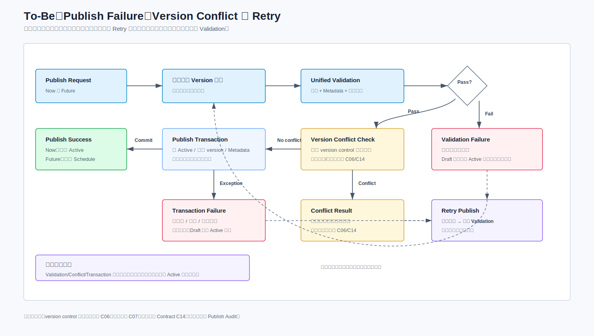

- Validation Failure 发生在业务写入前，返回失败字段数量和字段级错误；本次页面修改不保存，原 Draft/旧 Active 保持原数据库状态，不创建 Version History 条目。
- Transaction Failure 必须回滚全部数据库写入；Retry 重新读取最新持久化状态并重新执行 Validation，不能直接重放旧事务。
- 现有代码存在 Version Conflict 失败路径，但其比较基线、触发命令、检测时点和真实错误码尚未完成专项核实；本期不新增乐观锁字段、revision token、编辑锁、Redis lock 或 `requestId`，也不以推测行为编写验收用例。
- Category Delete 与 Category/Metadata 写入使用数据库 row lock 和固定锁顺序保护 Taxonomy 引用，不代表新增 Template 编辑锁。
- 每次 Template 基本信息、Metadata、启停或删除成功都写 Template Change History。Category/Subcategory 成功删除还必须在同一事务写入 `iic_msg_email_category_delete_audit`，并继续维护业务节点的 `deleted_by/deleted_date`。


## 9. Taxonomy 与 Metadata

### 9.1 Template 当前 Metadata 与修改历史

**Jira Coverage：** LEAD-301、LEAD-276、LEAD-278、LEAD-300

Metadata Service 统一处理 Template 与 Category/Subcategory/Tag 的当前关联。单个 Template Reassignment 复用 Metadata Update API；Category/Subcategory 删除触发的批量迁移由独立 Reassign-and-Delete 命令处理，不能由前端循环调用单条 Metadata Update。

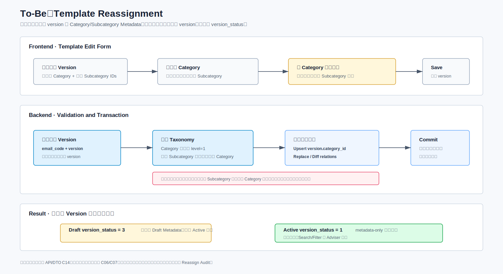

| 操作 | 当前关系行为 | 修改历史 | 对 Version 的影响 |
|---|---|---|---|
| 创建/修改 Template 当前 Metadata | 全量替换 `config.category_id`、Subcategory 和 Tag relations | 写一条完整 before/after 快照 | 不创建、不修改 Version |
| Save Draft / 创建 Working Copy | 不修改、不复制当前 Metadata | 不因 Version 写入单独记 Metadata History | 复用现有 Version 规则 |
| Publish / Schedule 到点生效 | 只读取当前 Metadata 做发布校验 | 状态切换本身不产生 Metadata 变化 | 只切换 `version_status` |
| Working Copy Cancel / Version Delete | 保留当前 Metadata | 不产生 Metadata History | 只软删除目标 Version |
| Active/Deactivate | 保留当前 Metadata | 写 `STATUS` 快照 | 版本状态不变 |
| Template Delete | 保留 relations 供追溯，正常查询由 config `status` 排除 | 写 `DELETE` 快照 | 复用现有 config/version 软删除 |

Metadata Update 使用 `PUT` 全量替换语义：

1. 请求必须通过 Path 显式指定 `email_code`，并携带完整 `category_id`、`subcategory_ids[]` 和全部 Tag Group 快照；请求不接收 `version`。
2. 主 Category 单选，Subcategory 多选；切换主 Category 后，前端清空原 Subcategory，后端仍要拒绝不属于新 Category 的残留 ID。
3. 每个 Tag Group 使用 `tag_codes[]` 表达多选；同组 `tag_code` 不得重复，Tag 必须有效且属于所声明 Group。
4. `subcategory_ids=[]` 或某组 `tag_codes=[]` 表示清空对应关系；字段缺失不得解释为“保持原值”。
5. 当前 Metadata 可暂时不完整；空 Tag Group 以零条 relation row 保存，不生成默认值。Publish 时才强制完整性。
6. 同一事务更新 `config.category_id`、全量替换该 Template 的 Subcategory/Tag relations，并写一条 Template Change History；任一写入失败时整体回滚。
7. Metadata Update 不创建 version、不修改 `version_status`；成功且值实际变化时必须写修改历史，幂等无变化请求不重复写历史。
8. 页面允许修改当前 Metadata 时，在控件变化确认后调用 Metadata Update；因为接口是全量替换，必须提交完整 `category_id`、`subcategory_ids[]` 和全部 `tagGroups`。成功响应后刷新目录路径，Template Library 后续查询立即按新 Category/Subcategory/Tag 返回。首次 Save Draft 前尚无 `email_code`，不能提前调用该接口；该规则不依赖当前正在编辑的 Version 是 Draft、Schedule 还是 Active。

API 使用分组 JSON 数组传输多选 Tag，数据库使用 `iic_msg_template_tag_rel` 逐项存储，从而支持 Tag Name Search、跨 Group AND、同 Group OR/ANY、唯一键和字典归属校验。

一对多关系在当前表中按行存储，在历史快照中按数组存储。例如 Category 保存 `{id,name}`，Subcategory 保存 `[{id,name}]`，Tag 按 Group 保存 `[{groupCode,groupName,values:[{tagCode,tagName}]}]`。历史快照只用于回放和问题追踪，不作为 Search/Filter 数据源。

### 9.2 Category 与 Tag Taxonomy 管理

**Jira Coverage：** LEAD-293、LEAD-307、LEAD-300

Category 与 Tag 都属于 Template Taxonomy，但维护方式不同：Category/Subcategory 由 Content Manager 通过管理页面维护；Tag Group/Value 没有管理页面和写 API，只允许通过受控 DB 脚本维护，并通过只读 API 提供给 Template 编辑和筛选页面。


#### 9.2.1 Category/Subcategory 管理

Category 管理包括 Create、Edit/Rename、Reorder 和 Delete。所有操作只处理 `iic_msg_email_category` 中未删除的两级节点，并由 Content Manager 权限保护。

创建与编辑规则：

- 只允许两级结构；一级 Category 的 `parent_id` 为空，二级 Subcategory 必须指向有效一级 Category。
- Name 必填、纯文本、最长 100 字符；归一化后的 Name 在整个 Template taxonomy 内全局唯一，不只在同一 parent 下唯一。
- 前端使用节点 `id` 执行 Edit/Reorder/Delete；层级由 `parent_id` 推导，不接收客户端提交的层级字段作为数据库事实。
- 单个 Category Create 继续使用单条接口；Subcategory 支持一次提交 1-5 条。后端先完成全部名称、层级和重复校验，再在同一事务批量 Insert；任一条失败时整批回滚，不返回部分成功。
- Created By/Created Date 使用 `iic_msg_email_category.created_by/created_date`，由后端写入并在管理列表/树响应中返回。
- 创建成功后立即出现在 Category Tree、模板编辑下拉框和筛选器中。
- Rename 只修改节点本身；Template 通过 ID 关联，因此无需批量更新模板关系，但导航、筛选和搜索应立即展示新名称。
- 本期不支持把既有 Subcategory 移动到另一个 Category；如需调整，先新建节点并迁移模板关系，再删除旧节点。

排序规则：

- 前端首次加载 Category Tree 时保留后端返回的 `sortOrder`；拖拽只允许发生在同一级和同一父节点容器内。拖动过程中不调用接口，用户完成一次 Drop 后再提交。
- Reorder API 一次提交 `parentCategoryId + orderedCategoryIds[]`。一级排序的 `parentCategoryId=null`；二级排序必须提交父 Category ID。数组必须包含该范围内全部有效同级节点，且顺序就是目标顺序。
- 后端开启事务，按 ID 固定顺序使用 `SELECT ... FOR UPDATE` 锁定该 parent 下全部有效同级节点；校验请求无重复 ID、没有跨 parent、请求 ID 集合与数据库集合完全相同。前端加载后若发生新增、删除或并发修改，集合不一致即返回排序数据已过期的业务失败，不做部分更新；真实错误码以 QA 实测为准。
- 校验通过后把数组位置转换为连续 `sort_order=1..N`，通过一条批量 `CASE WHEN` 或 JDBC Batch 更新；随后在提交前重新查询并校验数据库顺序与请求完全一致。
- 不把 MySQL changed-row count 等于节点数作为成功条件，因为原位置未改变的行可能报告 0 changed rows；成功判断使用“锁定时完整集合校验 + 更新后顺序校验”。
- 本期不新增 revision token、乐观锁或 Redis lock。两个合法并发请求会在行锁后串行执行，后提交的完整顺序最终生效；前端收到成功响应后使用响应顺序，收到失败响应时重新加载 Category Tree，不能保留本地假顺序。

删除采用“迁移后级联软删除”：后端先找出引用源节点的 Template，再通过 Version 是否存在 Active/Draft/Schedule 判断是否需要迁移。符合条件的 Template 只迁移一次当前 Category/Subcategory；仅有 Expired version 的 Template 不迁移。全过程不修改任何 `version_status`。


以下是 **To-Be Reassign-and-Delete 流程**。`SELECT ... FOR UPDATE`、受影响 version 锁定、批量关系更新和父子软删除必须位于同一事务；管理操作复用现有 Content Manager 鉴权，业务提示通过 `IICException` 交由 API 统一返回：

1. 页面先调用只读 Delete Impact API 获取受影响 Template 数量，并按 Active/Draft/Schedule 存在情况展示提示；该结果只用于确认。
2. 正式命令校验 Content Manager 权限，并加载源节点和请求指定的目标节点，通过 `parent_id` 校验层级。
3. 在数据库事务中按固定顺序锁定源节点、Level 1 的全部未删除子节点及目标 Category/Subcategory；节点不存在、已软删除、层级错误或目标位于待删除子树时整体失败。
4. 重新查询并锁定所有引用待删除节点的有效 Template；对每个 `email_code` 检查是否存在 `version_status IN (0,1,3)` 的未删除 Version，不依赖第 1 步的预览计数。
5. 对每个符合条件的 Template 更新一次当前 Category/Subcategory：Level 1 删除将 `config.category_id` 改为目标 Category，并将 Subcategory 替换为请求中的目标集合；Level 2 删除仅移除该 Subcategory并加入同一父 Category 下的目标 Subcategory，其他有效同级 Subcategory保留。
6. 为每个被迁移 Template 写一条 `CATEGORY_REASSIGNMENT` Change History，快照包含 `emailCode`、Template Name，以及迁移前后完整基本信息和 Metadata。任一 Template 更新影响 0 行、目标失效、relation 或 history 写入失败时整体回滚。
7. Metadata 迁移全部成功后，Level 1 在同一事务软删除父节点和全部子节点；Level 2 只软删除目标节点，父 Category 保持不变。
8. 每个被删除节点记录 `deleted_by`、`deleted_date` 和更新时间；原 row 的 ID 和 Name 保留。
9. 在同一业务事务内写入一条 `iic_msg_email_category_delete_audit`：记录后端生成的 `operation_id`、源节点、目标主分类、实际影响 Template 数量和删除节点快照；它与每条 Template Change History 使用同一个 `operation_id`。每条 History 的 `before_snapshot` 必须包含关联 Template 的 `emailCode`、`templateName` 及迁移前 Category/Subcategory，供审计查询还原删除时的关联模板名称。Audit Insert 失败时迁移和软删除全部回滚。
10. 事务提交后 Category Tree、Search/Filter 和编辑下拉框立即排除已删除节点；软删除节点不参与唯一校验，允许创建同名新节点。

版本范围与可见性规则：

- Template 存在任一 Active、Draft、Schedule version 时，迁移其唯一一套当前 Metadata；Disabled Template 只要 config/version 未软删除仍计入。
- Template 只有 Expired version 时不迁移当前关系；该规则是业务范围判断，不表示 Metadata 属于 Expired version。
- 已软删除 Template 不迁移。
- Reassign-and-Delete 只修改 Template 当前 Category/Subcategory，不修改 Tag、其他 Template 主表字段或任何 `version_status`。

并发控制：新增或修改 Template Category/Subcategory relation 时，也必须在同一事务中锁定目标 Category/Subcategory row 并确认 `is_deleted = 0`。Reassign-and-Delete 按“源节点及子节点 → 目标节点 → 受影响 Template”固定顺序加数据库行锁，使删除与普通 Metadata 写入串行；不新增 Redis lock。

SQL 已同步到 [QUERY_iic_msg_email_category.sql](sql/QUERY_iic_msg_email_category.sql)、[DML_iic_msg_email_category_delete.sql](sql/DML_iic_msg_email_category_delete.sql)、[Template Change History DML](sql/DML_iic_msg_email_template_change_history.sql) 和 [Category Delete Audit DML](sql/DML_iic_msg_email_category_delete_audit.sql)。

#### 9.2.2 Tag Group/Value 管理

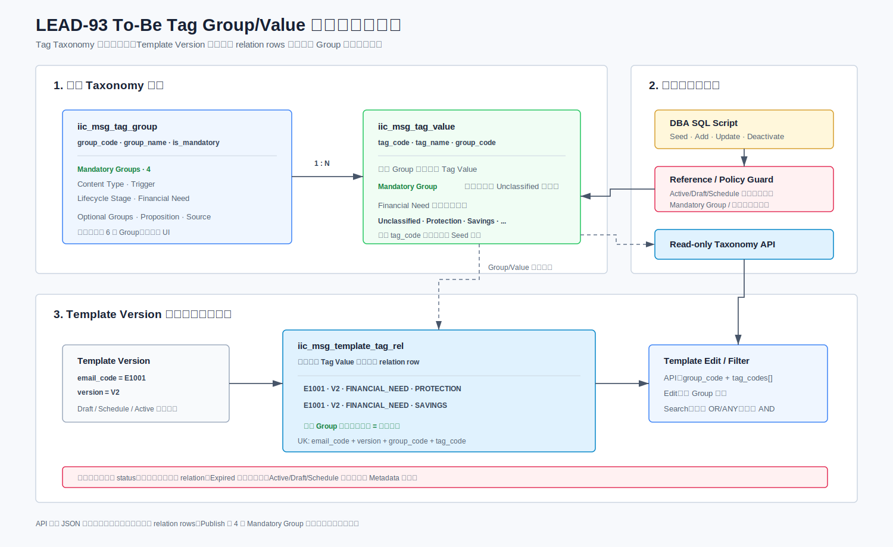

| 能力 | To-Be 设计 |
|---|---|
| Tag Group | 固定 4 个 Mandatory Group |
| Tag Value | 只能从预定义字典选择；`tag_code` 全局唯一并归属一个有效 Group |
| Template Assignment | 每个 Group 可选择多个 Tag Value；当前关联按 `email_code + tag_code` 唯一，冗余保存 `group_code` 并校验归属；关系按 `status` 软删除 |
| 选择数量上限 | Trigger 最多 5 个由 Service 常量校验；Taxonomy API 将该规则返回前端 |
| 管理页面 | 本期不提供 Tag Group/Value 管理 UI |
| 运行时 API | 新增只读 Tag Taxonomy API，返回脚本维护的全部 Group/Value |
| 首次初始化 | 上线时由 DBA 执行固定、幂等 Seed SQL |
| 后续维护 | 只能通过审核后的 DB 脚本新增或修改，不提供运行时写 API |
| Draft 空值 | 任意 Group 均可为空；不生成默认 Tag relation |

Tag Group/Value 保留 `status` 与维护字段，运行时查询只读取 `status=0`；本期不提供前端停用或删除入口，后续仅允许审核后的 DB 脚本维护。维护脚本必须保留 4 个固定 Mandatory Group，并在变更 `tag_code/group_code` 前检查现有 relation 引用。首批 Seed 包含 29 个 Tag Value：Taxonomy 文件中的 16 个值保留其 Description；Mapping 已使用但 Taxonomy 未定义的 13 个值按 Mapping 原分组补入，Description 暂存 `NULL`，不调整 Mapping 归类。运行时新建或更新 relation 时，必须校验 Tag Value 存在且归属请求声明的 Group，不能只依赖前端选项；Publish 才强制四个 Mandatory Group 非空。

Tag 初始化、维护和校验 SQL 分别引用 [DML_iic_msg_tag_group.sql](sql/DML_iic_msg_tag_group.sql)、[DML_iic_msg_tag_value.sql](sql/DML_iic_msg_tag_value.sql)、[QUERY_iic_msg_tag_value.sql](sql/QUERY_iic_msg_tag_value.sql) 和 [QUERY_iic_msg_tag_group.sql](sql/QUERY_iic_msg_tag_group.sql)。


## 10. Template 读模型与 Search / Filter

### 10.1 Version 内容与 Template Metadata 选择

所有读取入口仍先按现有 Tab 规则确定 `email_code + result_version`，用该 Version 返回 Subject、正文和附件；Category、Subcategory、Tag 始终按结果中的 `email_code` 读取 Template 当前值，不再按 version 选择。

| 读取入口 | result version | Template Metadata 规则 |
|---|---|---|
| Published Tab / Published Detail | 当前 Active (`version_status=1`) | 返回该 `email_code` 的当前 Metadata |
| Adviser View | Enabled Template 的当前 Active | 后端强制 Published-only，返回该 `email_code` 的当前 Metadata |
| Draft Tab / Working Copy Edit | 复用第 3.5 节现有 Draft/Schedule/Disabled 选版结果 | 返回同一套当前 Metadata；Metadata 是否可编辑由页面权限决定，不由 Version 状态决定 |
| 普通 Template Detail | 当前 Active；编辑 Working Copy 时显式使用目标 Draft/Schedule version | Version 只影响内容，不影响 Metadata |
| Preview | 当前页面正文和 Metadata 输入 | 仅渲染，不持久化；不包含附件 |
| Version History / 版本编辑器 | 按现有接口返回 Version 内容 | 可同时展示 Template 当前 Metadata，但必须标注为当前值；不提供历史 Metadata 快照，也不提供 Template 修改历史页面/API |

Published、Draft、Detail 和 Adviser 可以复用不同 Base Query，但必须遵守“Version 内容按 result_version，Metadata 按 email_code 当前值”的规则。Search/Filter 先保持 Tab 选版语义，再用当前关系过滤，不能由 relation 表改变结果版本。

### 10.2 查询构造

**Jira Coverage：** LEAD-300、LEAD-327


该图定义查询阶段和组合语义。核心原则是先得到符合现有 Tab 语义的 `email_code + result_version`，再按 `email_code` 的当前 Metadata 应用筛选。

查询分两步：

1. 先复用现有 Published 或 Draft Tab Base Query，确定符合 Tab 状态语义的 `email_code + result_version` 集合。
2. 从 config 读取 `category_id`，再按 `email_code` 关联 category relation 和 tag relation，叠加搜索条件；Email Subject 仍来自 `result_version`。

最终按 Tab 的逻辑模板语义去重并分页。不能先对多张 relation 表直接 join 后再分页，否则 Subcategory/Tag 会导致重复行和分页数量失真。

### 10.3 Published 场景

本期 Web Template Library 不交付 Campaign 管理或筛选入口，Published 和 Draft 查询均固定追加 `config.is_campaign = 0`，保持 Email-only 行为。`is_campaign` 是后台内部字段，不接收前端参数，也不返回页面 DTO。

Adviser View 必须强制 Published-only，不允许通过请求参数绕过。

### 10.4 Draft 场景

复用现有 Draft Tab 多分支条件，不将其简化为 `version_status = 3`。

### 10.5 推荐实现

- 主查询先产出 distinct `email_code` 或使用 `EXISTS` 过滤多值关系。
- Category、Subcategory、Tag 当前关系建立以 `email_code` 开头的索引，并为反向筛选保留以 `subcategory_id` 或 `tag_code` 开头的索引。
- Keyword 部分匹配 PRD v2.0 定义的 Template Name (`iic_msg_email_config.email_name`)、当前结果版本的 Email Subject (`iic_msg_email_config_version.title`)、Description (`iic_msg_email_config.description`) 和 Tag Name；不搜索 Category/Subcategory Name。
- 排序必须稳定；最终沿用现有 List/Count 排序并增加确定性的末级排序键，避免改变 Tab 的既有顺序。

### 10.6 Search / Filter SQL 文件

Search/Filter 的 SQL 设计模板位于 [QUERY_iic_msg_email_config.sql](sql/QUERY_iic_msg_email_config.sql)。该文件描述增量查询结构，开发时必须与现有 List/Count/排序和 Mapper 合并，不能直接替换现有查询。模板包括：

- Published Base Scope 与强制 Published-only 条件。
- Draft Tab 已确认的三个 OR 分支。
- 固定 `is_campaign = 0`、Category/Subcategory/Tag Filter，以及 Template Name/Email Subject/Description/Tag Name Keyword 组合过滤。
- 按 `email_code` 去重、稳定排序、分页和 Count。
- 使用 `FIELD()` 恢复详情 mapper 的分页顺序。
- 组内 ANY 的动态 SQL 模板。

其他表的查询与一致性校验文件统一见 12.8，本章不重复维护 SQL 清单。

参数由 MyBatis/JDBC 安全绑定，`IN` 列表必须展开为独立占位符。Category、Subcategory、Tag、Keyword 之间固定使用 AND；同一维度或同一 Tag Group 内多选固定使用 OR/ANY，即任一选中值匹配即可。

`LIKE %keyword%` 无法有效利用普通 B-Tree 索引。本期模板数量较小，接受数据库扫描；数据量显著增长时再评估全文索引或搜索引擎。

### 10.7 查询交互与边界场景

- Category 未选择时，Subcategory Filter 禁用或仅显示空集合；切换 Category 后自动清除不属于新 Category 的已选 Subcategory。
- 每个已选条件显示为可单独移除的筛选标签；Clear All 同时清除 Keyword 和全部 Filter，并恢复当前 Tab 默认查询。
- 无匹配结果时返回空列表和 `total = 0`，不是业务异常；前端显示统一空状态。
- Content Manager 保留 Published/Draft Tab 和 Status Filter 能力，但 Published Tab 不展示/不允许 Status Filter。后端不得因额外参数改变 Published-only 语义；正式请求模型和错误行为在 API Contract 中冻结。Adviser 不展示 Status Filter，后端强制 Published-only。
- Filter Panel 展示 4 个 Mandatory Tag Group。
- Keyword 与 Filter 组合使用 AND；同一维度内多值使用 OR/ANY；请求包含重复值时后端先去重。
- 实时搜索的防抖属于前端行为；后端必须支持请求取消后安全完成，且不得改变任何数据。

## 11. 实施影响与 API 摘要

完整接口地址、字段模型和错误语义见[LEAD-93 接口约定](LEAD-93_API_Contract_Clarification_CN.md)。本章只保留能力变更摘要，避免在两份文档中重复定义。

**Jira Coverage：** LEAD-277、LEAD-293、LEAD-306、LEAD-307、LEAD-301、LEAD-276、LEAD-278、LEAD-300、LEAD-279、LEAD-296、LEAD-326、LEAD-327

### 11.1 API 变更摘要

下表中的 Web 接口均由 v2 提供；Mobile App 不属于本期交付，继续保持既有 v1 行为而不接入 LEAD-93 新能力。Deactivate、Update Master、Get Max Version、Version History 和 Channel List 通过 v2 路由复用现有 Service 行为。

| 能力 | As-Is | To-Be API 变更 | 兼容策略 |
|---|---|---|---|
| Published List | 现有硬编码排除 `is_campaign=1` | 固定 `is_campaign=0`，增加 Category/Tag/Search 参数 | 保持 Email-only 和原 config/version 状态条件 |
| Draft List | 现有多分支查询 | 固定 `is_campaign=0`，增加 Category/Tag/Search 参数 | 复用原 Base Query；Version 返回内容，Template 返回当前 Metadata |
| Save Draft | 无 version Insert V1；Draft Update；Active 或仅 Expired 且无 Draft时 Insert V(N+1)；Schedule 复用 V(N) 并转 Draft且保留时间 | 不接收或修改 Category/Tag | 不改变现有版本选择逻辑；一个 Draft 仍由前端限制 |
| Publish | 原 `/add` 同时承载保存和发布语义 | 新增独立 `EX-16 /v2/publish`，增加 Category/Tag 发布校验 | 状态流转保持不变；`/v2/add` 只保存 Draft |
| Scheduled Version Save/Delete | Save Draft 执行同一 version `0 → 3` 并保留时间；Version Delete 将 Scheduled row 软删除 | 两条路径均不修改 Template 当前 Metadata；不新增独立 Cancel Schedule API | 不修改旧 Active，不新增 version |
| Deactivate | 更新 `email_status` | 无核心变更 | 保持现状 |
| Delete | config/version 软删除 | 保留 Subcategory/Tag relations并写 Template 删除历史 | 不修改 `version_status` |
| Category | 无 Template 两级管理 API | 新增 tree/create/update/delete/reorder | 新增专用表 `iic_msg_email_category` |
| Batch Subcategory Create | 无 | 新增一次 1-5 条、后端单事务的批量创建 API | 不允许前端循环单条 Create 模拟成功 |
| Category Reassign-and-Delete | 无 | 新增后端原子命令：按 Template 迁移当前 Metadata、逐 Template 写 History 后软删除节点 | 仅 Expired 的 Template 不迁移；失败整体回滚 |
| Category Delete Impact | 无 | 新增只读影响计数 API，供删除确认弹窗使用 | 仅作提示；正式命令在事务中重新查询 |
| Tag | 无 Template Tag API | 新增只读 taxonomy API | 无 Tag 管理 API |
| Metadata Update / Reassign | 无结构化 Metadata API | 新增 `POST /v2/category/metadata` 单模板全量替换和 `POST /v2/reassign` 批量重新分配 | 只指定 `email_code`；不创建 version、不修改状态；写修改历史 |
| Preview | 已确认可复用现有正文和 Metadata 预览能力 | 无 API 或实现变更 | 完全保持现状；不支持附件 |
| Cancel Draft | 已有 Version Delete、Template Delete | 未保存编辑仅前端丢弃；Published Working Copy 复用 Version Delete；新建 Draft 只使用 Template Delete | 不新增 Cancel API；不回滚 config 主表字段 |
| Copy and Create | 无独立接口；`/version/add` 只处理同一 Template 的版本增加 | 新增 v2 Copy API；首次 Save Draft 时原子创建独立 Template B 和 V1 Draft，并记录 `copy_from_email_code` | 来源只允许当前最新 Active；复制可编辑字段、当前 Metadata 和附件引用；A/B 生命周期独立；B 发布前仅做 Deactivate A 提醒 |

#### 11.1.1 Story 与接口影响索引

下表只统计本期方案中的运行时完整接口。同一接口可能同时支持多个 Story，因此各 Story 的接口数仅表示影响范围，不能相加作为接口总数。

| Story | 直接涉及的接口 | 保持不变/复用 | 修改现有 | 新增 | 本 Story 涉及数 |
|---|---|---:|---:|---:|---:|
| LEAD-277 数据模型和发布校验 | `EX-03`、`EX-04`、`EX-05`、`EX-10`、`EX-13`、`NEW-07` | 0 | 5 | 1 | 6 |
| LEAD-293 创建和管理分类/子分类 | `NEW-01`、`NEW-02`、`NEW-03`、`NEW-05`、`NEW-08` | 0 | 0 | 5 | 5 |
| LEAD-306 创建新模板 | `EX-05` | 0 | 1 | 0 | 1 |
| LEAD-307 删除分类/子分类 | `NEW-01`、`NEW-04`、`NEW-09` | 0 | 0 | 3 | 3 |
| LEAD-301 分配和编辑分类 | `EX-03`、`EX-10`、`NEW-01`、`NEW-07` | 0 | 2 | 2 | 4 |
| LEAD-276 模板重新分类 | `NEW-01`、`NEW-07` | 0 | 0 | 2 | 2 |
| LEAD-278 编辑已发布模板与 Copy and Create | `EX-03`、`EX-05`、`EX-09`、`EX-10`、`EX-11`、`EX-12`、`EX-14`、`EX-16`、`NEW-10` | 2 | 6 | 1 | 9 |
| LEAD-300 选择、分配和编辑标签 | `EX-03`、`EX-05`、`EX-10`、`EX-13`、`NEW-06`、`NEW-07` | 0 | 4 | 2 | 6 |
| LEAD-279 草稿与发布流程 | `EX-05`、`EX-09`、`EX-10`、`EX-11` | 0 | 4 | 0 | 4 |
| LEAD-296 删除模板 | `EX-08` | 0 | 1 | 0 | 1 |
| LEAD-326 模板预览 | 复用前端现有预览流程，无 LEAD-93 运行时接口 | 0 | 0 | 0 | 0 |
| LEAD-327 搜索与筛选 | `EX-01`、`EX-02` | 0 | 2 | 0 | 2 |
| LEAD-328 数据迁移 | 使用数据库脚本，无运行时接口 | 0 | 0 | 0 | 0 |
| 跨 Story 现有公共能力 | `EX-06`、`EX-07`、`EX-12`、`EX-14`、`EX-15` | 5 | 0 | 0 | 5 |

去重后的当前设计共包含 28 个 Web v2 完整接口：5 个仅升级路由并复用行为、11 个增强现有能力、12 个新增接口。完整清单和字段以接口约定为准。

### 11.2 Contract 管理

本期新增 Category Tree/CRUD/Reorder、Batch Subcategory Create、Category Delete Impact、Category Reassign-and-Delete、Tag Taxonomy、Template Metadata Update、Batch Reassign 和 Copy and Create；Search/Filter、Detail、Publish 和 Template Delete 需要接入当前 Metadata 或修改历史。普通 Save Draft、Version Delete、Preview 和附件不接入 Metadata；Copy and Create 仅在独立 Template 首次保存时写入提交的当前 Metadata 和 `copy_from_email_code`。Admin Detail 返回该来源字段供前端 Publish Popup 判断，普通列表和 Adviser Detail 不返回。Active/Deactivate 使用 v2 Endpoint 复用现有 Service 行为，但后端事务增加 Template Change History。

接口地址、字段模型、错误语义和权限统一维护在[LEAD-93 接口约定](LEAD-93_API_Contract_Clarification_CN.md)。发布校验是现有发布接口的内部步骤；放弃草稿、取消预约和单个模板重新分配不新增独立接口。分类或子分类删除触发的批量迁移使用独立的“迁移并删除”接口。

### 11.3 分层代码改造清单

| 层级 | 保持不变/复用 | 修改 | 新增 |
|---|---|---|---|
| Frontend | Preview、附件上传组件 | Template Edit、Tag Group 多选、Search/Filter、Cancel 路由、Copy 模板 Publish 前 Deactivate A 提醒 | Category 管理页面、Copy and Create 预填和首次保存调用 |
| API/Controller | Preview、Attachment、Active/Deactivate | List/Detail、Save Draft、Publish、Version/Template Delete；Admin Detail 返回 `copyFromEmailCode` | Category CRUD/Reorder、Batch Subcategory、Delete Impact、Reassign-and-Delete、Tag Taxonomy Read、Metadata Update、Copy and Create |
| Service | Scheduler、现有附件逻辑、Save Draft 选版、待核实的 Version Conflict 失败路径 | Template 命令编排、Publish Validation、Template Delete/启停历史 | Metadata Service、Template Change History Service、Taxonomy Service、Reassign-and-Delete Orchestrator、Template Copy Orchestrator（写来源字段） |
| Mapper/Repository | config/version/file Mapper | Published/Draft 查询、现有 Delete DML | Category/Tag 字典和 Subcategory/Tag relation Mapper |
| Database | `iic_msg_email_config_version`、附件表 | `iic_msg_email_config` 增加 `category_id`、`copy_from_email_code` | `iic_msg_email_category`、两张 Template relation、Tag Group/Value、Template Change History、Migration Log、Delete Audit |
| Release SQL | 现有发布执行机制 | config migration | Category/Tag seed、Template mapping、batch log、validation SQL |
| Scheduler | `changeVersionStatusByEffectiveFrom()` | 无 | 无 |

详细字段见第 7 章；Search/Filter 查询构造见第 10 章；正式 Endpoint、DTO 和错误处理约定见本章摘要及 [API Contract](LEAD-93_API_Contract_Clarification_CN.md)。

### 11.4 后端工作包与估算

本节用于开发计划、任务拆分和内部资源协调，不作为对 PO 的方案评审结论。


上图从页面操作、接口、后端工作包和数据库四个视角展示交付边界。后端工作量除接口开发外，还包括现有选版规则兼容、两阶段查询、跨表事务、生命周期状态、迁移脚本和一致性校验。

| 后端工作包 | 前端可见结果 | 后端具体改造 | 主要接口/数据 | 关联需求 | 估算 |
|---|---|---|---|---|---:|
| 列表、详情、搜索与筛选 | 页签内容与 Template 当前分类标签正确组合 | 保留现有页签选版；按 `email_code` 增加当前关系过滤、去重、总数、分页、排序和详情组装 | `EX-01`—`EX-04`；config、版本表和两张关系表 | LEAD-327 | 3 人天 |
| 模板写入、生命周期与复制创建 | 保存草稿、立即/未来发布、复制创建、发布前来源提醒和放弃行为一致 | 保留选版；发布读取当前 Metadata 校验；Copy Orchestrator 原子创建独立 B、V1 Draft、关系和历史并写来源字段；Admin Detail 返回来源供前端 Popup 判断 | `EX-03`、`EX-05`、`EX-09`—`EX-11`、`EX-16`、`NEW-10` | LEAD-278、279、296 | 6 人天 |
| Template Metadata 与修改历史 | 支持当前分类、子分类和标签查询/更新并可追溯 | 全量替换当前值；校验 taxonomy；基本信息、Metadata、启停和删除写前后快照 | `NEW-06`、`NEW-07`；关系表和 Change History | LEAD-277、300、301 | 3 人天 |
| 分类和子分类管理 | 分类树、新增、重命名、排序和批量子分类可用 | 两级树规则、有效名称唯一、同级排序事务、批量 1-5 条整体回滚 | `NEW-01`—`NEW-03`、`NEW-05`、`NEW-08`；分类表 | LEAD-293、307 | 3 人天 |
| 分类影响查询与迁移删除 | 删除前可查看影响数量并选择迁移目标 | 锁定源/目标节点及受影响 Template；迁移当前值、逐 Template 写历史、软删除和操作审计原子提交 | `NEW-04`、`NEW-09`；分类、config、关系、历史及删除审计表 | LEAD-307 | 4 人天 |
| 表结构和一次性数据迁移 | 无运行时页面；为上线准备数据 | 表结构、初始数据、Template 当前映射、批次迁移日志、校验和事务回退 | 1 张现有表扩展、7 张新业务表及迁移批次表 | LEAD-328 | 3 人天 |
| 联调与缺陷修正 | 前后端主流程可联调，现有行为不回归 | 列表、保存、发布、分类和删除主流程的集成修正 | 跨工作包 | 全部 | 3 人天 |
| **合计** |  |  |  |  | **25 人天** |

后端开发估算基线为 **25 人天**，按上述工作包统计。


## 12. Migration 与 SQL 执行设计

### 12.1 执行方式

**Jira Coverage：** LEAD-328

DBA 在上线前或上线窗口执行 SQL：

1. Schema change。
2. 加载 Staging，并在独立日志事务登记 Migration STARTED。
3. Category/Subcategory 与 Tag Group/Value 固定 seed。
4. 使用临时 `seed_key/parent_seed_key` 创建两级分类并解析为 `category_id`；`seed_key` 不写入正式表。
5. 按存量 `email_code` 更新 `config.category_id`，并写入一套 Template 当前 Subcategory/Tag relation。
6. 执行一致性校验 SQL。
7. 写入 Migration SUCCESS/FAILED 结果，输出 migration report，并由 PO/BA/Tech 共同确认。

### 12.2 脚本要求

- Schema DDL：由版本化 migration 单次执行，执行门禁和前置检查见 12.5-12.9。
- Seed/Mapping DML：幂等，重复执行不会产生重复数据。
- 可追踪：`iic_msg_template_migration_log` 按批次保存 STARTED/SUCCESS/FAILED 和数量结果；它不是运行时 Audit Log，Template 业务表不保存部署批次。
- 可校验：每一步有 count、duplicate、orphan 和 mandatory-tag 检查。
- 可回滚：回滚只针对 LEAD-93 新增/改造数据，不恢复被业务删除的模板。
- 不直接修改现有 `version_status` 生命周期数据。

完整 SQL 见 [SQL Index](sql/README.md)。

### 12.3 业务输入

PO/BA 需提供并确认：

- 79 个存量模板的保留、合并或淘汰结论。
- 每个保留模板对应的 Category、Subcategory 和 Tag。
- 重复/过期模板的目标 `email_code` 及处理方式。
- Deactivate/淘汰原因写入 Staging `action_note` 和一次性 Migration Log `action_reason`，用于迁移报告，不在 Template Library 页面或运行时 API 展示。

### 12.4 Migration 失败恢复与重跑

- 正式执行前必须运行 dry-run/pre-check，输出 staging 数量、未知 `email_code`、重复映射、缺失 Category/Subcategory/Tag 和目标名称冲突。
- 阶段开始、成功、失败和数量写入 `iic_msg_template_migration_log` 并同步输出 Migration Report；日志写入使用独立事务，业务迁移失败回滚后仍可登记 FAILED。
- 重跑使用同一批次时必须幂等；需要修正 mapping 时使用新批次，并保留旧批次报告。
- 业务 DML 在单一发布事务中执行；任一步失败时整体回滚，再由独立日志事务登记 FAILED。
- Validation Report 未经 PO/BA/Tech 签字，不开放新 UI 和 Adviser 新分类入口。

### 12.5 SQL 文件组织与执行约定

所有 SQL 以 [SQL Index](sql/README.md) 为入口，按 `DDL_<table>.sql`、`DML_<table>.sql`、`QUERY_<table>.sql` 分类。SQL 文件是执行内容的唯一来源，本文不再复制 SQL，避免设计文档与部署脚本漂移。

- MySQL 8.0、InnoDB、`utf8mb4_bin`。
- 不创建 FK/check constraint。
- DDL 由 DBA 以版本化脚本单次执行。
- Category Seed 使用有效名称判重，并通过临时 `seed_key → category_id` 映射保证父子和 Template 关联可重跑；`seed_key` 与 `batch_id` 均不进入运行时 Template 业务表。
- Deactivate migration 由 `@lead93_apply_deactivate = 1` 显式启用；只在业务 mapping 审批后开启，实际仅更新 `email_status = 0`。
- [SQL Index](sql/README.md) 的 `Readiness` 是执行门禁：标记为 Partially Updated 或 Blocked 的文件不得进入部署包。
- Search/Filter SQL 中已写入确认后的增量规则、`config.email_name` Template Title 条件和 Draft 选版矩阵；在完整 List/Count/排序及真实 Mapper 对接完成前，不作为最终 Mapper SQL。
- 列表、总数和定时任务查询是否需要新增索引，必须在内网使用实际 SQL 执行 `EXPLAIN` 后另行决定；本方案不预置候选索引。

### 12.6 DDL 文件

| 目标表 | 变更 | SQL |
|---|---|---|
| 已执行旧版 LEAD-93 草稿 DDL 的环境 | 删除 `format/category_code/is_default` 并升级最终索引和字段 | [DDL_LEAD93_upgrade_existing_schema.sql](sql/DDL_LEAD93_upgrade_existing_schema.sql) |
| `iic_msg_email_category` | 新建 Template 专用两级 taxonomy 表和树查询索引 | [DDL_iic_msg_email_category.sql](sql/DDL_iic_msg_email_category.sql) |
| `iic_msg_email_config` | 增加 Template 当前主 Category 字段 `category_id` | [DDL_iic_msg_email_config.sql](sql/DDL_iic_msg_email_config.sql) |
| `iic_msg_template_category_rel` | 新建 Subcategory 关系表 | [DDL_iic_msg_template_category_rel.sql](sql/DDL_iic_msg_template_category_rel.sql) |
| `iic_msg_tag_group` | 新建 Tag Group 表 | [DDL_iic_msg_tag_group.sql](sql/DDL_iic_msg_tag_group.sql) |
| `iic_msg_tag_value` | 新建 Tag Value 表 | [DDL_iic_msg_tag_value.sql](sql/DDL_iic_msg_tag_value.sql) |
| `iic_msg_template_tag_rel` | 新建 Template Tag 关系表 | [DDL_iic_msg_template_tag_rel.sql](sql/DDL_iic_msg_template_tag_rel.sql) |
| `iic_msg_email_template_change_history` | 新建 Template 基本信息/Metadata 修改历史快照表 | [DDL_iic_msg_email_template_change_history.sql](sql/DDL_iic_msg_email_template_change_history.sql) |
| `iic_msg_template_migration_log` | 新建一次性 migration batch log；不用于运行时审计 | [DDL_iic_msg_template_migration_log.sql](sql/DDL_iic_msg_template_migration_log.sql) |
| `iic_msg_email_category_delete_audit` | 新建 Category/Subcategory 成功删除运行时审计表 | [DDL_iic_msg_email_category_delete_audit.sql](sql/DDL_iic_msg_email_category_delete_audit.sql) |

### 12.7 DML 文件

| 目标/用途 | 内容 | SQL |
|---|---|---|
| Staging | Mapping 临时表及 `seed_key → category_id` 会话映射定义 | [DML_lead93_staging.sql](sql/DML_lead93_staging.sql) |
| `iic_msg_tag_group` | 固定 Group seed | [DML_iic_msg_tag_group.sql](sql/DML_iic_msg_tag_group.sql) |
| `iic_msg_tag_value` | 批准后的固定 Tag Value seed；不自动创建 Unclassified | [DML_iic_msg_tag_value.sql](sql/DML_iic_msg_tag_value.sql) |
| `iic_msg_email_category` | 按有效名称幂等 seed，并把临时 `seed_key` 解析为数据库 `id` | [DML_iic_msg_email_category.sql](sql/DML_iic_msg_email_category.sql) |
| `iic_msg_email_category` Runtime CRUD | 一次最多 5 条 Subcategory 原子批量 Create、Rename/Edit、同级 Reorder Mapper 模板；不属于部署执行序列 | [DML_iic_msg_email_category_runtime.sql](sql/DML_iic_msg_email_category_runtime.sql) |
| `iic_msg_email_category` Runtime Delete | 按 Template 迁移当前 Metadata、写历史后软删除 Category/Subcategory 的 Mapper 模板；不属于部署执行序列 | [DML_iic_msg_email_category_delete.sql](sql/DML_iic_msg_email_category_delete.sql) |
| `iic_msg_email_category_delete_audit` | 在删除业务事务内写入成功操作及迁移前后快照 | [DML_iic_msg_email_category_delete_audit.sql](sql/DML_iic_msg_email_category_delete_audit.sql) |
| `iic_msg_email_template_change_history` | Template 基本信息/Metadata 修改、启停、删除和分类迁移历史 | [DML_iic_msg_email_template_change_history.sql](sql/DML_iic_msg_email_template_change_history.sql) |
| `iic_msg_template_migration_log` | 在独立日志事务记录一次性迁移批次 STARTED/SUCCESS/FAILED 和数量 | [DML_iic_msg_template_migration_log.sql](sql/DML_iic_msg_template_migration_log.sql) |
| `iic_msg_template_category_rel` | Subcategory mapping | [DML_iic_msg_template_category_rel.sql](sql/DML_iic_msg_template_category_rel.sql) |
| `iic_msg_template_tag_rel` | Tag mapping | [DML_iic_msg_template_tag_rel.sql](sql/DML_iic_msg_template_tag_rel.sql) |
| `iic_msg_email_config` | 名称/描述/Category/受控 Deactivate migration；DDL 同时增加 Copy 来源字段 | [DML_iic_msg_email_config.sql](sql/DML_iic_msg_email_config.sql) |
| `iic_msg_email_config` Runtime | Copy and Create Insert 独立 Template B 主记录并写 `copy_from_email_code`；不属于部署执行序列 | [DML_iic_msg_email_config_runtime.sql](sql/DML_iic_msg_email_config_runtime.sql) |
| `iic_msg_email_config_version` | Email Subject migration；不写 Metadata | [DML_iic_msg_email_config_version.sql](sql/DML_iic_msg_email_config_version.sql) |
| `iic_msg_email_config_version` Runtime | Schedule Save Draft、Scheduled Version Delete，以及 Copy 创建 B V1 Draft；不写版本级 Metadata | [DML_iic_msg_email_config_version_runtime.sql](sql/DML_iic_msg_email_config_version_runtime.sql) |
| `iic_msg_template_category_rel` Runtime | 按 `email_code` 全量替换当前 Subcategory；Copy 时写 B 的已校验关系 | [DML_iic_msg_template_category_rel_runtime.sql](sql/DML_iic_msg_template_category_rel_runtime.sql) |
| `iic_msg_template_tag_rel` Runtime | 按 `email_code` 全量替换当前 Tag；Copy 时写 B 的已校验关系 | [DML_iic_msg_template_tag_rel_runtime.sql](sql/DML_iic_msg_template_tag_rel_runtime.sql) |

### 12.8 QUERY 与校验文件

| 主表 | 用途 | SQL |
|---|---|---|
| `iic_msg_email_category` | 重复检查、树查询、层级校验 | [QUERY_iic_msg_email_category.sql](sql/QUERY_iic_msg_email_category.sql) |
| `iic_msg_email_config` | Published/Draft Search 与分页 | [QUERY_iic_msg_email_config.sql](sql/QUERY_iic_msg_email_config.sql) |
| `iic_msg_email_config_version` | 多 Active/Draft、时间字段一致性、Schedule 扫描及 Copy 来源锁定 | [QUERY_iic_msg_email_config_version.sql](sql/QUERY_iic_msg_email_config_version.sql) |
| `iic_msg_template_category_rel` | Subcategory 与主 Category 一致性 | [QUERY_iic_msg_template_category_rel.sql](sql/QUERY_iic_msg_template_category_rel.sql) |
| `iic_msg_tag_value` | 固定 taxonomy 查询 | [QUERY_iic_msg_tag_value.sql](sql/QUERY_iic_msg_tag_value.sql) |
| `iic_msg_template_tag_rel` | Tag group/value 一致性 | [QUERY_iic_msg_template_tag_rel.sql](sql/QUERY_iic_msg_template_tag_rel.sql) |
| `iic_msg_tag_group` | Published Mandatory Tag 缺失校验 | [QUERY_iic_msg_tag_group.sql](sql/QUERY_iic_msg_tag_group.sql) |
| `iic_msg_template_migration_log` | 按 batch 查询一次性迁移状态和数量结果 | [QUERY_iic_msg_template_migration_log.sql](sql/QUERY_iic_msg_template_migration_log.sql) |
| `iic_msg_email_category_delete_audit` | 按 operation、源节点和时间查询成功删除审计 | [QUERY_iic_msg_email_category_delete_audit.sql](sql/QUERY_iic_msg_email_category_delete_audit.sql) |
| `iic_msg_email_template_change_history` | 按 Template、时间或操作查询修改历史 | [QUERY_iic_msg_email_template_change_history.sql](sql/QUERY_iic_msg_email_template_change_history.sql) |

### 12.9 执行顺序

1. 仅运行引用现有表和现有字段的 pre-DDL 检查，不提前查询 LEAD-93 新表或新字段。
2. 仅执行已解除 `Readiness/REVIEW GATE` 门禁并经 DBA 批准的 DDL；Partially Updated 或 Blocked 文件不得执行。
3. 运行新表和新字段的基线校验，包括 `QUERY_iic_msg_email_category.sql`，异常数量必须为零。
4. 设置 [SQL Index](sql/README.md) 中的 migration variables 并加载 staging。
5. 在独立日志事务写入 STARTED。
6. 执行 Tag seed、Category seed。
7. 执行 config Category、Template relation、Subject 和其他 approved config migration DML。
8. 执行全部 post-migration 一致性校验，并在独立日志事务写入 SUCCESS；失败回滚后写入 FAILED。
9. 任一步业务 DML 失败时回滚发布事务，再写入 FAILED；修正 mapping 后按新的明确批次重跑。


## 13. 风险与待确认项

本章只保留影响方案评审的摘要。完整问题、Owner、冻结点和关闭记录统一维护在[未确认项与现状核对登记册](LEAD-93_Open_Questions_Register_CN.md)，不得仅在本章关闭问题。

### 13.1 已接受风险

| 风险 | 处理方式 |
|---|---|
| 现有 Version Conflict 的比较基线、触发命令、检测时点和真实错误码尚未专项验证 | 本期不扩展锁/token；开发前补充代码定位和并发 QA 用例，未核实前不得把推测规则写成接口验收标准 |
| 一个 Draft 仅由前端页面限制，后端/数据库不保证；异常请求可能产生多个 Draft，甚至按最大版本继续 Insert | To-Be 暂时保持现状；前端有 Draft/Schedule 时禁止创建新 Draft，后端风险通过查询 SQL 监测，不把异常数据纳入正常状态机 |
| `LIKE %keyword%` 在数据增长后可能产生扫描开销 | 本期基于现有数据量使用数据库查询；上线前执行 `EXPLAIN`，后续按容量评估全文索引或搜索引擎 |
| 新增表不使用外键和 check constraint | Service 层在事务中校验层级、状态、唯一性和关系完整性，并通过校验 SQL 发现异常 |
| 应用回滚后旧版本不识别新增 Metadata | 新增表和字段保持向后兼容；应用回滚不删除新增数据，也不重写现有 version lifecycle |

### 13.2 业务待确认

| ID | 问题 | 当前处理 | 冻结点 |
|---|---|---|---|
| BUS-01 | 79 个存量模板的分类、标签、重复和过期映射 | 由 PO/BA 提供并签字确认 | Migration 数据脚本执行前 |

### 13.3 后续体验与查询优化（不属于本期开发基线）

| 主题 | 后续需要完成的工作 | 当前处理 |
|---|---|---|
| Category/Folder 浏览 | 明确先展示目录树、按节点展开加载模板、模板计数和空目录展示的交互；再评估是否需要树节点延迟加载和独立计数查询 | 本期仍按现有 Tab 列表 + Filter 查询，不新增目录浏览协议 |
| Search / Filter 性能 | 基于实际数据量和 `EXPLAIN` 评估分页、关键词检索、关系过滤和 Count 查询；数据增长后再决定全文索引、搜索服务或分层查询方案 | 本期保留数据库组合查询与现有分页语义 |
